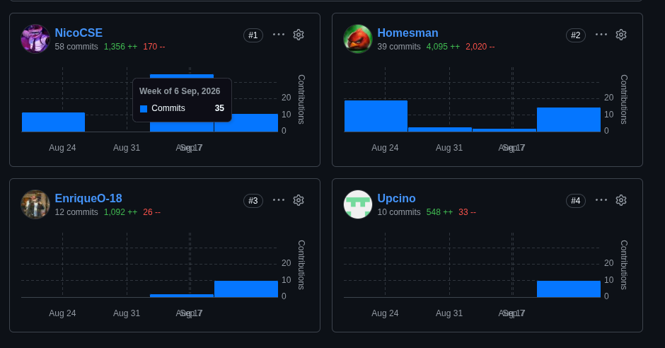
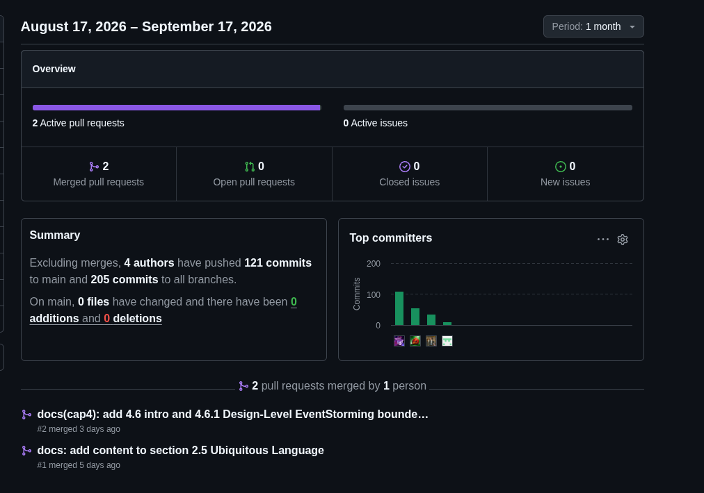

# Project Report Collaboration Insights

El siguiente enlace lleva al URL del repositorio que se encuentra disponible en la organización del equipo: https://github.com/upc-pre-1ASI0730-2620-8155-SoliDevs/project-report

A continuación, se explicará a detalle el desarrollo de actividades para la elaboración del informe, acompañado de capturas de los analíticos de colaboración y los commits hechos en GitHub.

## Avance 1

Para la entrega del avance 1, se procede a mostrar el análisis de colaboración, el cual representa el número de contribuciones realizadas en el repositorio del informe por cada integrante del equipo.

La siguiente imagen representa el resumen de todos los commits realizados en el repositorio a lo largo del periodo comprendido entre el 27 de agosto y el 17 de septiembre: 4 autores, 121 commits a la rama main y 205 commits al total de ramas (incluyendo feature branches), además de 2 pull requests mergeadas.

