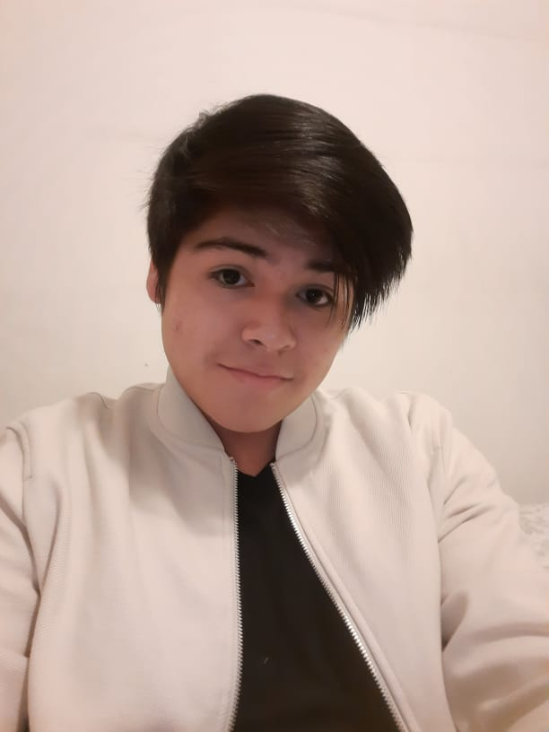
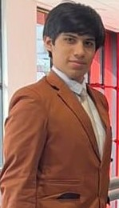
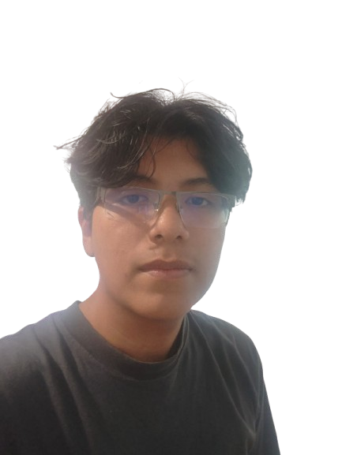

# Capítulo I: Introducción

---

## 1.1. Startup Profile

### 1.1.1. Descripción de la Startup

**SoliDevs** es una startup de base tecnológica conformada por estudiantes de Ingeniería de Software de la Universidad Peruana de Ciencias Aplicadas, dedicada al desarrollo de soluciones digitales orientadas a la mejora de procesos asistenciales en el sector salud. Su primer producto, **Tri-Aid**, es una plataforma web que da soporte al proceso de triaje en hospitales y clínicas: registra a los pacientes, captura automáticamente sus signos vitales desde los instrumentos de medición de datos médicos, clasifica la prioridad de atención y asigna al paciente a la especialidad médica correspondiente, generando alertas inmediatas cuando algún valor se encuentra fuera del rango habitual.

La plataforma ha sido concebida para responder a las necesidades de dos segmentos objetivo que participan del mismo proceso asistencial. Por un lado, el **personal de triaje** de hospitales y clínicas dispone de una experiencia web para registrar pacientes en segundos, visualizar en tiempo real las lecturas de signos vitales provenientes de los instrumentos de medición y priorizar la atención con apoyo de la clasificación automática; de este modo se reducen los errores de transcripción y los tiempos de espera en la puerta de emergencia. Por otro lado, el **paciente** cuenta con mayor transparencia sobre su estado dentro del proceso de triaje, conoce a qué especialidad será derivado y disminuye la necesidad de repetir sus datos en cada punto de atención.

Con un compromiso genuino con la innovación y la salud digital, **SoliDevs** aspira a posicionarse como referente en la digitalización del proceso de triaje en América Latina, contribuyendo a una atención más oportuna, segura y equitativa: cuando los datos vitales fluyen automáticamente del instrumento al sistema, el equipo de salud puede concentrarse en lo más importante, decidir mejor y atender más rápido.

**Misión:**
Mejorar la oportunidad y la seguridad de la atención de emergencia mediante una plataforma que digitalice el triaje, automatice la captura de signos vitales y facilite la asignación correcta de pacientes a las especialidades médicas, reduciendo errores y tiempos de espera en hospitales y clínicas.

**Visión:**
Consolidarse como la plataforma de referencia en triaje asistido por datos dentro del sector salud en Latinoamérica, siendo aliada estratégica de hospitales y clínicas en la transformación digital de sus procesos asistenciales críticos.

### 1.1.2. Perfiles de integrantes del equipo

| Integrante| Código Estudiante| Conocimientos y Habilidades que aporta                                                                                                                                                                                                                                                                                                                                                                                                                             |
|--------------------------------------------------------------------------------------------------|-------------------|--------------------------------------------------------------------------------------------------------------------------------------------------------------------------------------------------------------------------------------------------------------------------------------------------------------------------------------------------------------------------------------------------------------------------------------------------------------------|
|  Mitchell Adriano Alva Ayala                 | U202112423        | Soy Mitchell Alva, estudio Ingenieria de Software en la UPC. Me gusta trabajar de forma ordenada y con atencion al detalle, sobre todo en la parte visual y de datos del proyecto. En Tri-Aid me encargue del diseno de la base de datos mediante diagramas entidad-relacion por bounded context, y de la elaboracion de los wireframes y mockups de la Landing Page y de las aplicaciones web, cuidando que la experiencia fuera consistente para cada uno de los segmentos de usuario definidos. |
|  Nicolas Eduardo Castro Solorza     | U20241D428        | Hola queridos lectores, mi nombre es Nicolas Castro y actualmente soy un estudiante de la carrera de Ingenieria de Software que cursa su sexto ciclo. Me considero como una persona perseverante, bondadoso y dispuesto a cumplir cualquier objetivo que se me proponga. Como miembro de equipo, procuraré en apoyar y guiar de forma positiva a mis demas compañeros para cumplir con las expectativas del curso y progresar como futuros ingenieros de Software. | 
|  Hernan Gabriel Huayta Fuentes *(Team Leader)* | U202320776        | Soy Hernan Huayta, estudio Ingenieria de Software en la UPC. Soy de los que prefiere entender el problema completo antes de escribir una linea de codigo, aunque eso signifique discutir un rato mas en las reuniones. En este proyecto me toco organizar al equipo y llevar el proceso de punta a punta: las entrevistas de needfinding, el modelado del proceso de triaje con Event Storming, la arquitectura del sistema y la redaccion del informe. Tambien mantuve el control de versiones del repositorio, y aprendi que un historial limpio dice tanto del equipo como el propio producto. |
|  Enrique Augusto Ochoa Prado                  | U202411222    | ¡Hola, lectores! Soy Enrique, estudiante de Ingeniería de Software en la UPC y desarrollador full-stack. Hoy mantengo un sistema web en producción, y eso me enseñó que el código no termina cuando compila, sino cuando alguien lo usa sin problemas. En SoliDevs quiero aportar esa mentalidad para que Tri-Aid sea una plataforma confiable y útil para quienes la usan.                                                                                                                                                                                                                                                                                                                                                                                                                                             |
