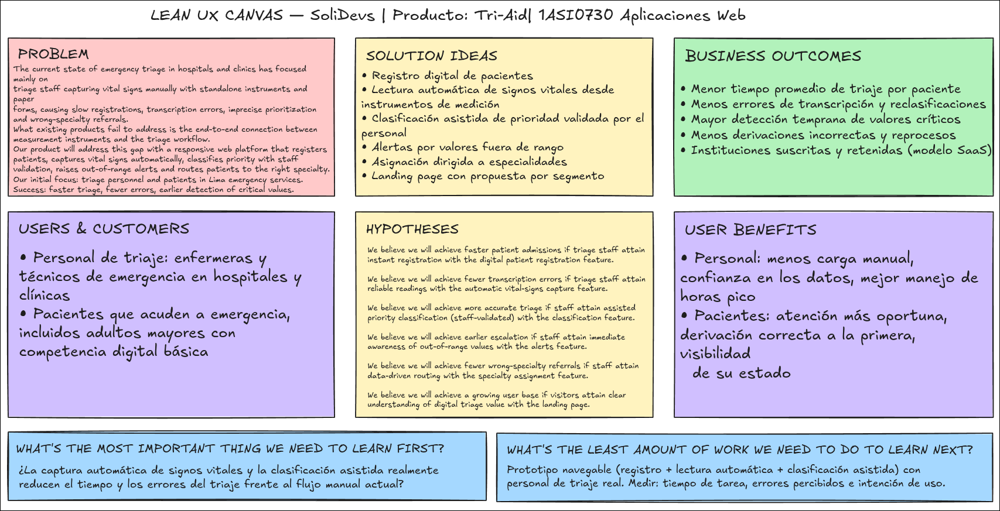

## 1.2. Solution Profile

### 1.2.1. Antecedentes y problemática

#### Antecedentes

El triaje es la puerta de entrada del proceso asistencial de emergencia: en él se decide, a partir de los signos vitales del paciente, qué tan rápido y con qué especialidad debe ser atendido. Sin embargo, en gran parte de hospitales y clínicas del país este proceso se realiza de forma **manual y en papel**: el personal de triaje mide los signos vitales con instrumentos independientes (tensiómetro, oxímetro, termómetro), anota los valores en una ficha física y los transcribe luego al sistema hospitalario. Esta doble digitación consume minutos críticos, introduce errores de transcripción y retrasa la clasificación de prioridad del paciente, especialmente en horas pico, cuando la demanda de emergencia se concentra y la sala de espera se satura.

El costo de este proceso manual no es solo operativo: un valor mal registrado puede derivar en una clasificación de prioridad incorrecta y, con ello, en la asignación del paciente a una especialidad equivocada o en una atención tardía para casos que requerían respuesta inmediata. A ello se suma la experiencia del paciente, que espera sin visibilidad de su estado y debe repetir sus datos en cada punto del proceso.

El contexto tecnológico peruano hace viable cerrar esta brecha. De acuerdo con el Instituto Nacional de Estadística e Informática, al cuarto trimestre de 2024 el **58,4 % de los hogares del país dispone de acceso a Internet**, cifra en crecimiento sostenido (INEI, Informe Técnico de TIC, 2024). Asimismo, el sector salud cuenta con infraestructura nacional de información sanitaria —como el Repositorio Único Nacional de Información en Salud (REUNIS) del MINSA— que evidencia la existencia de datos de producción asistencial digitalizados, así como con marcos normativos de triaje (p. ej., la Norma Técnica de Salud N.° 158-MINSA/DGSP-V.01 para el triaje en emergencias). <!-- TODO: extraer de REUNIS/SUSALUD la cifra de atenciones de emergencia anual más reciente para reforzar este párrafo -->

En este escenario, la brecha no está en la disponibilidad de instrumentos de medición ni en la voluntad del personal, sino en la **desconexión entre los instrumentos que miden los signos vitales y el proceso de triaje**. SoliDevs propone una plataforma web que conecte esa cadena de extremo a extremo: captura automática de lecturas, clasificación asistida de prioridad, alertas tempranas por valores fuera de rango y asignación dirigida a la especialidad correspondiente.

#### Problemática

Para comprender la necesidad del proyecto, se aplicó la técnica de las 5 W's + 2 H's:

**What (¿Cuál es el problema?):**
El proceso de triaje en hospitales y clínicas depende de la medición y el registro manual de signos vitales, lo que genera demoras, errores de transcripción y clasificaciones de prioridad imprecisas, y consecuentemente derivaciones tardías o a especialidades equivocadas.

**When (¿Cuándo ocurre el problema?):**
Ocurre de manera constante en cada atención de emergencia, y se intensifica en horas pico y campañas de demanda alta (temporada de frío, brotes estacionales), cuando el volumen de pacientes desborda la capacidad del registro manual.

**Where (¿Dónde ocurre el problema?):**
En el módulo de triaje de los servicios de emergencia de hospitales y clínicas, tanto públicos como privados, que aún operan con fichas de papel e instrumentos de medición no integrados.

**Who (¿A quiénes afecta el problema?):**
- **Personal de triaje (enfermeras y técnicos):** sobrecargados por la medición y doble digitación de datos, con riesgo de errores en la clasificación de prioridad.
- **Pacientes:** enfrentan largas esperas sin visibilidad de su estado, repiten sus datos en cada punto de atención y pueden ser derivados a la especialidad equivocada.
- **La institución de salud:** asume costos operativos mayores, congestión del servicio y riesgo clínico-legal por fallas de priorización.

**Why (¿Por qué sucede el problema?):**
Porque los instrumentos de medición de datos médicos no están integrados al proceso de triaje: los valores se anotan y transcriben a mano, no existen validaciones automáticas de rangos habituales y la asignación a especialidades depende del criterio y la carga del personal, sin apoyo de datos.

**How (¿Cómo se manifiesta el problema?):**
En colas de espera prolongadas en la puerta de emergencia, fichas físicas ilegibles o incompletas, retrasos para detectar valores críticos (p. ej., saturación o presión peligrosas), pacientes mal derivados que regresan al triaje y sobrecarga del personal en horas pico.

**How Much (¿Cuánto afecta el problema?):**
Cada minuto adicional de triaje retrasa la atención de todos los pacientes en cola. Un error de transcripción puede cambiar el nivel de prioridad de un paciente y convertir una atención inmediata en una espera prolongada, con impacto clínico directo. Para la institución, se traduce en congestión, horas-hombre perdidas en re-procesos y riesgo de complicaciones evitables. <!-- TODO: con la cifra de REUNIS/SUSALUD, dimensionar el volumen anual de atenciones de emergencia afectadas -->

#### Objetivos y restricciones (alcance)

**Objetivos:**
1. Reducir el tiempo de registro y triaje del paciente en la puerta de emergencia mediante el registro digital y la captura automática de signos vitales.
2. Disminuir los errores de transcripción de signos vitales al integrar la lectura directa de los instrumentos de medición con la plataforma.
3. Apoyar la clasificación de prioridad del paciente con una clasificación asistida basada en rangos habituales, mantenida bajo validación del personal de triaje.
4. Generar alertas inmediatas al personal cuando un valor medido se encuentre fuera del rango habitual.
5. Facilitar la asignación del paciente a la especialidad médica correspondiente a partir de la clasificación de triaje.
6. Brindar al paciente mayor visibilidad de su estado dentro del proceso de triaje.

**Restricciones:**
- La plataforma **no** reemplaza el criterio clínico: la clasificación de prioridad es asistida y el personal de triaje siempre valida y confirma el resultado.
- El alcance corresponde al proceso de triaje (registro, captura de signos vitales, clasificación, alertas y derivación a especialidad); no incluye la gestión clínica interna posterior (hospitalización, cirugía, facturación).
- La integración con instrumentos de medición se realiza a través de sus mecanismos de exportación/conectividad disponibles (simulador o servicio de terceros durante el desarrollo académico). <!-- TODO: definir la fuente concreta de lecturas (API de terceros / simulador) -->
- La solución se entrega como aplicación web responsive; la experiencia del paciente es informativa y no sustituye los canales oficiales de emergencia.

### 1.2.2. Lean UX Process

#### 1.2.2.1. Lean UX Problem Statements

**Problem Statement** (versión única para todo el proyecto, aplicando la plantilla *Brand new initiative* de Lean UX, considerando ambos segmentos):

> *The current state of **emergency triage in hospitals and clinics** has focused mainly on **triage nurses and technicians capturing vital signs manually with standalone instruments and paper forms, transcribing values by hand, and assigning patients based on workload and experience**, which produces **slow registrations, transcription errors, delayed or inaccurate priority classification, and misassignments to medical specialties**.*
>
> *What existing products/services fail to address is **the end-to-end connection between medical measurement instruments and the triage workflow: automatic vital-sign capture, assisted priority classification with out-of-range alerts, and data-driven routing of patients to the right specialty, including visibility for the patient**.*
>
> *Our product/service will address this gap by **a responsive web platform that digitally registers patients, captures vital signs automatically from connected measurement instruments, classifies patient priority with validation by triage staff, raises immediate alerts on out-of-range values, and assigns patients to the corresponding medical specialty**.*
>
> *Our initial focus will be **triage personnel and patients in the emergency services of hospitals and clinics in Lima Metropolitan Area**.*
>
> *We'll know we are successful when we see **faster triage registrations, fewer transcription and prioritization errors, out-of-range values detected and attended earlier, and patients routed to the correct specialty on the first pass**.*

#### 1.2.2.2. Lean UX Assumptions

<!-- TODO: validar estos enunciados en la sesión del equipo; son la base de las hypotheses -->

**Business Assumptions**
1. Los hospitales y clínicas privadas de Lima están dispuestos a adoptar una plataforma SaaS que digitalice su proceso de triaje.
2. El modelo de monetización por suscripción anual por módulo de emergencia es viable para las instituciones de salud.
3. La regulación sanitaria permite operar la plataforma como herramienta de soporte al triaje, manteniendo la decisión clínica en el personal de salud.
4. SoliDevs puede implementar la plataforma en una institución piloto durante los primeros meses posteriores al lanzamiento.
5. La integración con instrumentos de medición es el diferenciador competitivo de la solución frente a los sistemas hospitalarios actuales.

**Business Outcome Assumptions**
1. Las instituciones reducirán el tiempo promedio de registro y clasificación por paciente en el módulo de triaje.
2. El número de errores de transcripción de signos vitales disminuirá de forma medible tras la adopción.
3. La institución aumentará la detección temprana de valores críticos (alertas atendidas) mes a mes.
4. La retención anual de instituciones suscritas será alta si los indicadores de triaje mejoran.
5. Reducir derivaciones a especialidad equivocada disminuirá reprocesos y costos operativos del servicio de emergencia.

**User Assumptions**
1. El personal de triaje está compuesto principalmente por enfermeras y técnicos de enfermería con competencia digital intermedia, familiarizados con sistemas hospitalarios.
2. Los pacientes que acuden a emergencia incluyen tanto perfiles digitales (jóvenes y adultos) como perfiles con competencia digital básica (adultos mayores).
3. El personal de triaje usa diariamente dispositivos con navegador web (desktop en el módulo de triaje) durante sus turnos.
4. Los pacientes acceden a la información principalmente desde smartphones Android.
5. Ambos segmentos están dispuestos a usar la plataforma si reduce esperas o esfuerzo, sin requerir capacitación extensa.

**User Outcome and Benefit Assumptions**
1. El personal de triaje quiere clasificar pacientes más rápido y sin errores de digitación para atender más casos por turno.
2. El personal de triaje desea detectar valores críticos de forma inmediata para escalar la atención a tiempo.
3. Los pacientes quieren conocer su estado y la especialidad a la que serán derivados sin preguntar repetidamente.
4. Los pacientes quieren evitar repetir sus datos personales en cada punto de atención.
5. El personal valora contar con un historial de lecturas confiable para sustentar la clasificación de prioridad.

**Feature Assumptions**
1. Un **registro digital de pacientes** (datos de identidad y contacto) agiliza la admisión en triaje.
2. La **lectura automática de signos vitales** desde los instrumentos de medición elimina la transcripción manual y sus errores.
3. La **clasificación asistida de prioridad** (basada en rangos habituales y validada por el personal) mejora la precisión del triaje.
4. Las **alertas inmediatas por valores fuera de rango** permiten escalar casos críticos sin demora.
5. La **asignación dirigida a especialidades** reduce derivaciones incorrectas y reprocesos.
6. Una **landing page con propuestas de valor por segmento** (personal de salud y pacientes) canaliza el interés hacia la plataforma.

Estos enunciados de creencias se combinan en la siguiente sección mediante la plantilla de *hypothesis statements* del Lean UX Canvas ("We believe that [business outcomes] will be achieved if [user] attains [benefit] with [feature]"), generando una hipótesis por cada *feature assumption*.

#### 1.2.2.3. Lean UX Hypothesis Statements

<!-- Regla del enunciado: un hypothesis statement por cada feature assumption (plantilla oficial) -->

**H1 — Patient Registration:**
> We believe we will achieve **faster patient admissions**
> If **triage nurses and technicians**
> Attain **instant registration without manual paperwork**
> With **the digital patient registration feature**.

**H2 — Automatic Vital Signs:**
> We believe we will achieve **fewer transcription errors**
> If **triage nurses and technicians**
> Attain **reliable readings captured directly from measurement instruments**
> With **the automatic vital-signs reading feature**.

**H3 — Assisted Priority Classification:**
> We believe we will achieve **more accurate and consistent priority classification**
> If **triage nurses and technicians**
> Attain **an assisted classification based on habitual ranges that they validate and confirm**
> With **the assisted patient priority classification feature**.

**H4 — Out-of-Range Alerts:**
> We believe we will achieve **earlier detection and escalation of critical patients**
> If **triage nurses and technicians**
> Attain **immediate awareness of out-of-range values**
> With **the real-time out-of-range alerts feature**.

**H5 — Specialty Referral:**
> We believe we will achieve **fewer wrong-specialty referrals and rework in the emergency service**
> If **triage nurses and technicians**
> Attain **data-driven routing of each patient to the corresponding specialty**
> With **the specialty assignment and referral feature**.

**H6 — Landing Page:**
> We believe we will achieve **a growing pipeline of interested institutions and users**
> If **triage staff and patients**
> Attain **a clear understanding of the value of digital triage**
> With **the landing page with segment-specific value propositions and calls-to-action**.

#### 1.2.2.4. Lean UX Canvas

Finalizando el proceso Lean UX se elaboró el **Lean UX Canvas**, que consolida en una sola vista las 8 casillas del método: el problema de negocio (Problem Statement), las ideas de solución derivadas de las feature assumptions, los resultados de negocio esperados, los usuarios y clientes (segmentos objetivo), las hipótesis planteadas, los beneficios de usuario, y las dos preguntas de aprendizaje que guiarán la validación (qué aprender primero y con el mínimo esfuerzo). El canvas fue construido colaborativamente por el equipo y se presenta a continuación; su contenido es insumo directo de los Capítulos III (Product Backlog) y V (Sprints).

*Figura 1. Lean UX Canvas de SoliDevs (elaboración propia). El detalle completo de cada casilla está desarrollado en las secciones 1.2.2.1 a 1.2.2.3 de este capítulo.*
