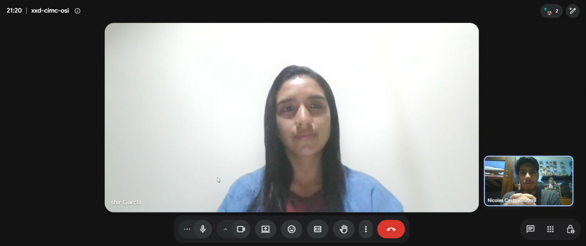
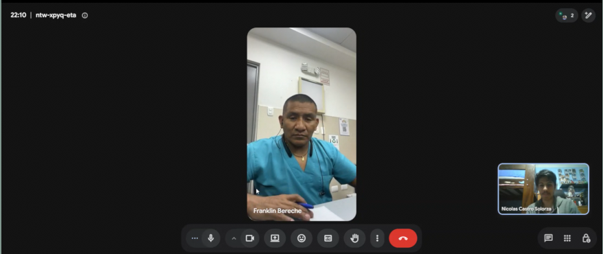
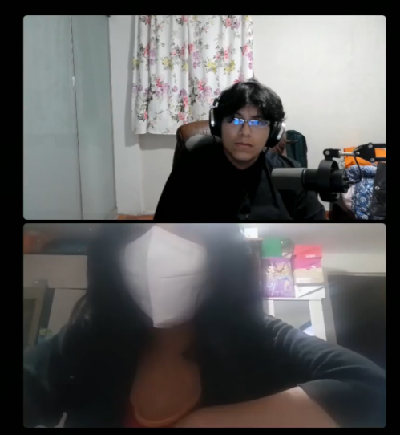
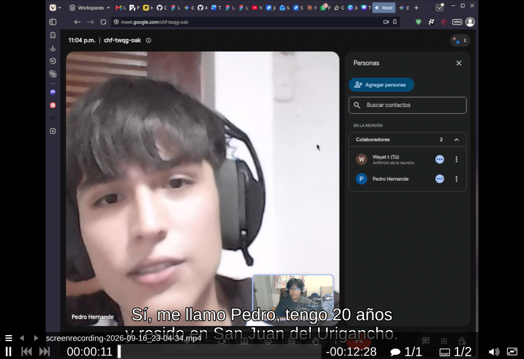
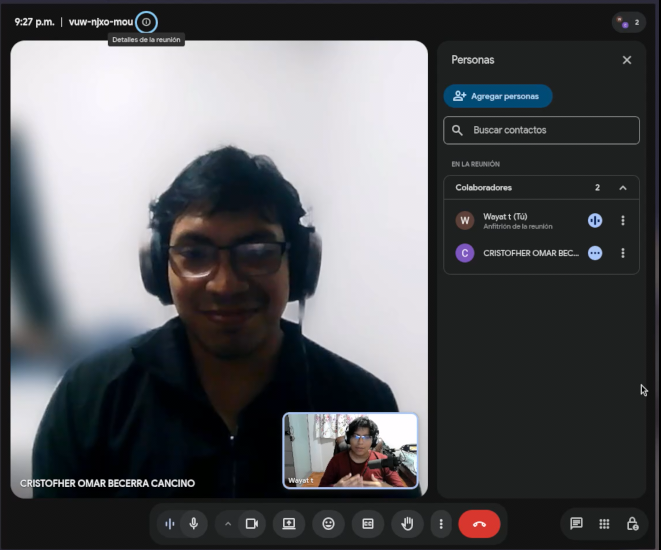
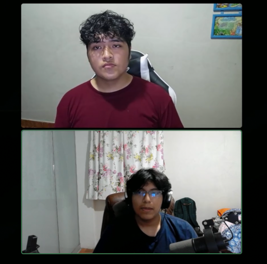

## 2.2. Entrevistas

---

Como técnica de indagación de requerimientos, el equipo aplicó **entrevistas semiestructuradas** a representantes de los dos segmentos objetivo. Para cada segmento se realizaron **3 entrevistas**, grabadas en video (evidencia subida y compartida mediante enlaces) con una duración objetivo de 15 a 20 minutos por sesión. Las entrevistas combinaron preguntas de caracterización (para la construcción posterior de los User Personas) con preguntas de profundización sobre el proceso de triaje y los puntos de dolor identificados en el Lean UX Process del Capítulo I. El diseño que se presenta a continuación fue el aplicado en las entrevistas registradas en la sección 2.2.2.

### 2.2.1. Diseño de entrevistas

---

#### Segmento 1 — Personal de triaje de hospitales y clínicas

**Perfil del entrevistado objetivo:** enfermeras(os) o técnicos de enfermería con experiencia actual o reciente (máximo 2 años) en módulos de triaje o admisión de emergencia de hospitales o clínicas de Lima Metropolitana, de ambos sexos, con niveles de competencia digital variados.

**Ficha de datos demográficos y complementarios (por entrevistado):**

| Categoría | Datos a recolectar |
|---|---|
| Demográficos | Nombres y apellidos, edad, género, distrito de residencia, distrito del centro de trabajo |
| Formación y rol | Profesión/carrera, años de experiencia, años en triaje/emergencia, tipo de institución (pública/privada), turno habitual |
| Personales | Estado civil, composición familiar, personalidad (cómo se describen bajo presión), habilidades destacadas |
| Tecnología | Dispositivos de preferencia (PC, tablet, celular), navegador, apps o sistemas hospitalarios que usa (HIS, SIPES, Excel, papel), dominio tecnológico (básico/intermedio/avanzado) |
| Canales digitales | Canales que usa a diario (WhatsApp, correo, redes sociales, plataformas de capacitación) |
| Marcas e influencias | Instituciones en las que ha trabajado, referentes o protocolos que sigue (NT-158, Manchester, GET), cursos o certificaciones |

**Preguntas principales:**

1. ¿Me puede describir cómo es un día típico en su turno de triaje, desde que llega un paciente hasta que queda asignado a una especialidad?
2. ¿Qué instrumentos utiliza para medir los signos vitales y qué hace con esos valores después de medirlos?
3. ¿Cuánto tiempo le toma, en promedio, completar el triaje de un paciente? ¿Qué parte consume más tiempo?
4. ¿Qué errores ocurren con más frecuencia durante el triaje y cuándo se detectan?
5. Cuéntenos de una ocasión en la que el triaje se retrasó o algo salió mal. ¿Qué pasó y cómo lo resolvieron?
6. ¿Cómo deciden (usted o el sistema) a qué especialidad se deriva a un paciente? ¿Qué pasa cuando la derivación fue incorrecta?
7. ¿Qué sistemas informáticos usa hoy en el triaje y qué es lo que más le molesta o le falta?
8. Si los signos vitales llegaran automáticamente al sistema desde los instrumentos, ¿qué cambiaría en su trabajo? ¿Qué se lo haría confiar o desconfiar de esa lectura automática?
9. ¿Qué información le gustaría ver en pantalla para decidir la prioridad de un paciente con más confianza?
10. ¿Qué le haría adoptar (o rechazar) una nueva herramienta digital de triaje en su servicio?

**Preguntas complementarias:**

- ¿Trabaja con fichas de papel, con un sistema, o con ambos? ¿Por qué?
- ¿En horas pico, qué es lo primero que se sacrifica: velocidad, detalle del registro o precisión?
- ¿Ha recibido capacitación formal en escalas de triaje (NT-158, Manchester, ESI)? ¿Cuál usa su servicio?
- ¿Qué haría si el sistema le alerta que un valor está fuera de rango y usted no está de acuerdo con la alerta?
- ¿Cómo se entera de que un paciente que usted clasificó ya fue atendido? ¿Esa información le llega de vuelta?
- Si un colega suyo quisiera aprender a usar Tri-Aid, ¿qué debería tener la herramienta para aprenderla en una mañana?

#### Segmento 2 — Pacientes que acuden a emergencia

**Perfil del entrevistado objetivo:** personas adultas (18 a 70 años, con énfasis en adultos mayores) que hayan pasado por un proceso de triaje o admisión de emergencia en los últimos 12 meses en Lima Metropolitana, de ambos sexos y niveles de competencia digital variados (incluyendo usuarios que dependen de familiares para lo digital).

**Ficha de datos demográficos y complementarios (por entrevistado):**

| Categoría | Datos a recolectar |
|---|---|
| Demográficos | Nombres y apellidos, edad, género, distrito de residencia, estado civil, composición familiar |
| Ocupación | Ocupación actual, horario/tipo de trabajo, quién lo acompañó en su última visita a emergencia |
| Personales | Personalidad (paciente/impaciente, cómo maneja esperas), habilidades, marcas o instituciones de salud que conoce (EsSalud, clínicas, postas) |
| Tecnología | Dispositivos de preferencia, navegador o apps que usa (WhatsApp, Yape, banca), quién le ayuda con lo digital si no maneja, dominio tecnológico |
| Canales digitales | Canales donde consulta información de salud (Google, WhatsApp, llamadas, redes) |
| Salud | Condición crónica (si desea compartir), frecuencia de visitas a emergencia en el último año |

**Preguntas principales:**

1. Cuéntenos la última vez que fue (o llevaron) a una emergencia: ¿qué pasó desde que llegó hasta que lo atendieron?
2. ¿Cuánto tiempo esperó en el triaje o antes de ser atendido? ¿Qué hizo durante esa espera?
3. ¿Le tomaron los signos vitales? ¿Le dijeron qué significaban esos valores o qué prioridad tenía?
4. ¿Le explicaron a qué especialidad lo derivaban? ¿Alguna vez sintió que lo mandaron al especialista equivocado?
5. ¿Tuvo que repetir sus datos (nombre, DNI, historia) más de una vez en la misma visita? ¿Cómo se sintió?
6. ¿Qué información le gustaría tener mientras espera (su turno, su prioridad, a quién le toca)?
7. Si una app le mostrara el estado de su triaje y a qué especialidad va, ¿la usaría? ¿Qué necesitaría que tuviera?
8. ¿Alguna vez un valor de sus signos vitales ("está crítico", "presión alta") lo alarmó o no le dijeron nada? ¿Qué pasó?
9. ¿Qué diferencias nota entre atenderse en una clínica privada y en un hospital público en el triaje?
10. ¿Qué haría que una visita a emergencia se sienta "bien atendida" aunque la espera sea larga?

**Preguntas complementarias:**

- ¿Prefiere que su familiar pueda ver su estado en el celular o que solo usted lo sepa?
- ¿Ha usado alguna vez una app de salud (cita, telemedicina, farmacia)? ¿Qué le pareció?
- Si tuviera que elegir: ¿prioriza que lo atiendan rápido o que lo atienda el especialista correcto aunque demore más?
- ¿Le generaría confianza que el sistema "lea" automáticamente sus signos vitales del aparato, o prefiere que la enfermera los confirme?
- ¿Qué es lo primero que pregunta un familiar cuando lo acompañan a emergencia?

<!-- Diseño de entrevistas aplicado en el TB1: 3 entrevistas por segmento registradas en 2.2.2. -->

### 2.2.2. Registro de entrevistas

---

#### Segmento 1: Personal de triaje de hospitales y clínicas

**Entrevista 1 — García, Shirley (31 años, San Isidro)**

Licenciada en enfermería, coordinadora y jefa del departamento de enfermería de una clínica privada. Describió el flujo actual: el paciente pasa por admisión donde se verifican sus datos, luego a triaje donde se le toman los signos vitales con tensiómetro, termómetro y pulsoxímetro (glucómetro en casos de emergencia), se evalúan los valores y se deriva a la especialidad correspondiente. El triaje demora entre 5 y 10 minutos en la toma de signos más 10 minutos de evaluación, y afirmó que **lo que más tiempo consume es el registro de los datos**. Indicó que los errores ocurren cuando hay alta demanda de pacientes y se mezclan los roles ("siempre tiene que ser el triaje licenciado o médico"), detectándose durante la revisión del triaje. La derivación se decide con el motivo de consulta, los signos y los síntomas; si es incorrecta, el médico la corrige mediante interconsulta. Su clínica cuenta con un sistema institucional propio que considera completo (historia clínica, interconsultas, notas de enfermería), aunque utiliza fichas físicas de triaje de forma paralela, generando doble registro. Manifestó que la captura automática de signos vitales reduciría la digitación manual y ahorraría tiempo, y que confiaría en las lecturas si son precisas y si puede visualizar en pantalla los signos vitales, antecedentes, alergias, nivel de prioridad y anamnesia del paciente. Adoptaría una herramienta que sea rápida, segura, confiable e intuitiva, y la rechazaría si es complicada. Usa laptops y PCs con Windows, navegador Chrome, además de Drive, Word y Excel. Recibió capacitación formal en escalas de triaje y puede consultar posteriormente el progreso de los pacientes que clasificó a través del sistema.

*URL del video:* [https://shorturl.at/yuHTA](https://shorturl.at/yuHTA)

**Entrevista 2 — Bereche, Franklin (44 años, Piura)**

Licenciado en enfermería del Hospital Cayetano Heredia de Piura. Describió el flujo de triaje de su servicio: al paciente se le revisan los síntomas y las funciones vitales (frecuencia respiratoria, temperatura, frecuencia cardíaca y presión arterial, tomadas con termómetro, pulsoxímetro —algunos empotrados—, tensiómetro y estetoscopio) y, de acuerdo a ellos, se deriva al tópico de cirugía o de medicina, resolviendo en el propio triaje aquella sintomatología que el médico puede manejar. Los valores obtenidos determinan la gravedad y la prioridad (ejemplificó un cuadro hipertensivo de 210/120 mmHg). El triaje demora alrededor de 5 minutos y afirmó que **lo que más tiempo consume es la entrevista al paciente sobre la sintomatología que trae**. Señaló que los errores frecuentes ocurren porque el paciente refiere síntomas que no presenta o da información inadecuada, detectándose recién cuando la especialidad receptora reevalúa el caso y lo traslada al área correspondiente (ej. una presunta apendicitis derivada a cirugía que los análisis auxiliares descartan y pasa a medicina). La derivación se decide según si el problema se resuelve con un procedimiento quirúrgico o con manejo médico. Reportó el uso de sistemas institucionales (SICCAM en INSA y un sistema ESI en EsSalud) que permiten registrar síntomas, solicitar camas por servicio y alertan los valores fuera de límites —en tiempo real en el primero y solo al guardar en el segundo—, aunque criticó que **la digitación en pantalla resta atención al paciente y que esos segundos son importantes en la atención**. Consideró que la captura automática de signos vitales haría la recolección más ágil y confiaría en las lecturas como confía en un monitor: corroborando manualmente el signo alterado y repitiendo la toma. Indicó que en pantalla no pueden faltar la saturación, la presión arterial, la frecuencia cardíaca, la temperatura, la frecuencia respiratoria y el trazado electrocardiográfico. Adoptaría una herramienta útil y confiable —"que los errores sean cero"— y la rechazaría si sus lecturas son inconsistentes. Complementariamente, su institución aún realiza registros manuales (balance hídrico); en horas pico sacrifica el detalle del registro porque la precisión es la prioridad. Usa celular (Apple/Samsung) con escalas clínicas instaladas (Glasgow, evaluación pupilar), no posee laptop ni computadora, prefiere Windows y navega con Chrome. En el mismo sistema institucional verifica después si el paciente permaneció en el servicio asignado, validando así su valoración inicial. Pidió que una futura herramienta sea **intuitiva de aprender en una sola mañana, ligera para el celular y con una interfaz amigable que permita diferenciar rápidamente los parámetros**.

*URL del video:* [https://shorturl.at/wfoRD](https://shorturl.at/wfoRD)

**Entrevista 3 — Rojas, Camila (25 años, Lima)**

Licenciada en enfermería con 2 años de experiencia, el último en triaje de un hospital público de Lima. Describió el flujo: el paciente llega a admisión donde se verifican sus datos y pasa a triaje, donde se toman los signos vitales (tensiómetro, termómetro y pulsoxímetro; glucómetro si el paciente se ve mal) y se entrevista sobre los síntomas para priorizar y derivar a medicina, cirugía u otra especialidad. El triaje demora entre 5 y 10 minutos y afirmó que **lo que más tiempo consume es la entrevista y el registro**, pues debe digitar todo manualmente y en ocasiones el paciente no sabe explicar bien qué le pasa. Los errores frecuentes son la sub-clasificación por una mala descripción de síntomas y los errores de digitación con alta demanda, detectándose cuando el médico evalúa o alguien revisa el registro. Relató una noche con muchos pacientes simultáneos en la que avisó a su jefa, se repartieron los pacientes y se priorizó a los graves explicando la espera a los leves. La derivación la decide ella con los síntomas y signos vitales, consultando al médico ante dudas; una derivación incorrecta se corrige con interconsulta al área correcta. Su hospital usa un sistema clínico (historia, interconsultas, notas de enfermería), pero criticó que **digitar todo a mano le quita tiempo de mirada al paciente**. Consideró que la captura automática de signos vitales agilizaría el proceso y confiaría si el equipo está calibrado y los valores coinciden con el paciente —ante algo raro, remediría a mano—. En pantalla querría signos vitales, antecedentes, alergias, motivo de consulta, nivel de prioridad y alertas visibles en rojo. Adoptaría una herramienta rápida, confiable y fácil de usar; la rechazaría si es complicada o lenta. Usa la PC del triaje (Windows) y Chrome, y en su celular Android consulta escalas clínicas (Glasgow). En horas pico sacrifica el detalle del registro, nunca la precisión, y verifica en el sistema si sus pacientes llegaron a la especialidad asignada.

*URL del video:* [https://shorturl.at/Q3FHj](https://shorturl.at/Q3FHj)

#### Segmento 2: Pacientes que acuden a emergencia

**Entrevista 1 — Hernández, Pedro (20 años, San Juan de Lurigancho)**

Repartidor en motocicleta que acudió a emergencias tras un accidente de tránsito mientras trabajaba. Fue trasladado por un vecino en auto (no llegó ambulancia) y, con el brazo lastimado, tuvo que llenar él mismo la ficha de admisión en papel. Esperó alrededor de 40 minutos para la evaluación de triaje. Durante la espera nadie lo informó sobre el avance de su atención; acudió dos veces a la ventanilla y solo le indicaron esperar. Recibió un número de prioridad sin explicación de su significado, y su turno fue llamado a voces — estuvo a punto de perderlo porque se había quedado dormido. Relató que el dolor, la incertidumbre y la hora tardía lo llevaron a considerar retirarse sin ser atendido. Al alta recibió la receta en papel y la placa de la radiografía; extravió la receta una semana después y tuvo que solicitarla nuevamente para comprar los antibióticos. Uso de tecnología: celular Samsung A54 (Android), WhatsApp, Yape, Plin, TikTok e Instagram a diario; trámites por Chrome; prefirió una web sin instalar aplicaciones. Declaró que habría usado un enlace del hospital para consultar el tiempo restante de su turno y su comprobante digital, y que desconfiaría si la plataforma se cae, comparte sus datos o exige registros complicados. Si pudiera cambiar una sola cosa: **"que te informen... con solo ver mi turno en el celular todo habría sido distinto"**.

*URL del video:* [https://shorturl.at/om88z](https://shorturl.at/om88z)

**Entrevista 2 — Becerra, Cristofer (21 años, San Martín de Porres)**

Estudiante universitario que acudió a emergencias hace cuatro años por una apendicitis: tras días de mala alimentación empezó con dolor abdominal, y por la insistencia de su abuela acudió al hospital con sus padres. El registro demoró alrededor de una hora, la consulta médica otra hora, y luego **esperó cerca de seis horas sentado para ingresar a cirugía** mientras el dolor aumentaba. Durante la espera nadie lo informó del avance —el médico se acercó una sola vez a indicarle que esperara— y su turno llegó recién a las 3:30 de la madrugada, cuando le entregaron la bata de operación. No consideró retirarse ni acudir a una clínica privada. Nunca ha utilizado una aplicación o sistema de salud que muestre el estado de la atención. Señaló que una herramienta que muestre el proceso le habría dado tranquilidad (“yo no sabía nada, si estaba bien, si estaba empeorando o mejorando”). Su principal desconfianza frente a una app de este tipo es la **filtración de datos personales** (DNI, celular, correo). Si pudiera cambiar un solo aspecto: la información al paciente —“me dejaron a la deriva durante seis horas; si los doctores hubieran venido a decirme cómo estaba, la experiencia habría sido distinta”.

*URL del video:* [https://shorturl.at/c7JVf](https://shorturl.at/c7JVf)

**Entrevista 3 — Ramos Quispe, Luis Ángel (29 años, San Martín de Porres)**

Técnico de instalación de gas doméstico, conviviente y padre de una hija de 3 años. Un domingo, jugando vóley en la loza deportiva del barrio, saltó a bloquear en la red y cayó pisando el pie de otro jugador: se torció el tobillo derecho (esguince grave grado II) y sus amigos lo llevaron en mototaxi al Hospital Cayetano Heredia. En admisión le tomaron los datos y le dieron una ficha con un número escrito a mano; esperó **cerca de tres horas** con el tobillo hinchado, acercándose dos veces a la ventanilla sin obtener información. En el triaje le tomaron los signos vitales pero no le explicaron su nivel ni su significado. Además, **fue derivado primero a Medicina de Emergencia por error** —la doctora lo reenvió a Traumatología—, perdiendo media hora adicional. Tuvo que repetir sus datos tres veces en la misma visita (admisión, triaje y farmacia). Recibió venda elástica y receta de antiinflamatorios; sin seguro, pagó la atención de su bolsillo y estuvo 10 días sin trabajar. Uso de tecnología: Samsung J7 de gama baja, WhatsApp y Yape; prefiere un enlace web sin registros complicados y solicita que su pareja pueda ver su avance desde su propio celular. Dijo que el familiar siempre pregunta primero “¿cuánto falta?”, que prioriza al especialista correcto aunque demore más (“rápido pero al tonto, no”), y que confiaría en la lectura automática de los dispositivos si la enfermera confirma al final. Si pudiera cambiar un solo aspecto: **que te informen** —“la noche entera a ciegas, sin saber si tu caso es grave, cuánto falta ni a dónde te mandan, eso es lo que uno no olvida”.

*URL del video:* [https://shorturl.at/ZTYG7](https://shorturl.at/ZTYG7)
