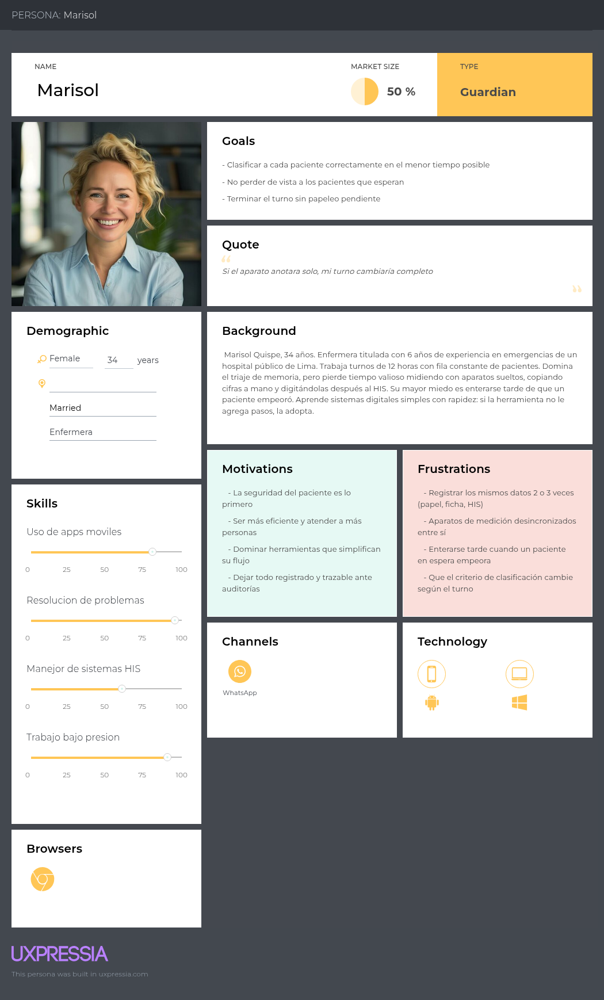
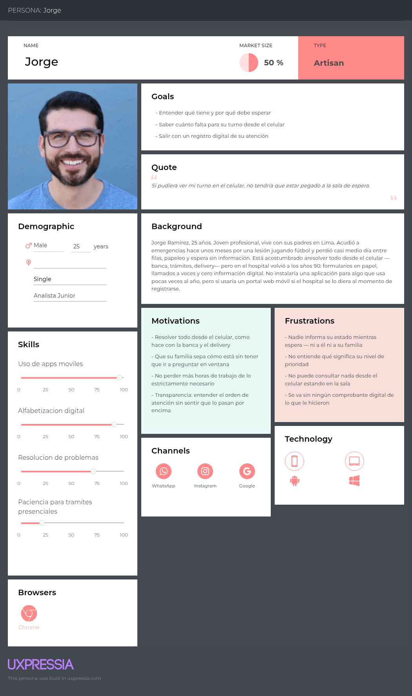
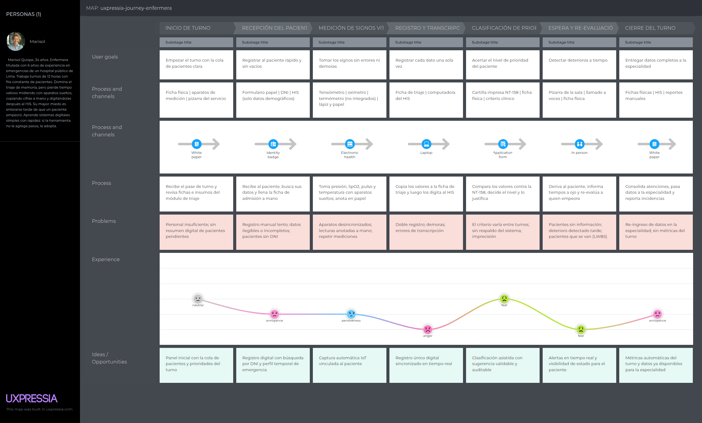
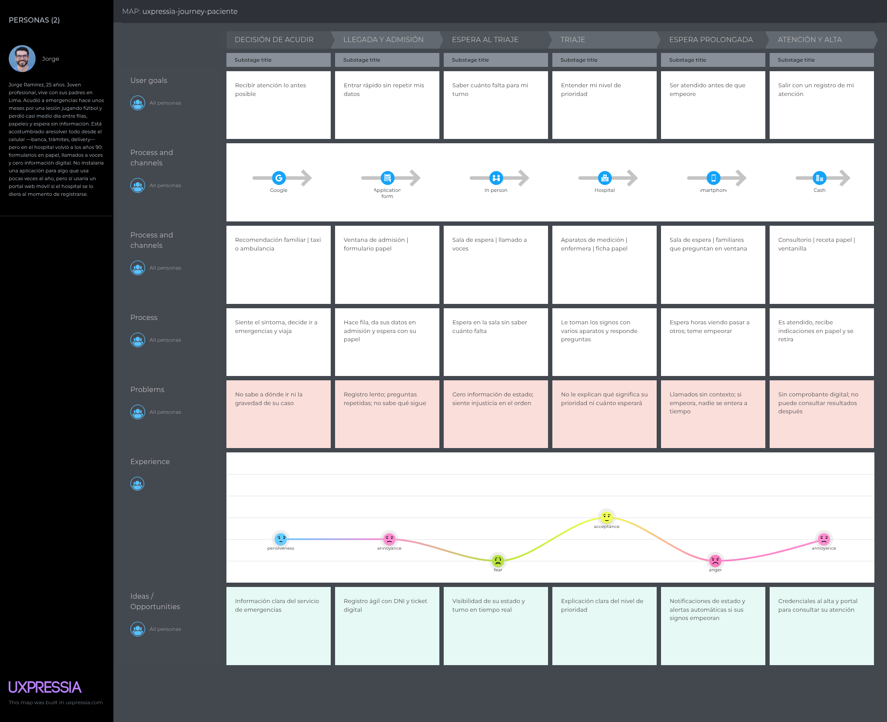
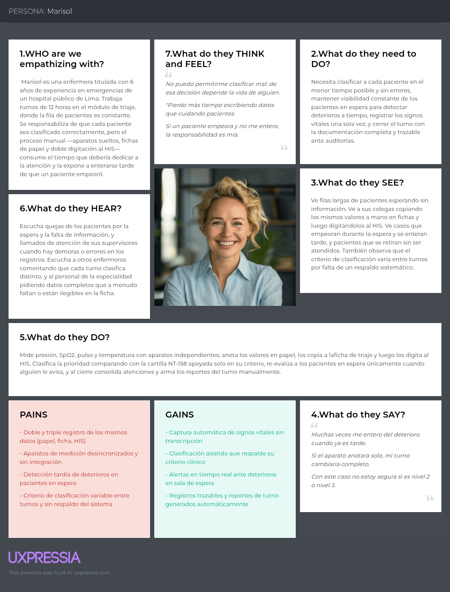
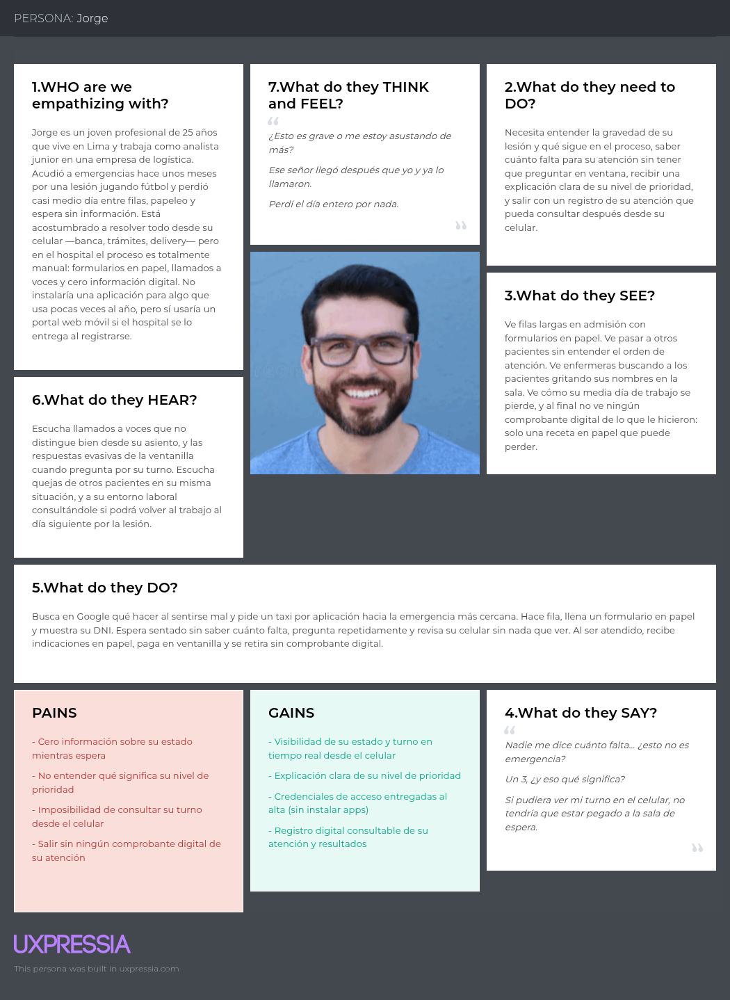
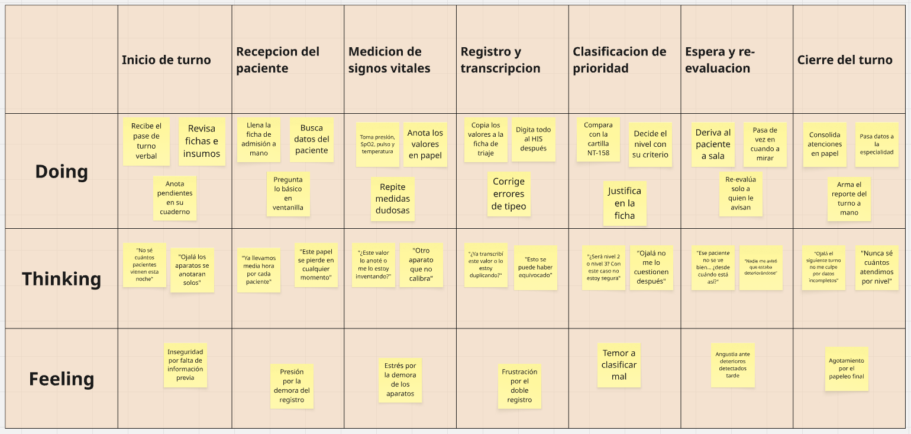
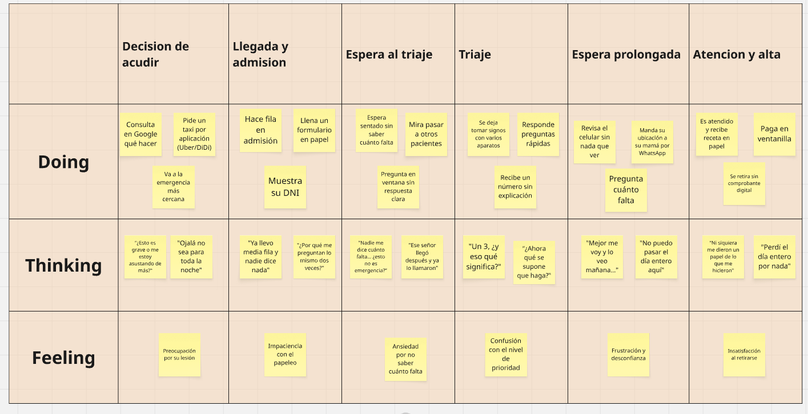

## 2.3. Needfinding

En esta sección, el equipo presenta los artefactos resultantes del análisis de la información recolectada en las entrevistas realizadas a ambos segmentos objetivos y del análisis competitivo. Estos artefactos nos permitieron comprender en profundidad el contexto, las necesidades y las frustraciones de los usuarios del proceso de triaje en emergencias. A continuación, se detallan los User Personas, el User Task Matrix, los User Journey Maps, los Empathy Maps y los As-Is Scenario Maps.

---

### 2.3.1. User Personas

---

Para representar a los usuarios de Tri-Aid se elaboraron dos User Personas, una por cada segmento objetivo, utilizando la plataforma **UXPressia**. Estas personas sintetizan las características demográficas, habilidades, metas, motivaciones y frustraciones observadas en el proceso de triaje y en la experiencia del paciente dentro de emergencias.

#### Segmento 1: Personal de triaje de hospitales y clínicas

   

**Marisol Quispe, 34 años.** Enfermera titulada con 6 años de experiencia en emergencias de un hospital público de Lima. Trabaja turnos de 12 horas con fila constante de pacientes. Domina el triaje de memoria, pero pierde tiempo valioso midiendo con aparatos sueltos, copiando cifras a mano y digitándolas después al HIS. Su mayor miedo es enterarse tarde de que un paciente empeoró. Aprende sistemas digitales simples con rapidez: si la herramienta no le agrega pasos, la adopta.

- **Metas:** clasificar a cada paciente correctamente en el menor tiempo posible; no perder de vista a los pacientes que esperan; terminar el turno sin papeleo pendiente.
- **Motivaciones:** la seguridad del paciente es innegociable; sentirse eficiente atendiendo a más personas en menos tiempo; dominar herramientas que simplifican su flujo; que su trabajo quede registrado y trazable ante auditorías.
- **Frustraciones:** doble y triple registro de los mismos datos (papel, ficha, HIS); aparatos de medición desincronizados entre sí; enterarse tarde de que un paciente en espera deterioró; que el criterio de clasificación varíe según el turno.
- **Canales y tecnología:** WhatsApp y llamadas telefónicas; Chrome en su celular Android; Windows en la PC del HIS.
- **Cita:** *"Si el aparato anotara solo, mi turno cambiaría completo."*

#### Segmento 2: Pacientes que acuden a hospitales y clínicas

   

**Jorge Ramírez, 25 años.** Joven profesional que vive con sus padres en Lima. Acudió a emergencias hace unos meses por una lesión jugando fútbol y perdió casi medio día entre filas, papeleo y espera sin información. Está acostumbrado a resolver todo desde el celular —banca, trámites, delivery— pero en el hospital el proceso es totalmente manual: formularios en papel, llamados a voces y cero información digital. No instalaría una aplicación para algo que usa pocas veces al año, pero sí usaría un portal web móvil si el hospital se lo entrega al registrarse.

- **Metas:** entender qué tiene y por qué espera; saber cuánto falta para su turno desde el celular; salir con un registro digital de su atención.
- **Motivaciones:** resolver todo desde el celular, como hace con la banca y el delivery; no perder más horas de trabajo de lo estrictamente necesario; transparencia para entender el orden de atención.
- **Frustraciones:** nadie informa su estado mientras espera; no entiende qué significa su nivel de prioridad; no puede consultar nada desde el celular estando en la sala; se va sin ningún comprobante digital.
- **Canales y tecnología:** WhatsApp, Instagram y Google; nativo digital, prefiere la web móvil y evita instalar aplicaciones nuevas.
- **Cita:** *"Si pudiera ver mi turno en el celular, no tendría que estar pegado a la sala de espera."*

### 2.3.2. User Task Matrix

---

La siguiente matriz concentra las tareas que los User Persona realizan para cumplir sus objetivos durante el proceso de triaje, independientemente de la existencia de la solución de software. Se considera como columna cada User Persona y, como sub-columnas, la Frecuencia y la Importancia de cada tarea:

| Tareas (Tasks) | Marisol Quispe (Personal de triaje) - Frecuencia | Marisol Quispe (Personal de triaje) - Importancia | Jorge Ramírez (Paciente) - Frecuencia | Jorge Ramírez (Paciente) - Importancia |
|---|---|---|---|---|
| Registrar al paciente en admisión | Muy alta | Muy alta | Alta | Alta |
| Medir los signos vitales | Muy alta | Muy alta | N/A | N/A |
| Transcribir los valores al HIS | Muy alta | Alta | N/A | N/A |
| Clasificar la prioridad de atención | Muy alta | Muy alta | N/A | N/A |
| Esperar información sobre su estado | Muy alta | Alta | Muy alta | Muy alta |
| Re-evaluar pacientes en espera | Media | Muy alta | N/A | N/A |
| Derivar al paciente a la especialidad | Muy alta | Muy alta | N/A | N/A |
| Llamar al paciente para su atención | Muy alta | Media | Alta | Muy alta |
| Consultar el estado de su atención | Alta | Media | Alta | Muy alta |
| Consultar los resultados de su atención | N/A | N/A | Media | Alta |

Como se puede observar en la matriz, existe una coincidencia crítica en la tarea de esperar información sobre el estado de atención: es la única que ambos segmentos realizan con alta frecuencia e importancia, y hoy se cumple sin ninguna herramienta de por medio. Para el personal de triaje, las tareas de mayor frecuencia e importancia son el registro, la medición, la clasificación y la derivación, todas manuales y consecutivas; mientras que para el paciente las tareas centrales son esperar, ser llamado y consultar su estado. La principal diferencia radica en que las tareas del personal son operativas y consecutivas entre sí (un retraso arrastra a todo el flujo), mientras que las del paciente son pasivas y dependen por completo de la información que recibe.

### 2.3.3. Journey Mapping

---

Se elaboró un Customer Journey Map por segmento en **UXPressia**, documentando las etapas del recorrido, los objetivos, los canales utilizados, las emociones experimentadas, los problemas encontrados y las oportunidades de mejora. Ambos journey maps describen el proceso actual (AS-IS) y evidencian los dolores que Tri-Aid resuelve.

#### Journey Map — Personal de triaje

   

El recorrido del personal de triaje abarca siete etapas: inicio de turno, recepción del paciente, medición de signos vitales, registro y transcripción, clasificación de prioridad, espera y re-evaluación, y cierre del turno. La curva de emociones se mantiene baja durante casi todo el recorrido: la recepción genera presión por la fila que espera, la medición produce estrés por la demora de los aparatos, el registro y la transcripción generan frustración por el doble registro, la clasificación genera inseguridad ante casos límite, y la espera genera angustia ante deterioros detectados tarde. El turno concluye con agotamiento por el papeleo final, sin métricas que permitan evaluar el desempeño.

#### Journey Map — Paciente

   

El recorrido del paciente abarca seis etapas: decisión de acudir, llegada y admisión, espera al triaje, triaje, espera prolongada y atención y alta. La única elevación de la curva emocional ocurre durante el triaje, cuando el paciente percibe que será evaluado; sin embargo, esta mejoría es efímera: al regresar a la sala de espera sin información sobre su estado, su estado emocional cae nuevamente hacia la frustración y la desconfianza. Finalmente, el paciente se retira insatisfecho, sin un comprobante digital que documente su atención.

### 2.3.4. Empathy Mapping

---

Para la construcción de los Empathy Maps, el equipo colocó a cada User Persona en el centro del análisis y respondió las preguntas clave del artefacto a partir de las observaciones obtenidas en las entrevistas y en el modelado del proceso de triaje: ¿qué dolores enfrenta a diario?, ¿cuál es su objetivo principal?, ¿qué herramientas utiliza y qué le gustaría cambiar?, ¿qué dice, ve, oye y hace durante el proceso? A partir de estas respuestas, el equipo identificó con claridad los mayores dolores (Pains) de cada segmento, ligados al registro manual, la falta de información durante la espera y la detección tardía de deterioros, así como sus principales ganancias (Gains), enfocadas en la captura automática de signos vitales, la visibilidad del estado de atención en tiempo real y la trazabilidad de los registros.

#### User Persona 1: Marisol Quispe

   

#### User Persona 2: Jorge Ramírez

   

### 2.3.5. As-Is Scenario Mapping

---

A continuación, se presentan los As-Is Scenario Maps de nuestros arquetipos. Estos artefactos nos permiten desglosar detalladamente las acciones, los pensamientos y las emociones que experimenta cada usuario en su contexto actual, etapa por etapa del proceso de triaje. Este análisis nos ofrece una base sólida para identificar los puntos críticos del proceso y diseñar posteriormente los flujos de interacción de nuestra solución.

En el escenario actual, el paciente llega a emergencias y es registrado en papel; la enfermera mide sus signos vitales con aparatos independientes, los transcribe al HIS y clasifica la prioridad con la NT-158 apoyada solo en su criterio; el paciente espera sin información, es re-evaluado manualmente, derivado por criterio de cupos y, al ser atendido, sus datos se ingresan nuevamente en la especialidad. De este escenario se identifican los dolores que motivan el Big Picture Event Storming (sección 2.4): datos clínicos solo en papel, dispositivos no integrados, errores de transcripción, doble registro, prioridad imprecisa, espera sin información, deterioros detectados tarde, derivaciones erróneas y re-ingreso de datos.

#### User Persona 1: Marisol Quispe

   

El escenario actual de la enfermera de triaje evidencia una doble carga: por un lado, ejecuta manualmente todas las tareas clínicas y administrativas (medir con aparatos sueltos, anotar en papel, transcribir al HIS, clasificar con su criterio); por otro, carga con la incertidumbre de trabajar sobre datos en papel. Sus pensamientos reflejan esta inseguridad y sus emociones oscilan entre la presión por la fila, la frustración por el doble registro, el temor a clasificar mal y el agotamiento del cierre del turno.

#### User Persona 2: Jorge Ramírez

   

El escenario actual del paciente muestra el contraste entre sus costumbres digitales fuera del hospital (buscar información, pedir un taxi por aplicación) y la experiencia totalmente manual y presencial que encuentra al ingresar. Sus pensamientos evidencian la falta de información durante la espera y la desconfianza en el orden de atención, mientras que sus emociones transitan de la preocupación inicial hacia la ansiedad, la frustración y la insatisfacción final al retirarse sin ningún registro de su atención.
