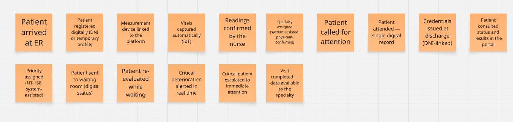
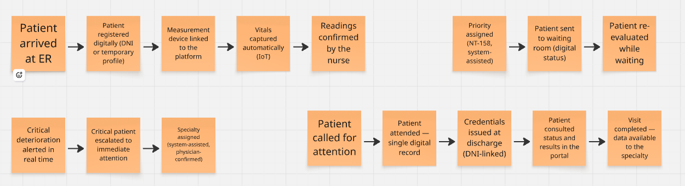
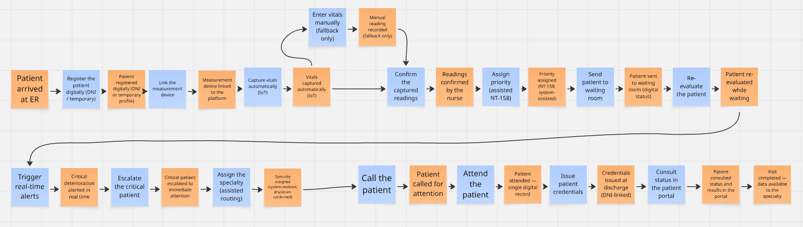
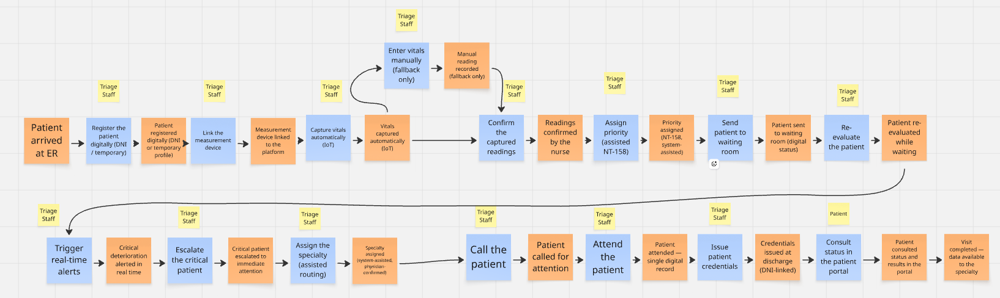
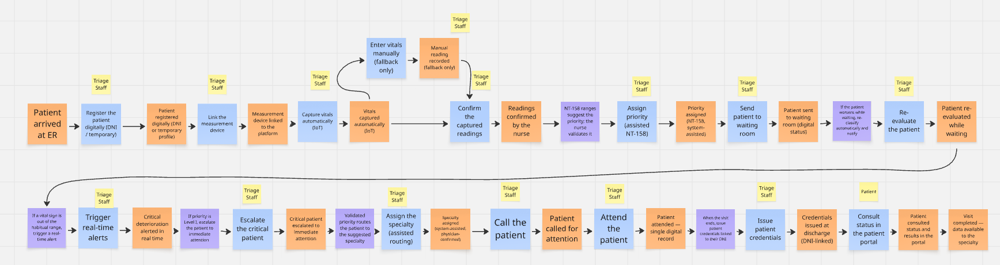

### 2.4. Big Picture Event Storming

En esta sección se presenta el Big Picture Event Storming desarrollado para modelar el dominio del **proceso de triaje en emergencias hospitalarias asistido por IoT**, sobre el cual se desarrolla Tri-Aid. Mediante una sesión colaborativa, el equipo identificó los principales Domain Events del negocio, los organizó cronológicamente e incorporó los Commands, Actors y Business Policies que intervienen en cada flujo. El modelado fue realizado utilizando la plataforma **Miro**, construyendo el tablero paso a paso conforme a la técnica de Event Storming: primero los hechos del negocio, luego su secuencia temporal, después las acciones que los provocan, los responsables de ejecutarlas y, finalmente, las reglas que gobiernan el comportamiento del sistema. Con el fin de brindar una mejor visualización del proceso de modelado, el tablero desarrollado en Miro se encuentra disponible en el siguiente enlace: <!-- TODO: enlace público al board de Miro -->

#### Paso 1: Identificación de Domain Events

   

En esta primera etapa se realizó una lluvia de ideas para identificar los Domain Events del proceso de triaje. Los eventos fueron refinados para conservar únicamente hechos relevantes del negocio, redactados en tiempo pasado y representados mediante notas adhesivas de color naranja. Como resultado se identificaron dieciséis Domain Events, desde el ingreso del paciente ("Patient arrived at ER") hasta el cierre de la visita ("Visit completed — data available to the specialty"), pasando por el registro digital, la vinculación del dispositivo de medición, la captura automática de signos vitales por IoT, la clasificación de prioridad asistida, la generación de alertas en tiempo real, la emisión de credenciales al alta y la consulta del estado por parte del paciente en el portal.

#### Paso 2: Organización cronológica de los Domain Events

   

Una vez identificados los Domain Events, estos fueron organizados cronológicamente en dos filas de acuerdo con el comportamiento natural del proceso asistencial. De esta organización se derivan cuatro fases: la admisión y captura automática de signos vitales, el triaje asistido y la espera con re-evaluación, la generación de alertas y la derivación a la especialidad, y finalmente la atención, el alta con entrega de credenciales y la consulta del paciente en el portal. Asimismo, se modelaron las bifurcaciones lógicas del proceso: ante un empeoramiento durante la espera, el flujo se dirige hacia la generación de alertas y la escalación del paciente; en caso contrario, avanza directamente hacia la asignación de la especialidad.

#### Paso 3: Incorporación de Commands

   

En esta etapa se incorporaron los Commands, representados mediante notas adhesivas de color azul. Cada Command representa una decisión o acción del negocio que da origen a un Domain Event, permitiendo modelar las acciones que impulsan el proceso de triaje. Destaca la incorporación del command "Enter vitals manually (fallback only)", que modela la excepción del negocio: si un dispositivo de medición falla, el personal puede registrar las lecturas manualmente, generando el evento "Manual readings recorded (fallback only)". Este camino alternativo se representa fuera de la línea principal del proceso, ya que solo ocurre ante un fallo de la captura automática, y evidencia que el flujo normal del sistema nunca depende del tipeo manual de datos.

#### Paso 4: Incorporación de Actors

   

Posteriormente, se identificaron los actores que intervienen en la ejecución de los Commands del negocio, representados mediante notas adhesivas de color amarillo y ubicados junto a los commands correspondientes. De acuerdo con los segmentos objetivos definidos para Tri-Aid, se identificaron dos actores principales: el **personal de triaje (Triage Staff)**, responsable de registrar al paciente, vincular los dispositivos, confirmar las lecturas, validar la prioridad, re-evaluar a los pacientes en espera y emitir las credenciales al alta; y el **paciente (Patient)**, quien interactúa únicamente a través del portal para consultar su estado y resultados. De esta forma se modela que el paciente nunca se registra por sí mismo en el sistema: la cuenta y las credenciales son siempre creadas y entregadas por el personal de triaje.

#### Paso 5: Incorporación de Business Policies

   

Finalmente, se incorporaron las Business Policies, representadas mediante notas adhesivas de color morado. Estas políticas describen las reglas del negocio que establecen cuándo un Domain Event desencadena la ejecución de un nuevo Command, conectando procesos distintos del dominio. Entre las principales se encuentran: la sugerencia de prioridad según los rangos de la norma técnica NT-158, la cual es siempre validada por la enfermera antes de asignarse; la generación automática de alertas en tiempo real ante valores fuera del rango habitual; la escalación inmediata de pacientes con prioridad de Nivel I; la re-clasificación automática cuando un paciente empeora durante la espera; el enrutamiento hacia la especialidad sugerida una vez validada la prioridad; y la emisión de credenciales vinculadas al DNI al finalizar la atención. Con estas políticas, el modelo queda completo y establece la base para la definición del lenguaje ubicuo y las user stories del producto.
