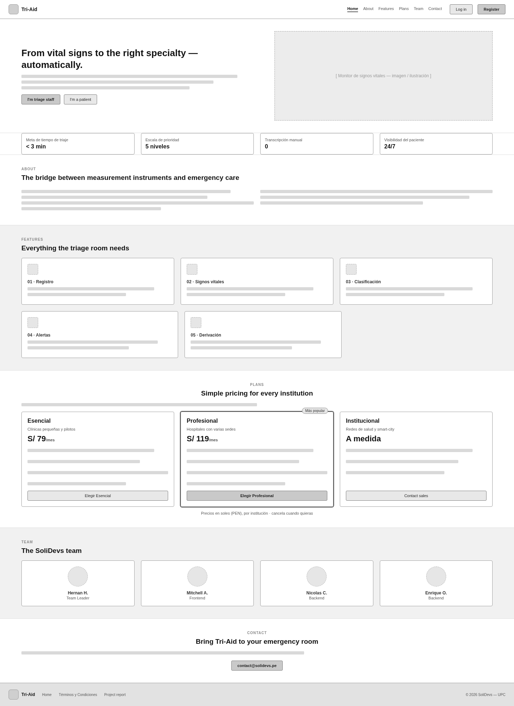
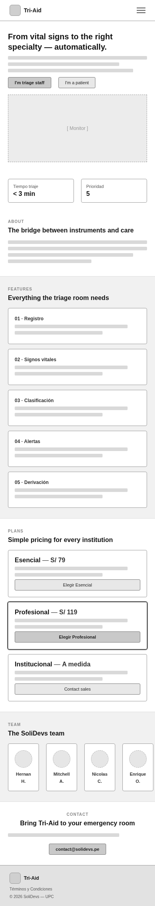
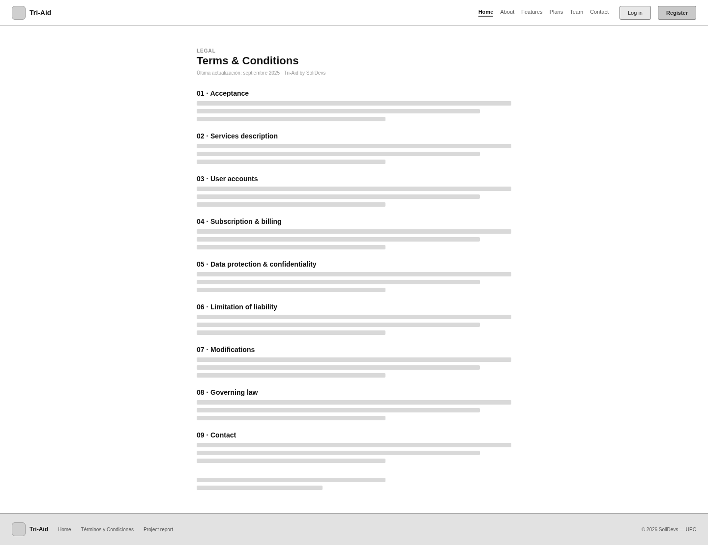
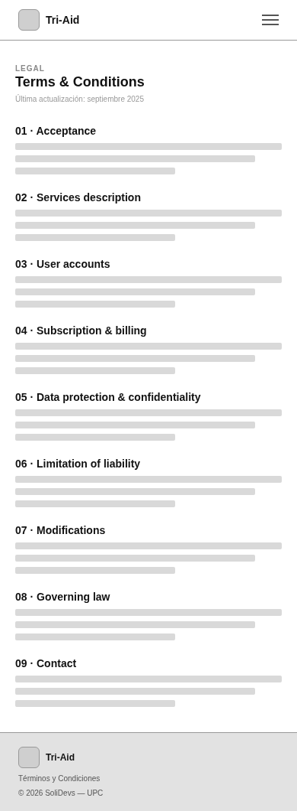
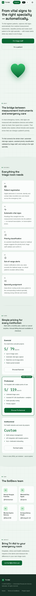
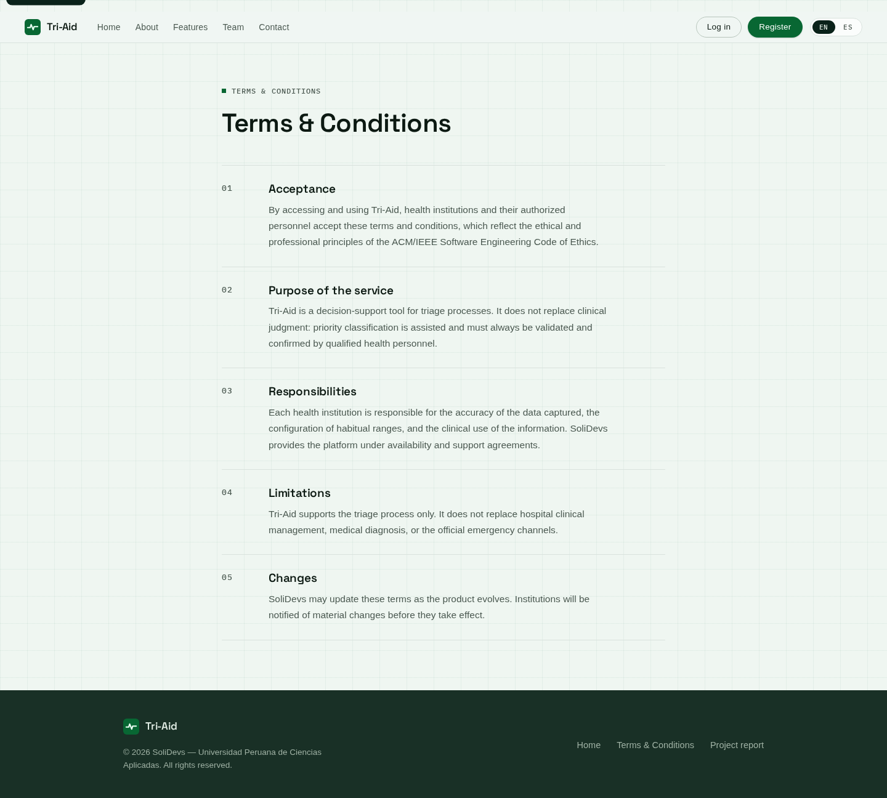
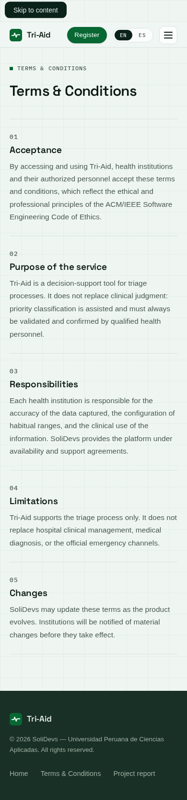

## 4.3. Landing Page UI Design

---
El planteamiento del diseño de interfaz de usuario para nuestra Landing Page se considerará como un tema fundamental para el proyecto debido a que es una primera impresión hacia los usuarios del cómo se vizualizará y objetivos presentará.  Gracias a esto, nos permitira obtener la informacion necesaria para causar una gran impresión y mayor interés en la navegación de la página.

### 4.3.1. Landing Page Wireframe

**Web Browser Wireframe**

Wireframe estructural de la Landing Page en vista Desktop. Al tratarse de un boceto de baja fidelidad, se representa en escala de grises para centrar el análisis en la jerarquía de contenido y en la retícula: navegación fija, héroe con propuesta de valor, métricas del producto, sección About, funcionalidades, flujo de trabajo, planes de suscripción, equipo y contacto.

  

<i>Landing Page — Wireframe (Desktop Browser)</i>

**Mobile Browser Wireframe**

Versión móvil del wireframe, con navegación colapsada en menú hamburguesa y apilamiento vertical de secciones para pantallas de 390 px.

  

<i>Landing Page — Wireframe (Mobile Browser)</i>

**Términos y Condiciones — Wireframe**

  

<i>Términos y Condiciones — Wireframe (Desktop Browser)</i>

  

<i>Términos y Condiciones — Wireframe (Mobile Browser)</i>

### 4.3.2. Landing Page Mock-up

**Web Browser Mock-Up**

Mock-up de alta fidelidad con el sistema visual de Tri-Aid (papel con retícula de 44 px, tinta verde profunda y acento ECG). Incluye la nueva sección de planes de suscripción (Esencial, Profesional e Institucional), cuyos llamados a la acción redirigen al flujo de contratación del bounded context de Suscripciones.

  

<i>Landing Page — Mock-up (Desktop Browser)</i>

**Mobile Browser Mock-Up**

  

<i>Landing Page — Mock-up (Mobile Browser)</i>

**Términos y Condiciones — Mock-up**

  

<i>Términos y Condiciones — Mock-up (Desktop Browser)</i>

  

<i>Términos y Condiciones — Mock-up (Mobile Browser)</i>

