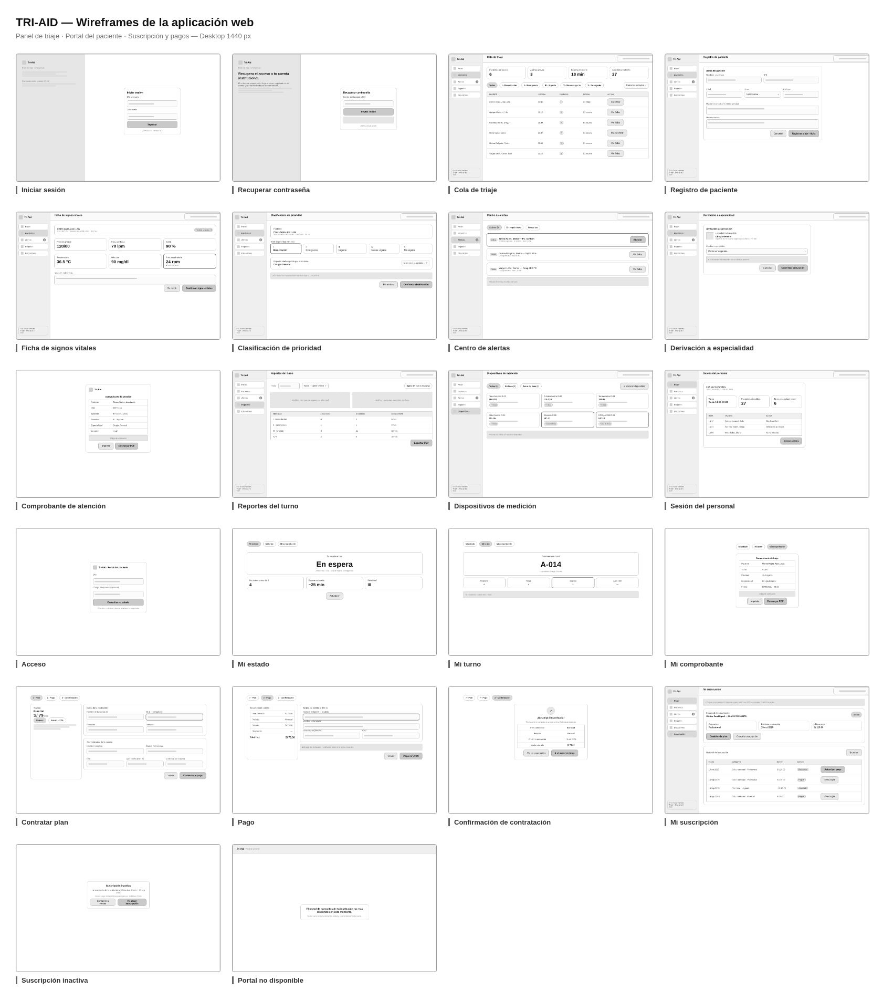
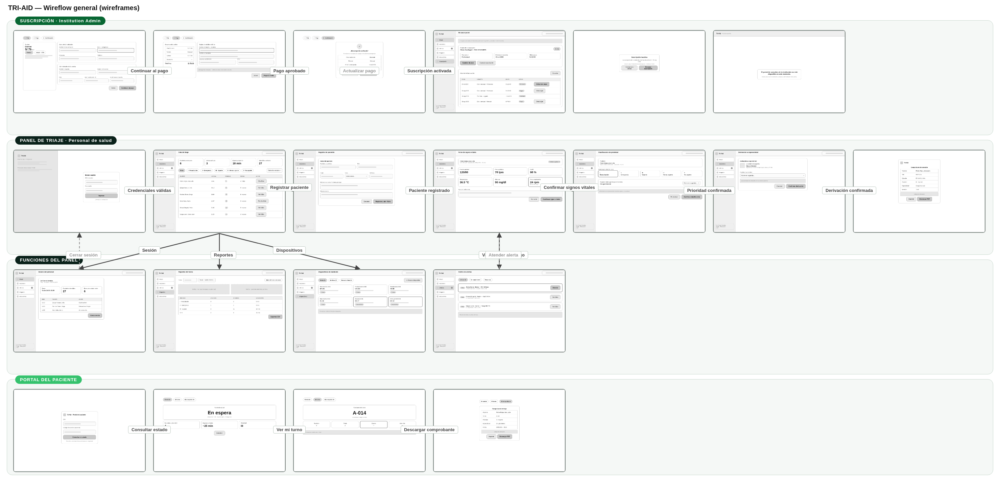
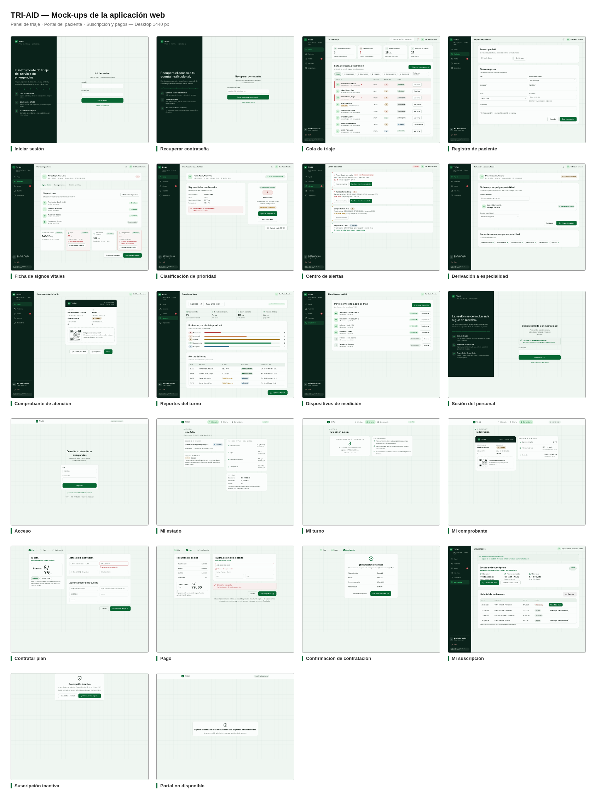
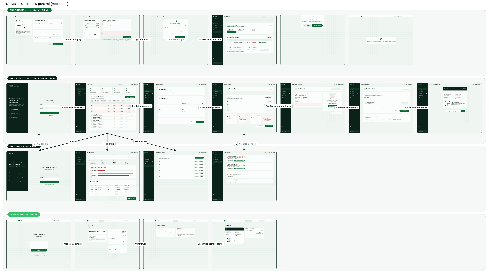

## 4.4. Web Applications UX/UI Design

---

El diseño UX/UI de la aplicación web de Tri-Aid se centra en dar soporte al proceso de triaje hospitalario: registrar pacientes, capturar signos vitales, clasificar la prioridad y derivar al paciente a la especialidad correcta. Desde la perspectiva UX se prioriza la reducción de pasos por paciente y la visibilidad inmediata de alertas; desde la perspectiva UI se emplea un sistema visual propio (papel con retícula de 44 px, tinta verde profunda y acento ECG) sobre componentes limpios y accesibles. A continuación se presentan los wireframes (versión estructural en blanco y negro), el wireflow general, los mock-ups de alta fidelidad y los user flows de los objetivos de usuario principales.

### 4.4.1. Web Applications Wireframes

Los wireframes en blanco y negro definen la estructura de cada pantalla sin la interferencia del estilo visual final, permitiendo validar la organización de la información y los flujos de navegación.

  

<i>Tablero de wireframes — Panel de triaje · Portal del paciente · Suscripción y pagos · Desktop 1440 px</i>

### 4.4.2. Web Applications Wireflow Diagrams

El wireflow general de Tri-Aid conecta las 22 pantallas del producto mediante flechas de navegación etiquetadas con los disparadores de cada transición. El recorrido principal del personal de salud va del inicio de sesión a la cola de triaje y de ahí a la cadena registro → signos vitales → clasificación → derivación → comprobante; los valores fuera de rango ramifican hacia el centro de alertas, mientras que reportes, dispositivos y sesión cuelgan del menú lateral. En paralelo, el paciente consulta su estado desde el portal y el Institution Admin gestiona la suscripción, con flujos alternativos punteados para el pago rechazado y la suscripción inactiva.

  

<i>Wireflow general — wireframes conectados por flujo de navegación (Suscripción · Panel · Portal)</i>

### 4.4.3. Web Applications Mock-ups

Los mock-ups aplican el sistema visual definitivo sobre la estructura validada en los wireframes: tipografía Space Grotesk + IBM Plex Mono, verde profundo institucional y acento ECG para los elementos vivos del monitor.

  

<i>Tablero de mock-ups — Panel de triaje · Portal del paciente · Suscripción y pagos · Desktop 1440 px</i>

### 4.4.4. Web Applications User Flow Diagrams

El user flow general consolida los objetivos de usuario principales sobre el flujo completo con mock-ups, incluyendo el happy path y los flujos alternativos (valores fuera de rango, pago rechazado, suscripción inactiva):

  

<i>User Flow general — mock-ups conectados por objetivos de usuario</i>

**User Goals cubiertos:**

1. **Atender a un paciente desde su llegada** (Iniciar sesión → Cola de triaje → Registro → Ficha de signos vitales → Clasificación → Derivación → Comprobante). Flujos incluidos: registro de paciente nuevo o existente, valor fuera de rango → alerta (Centro de alertas) → atención, re-clasificación durante la espera.
2. **Gestionar la suscripción institucional** (Contratar plan → Pago → Confirmación de contratación → Mi suscripción). Flujos incluidos: contratación desde la landing, pago rechazado → actualizar método de pago, cambio de plan con prorrateo, cancelación con confirmación.
3. **Consultar el estado de la atención como paciente** (Acceso → Mi estado → Mi turno → Mi comprobante). Flujos incluidos: consulta por DNI, estado y turno, descarga del comprobante; institución con plan inactivo → mensaje institucional (Portal no disponible).
