## 4.4. Web Applications UX/UI Design

Los wireframes, mockups, wireflows y user flows presentados a continuacion fueron elaborados en **Figma** y pueden visualizarse en el siguiente enlace: https://shorturl.at/MMsBu
---

El diseño UX/UI de la aplicación web de Tri-Aid se centra en dar soporte al proceso de triaje hospitalario: registrar pacientes, capturar signos vitales, clasificar la prioridad y derivar al paciente a la especialidad correcta. Desde la perspectiva UX se prioriza la reducción de pasos por paciente y la visibilidad inmediata de alertas; desde la perspectiva UI se emplea un sistema visual propio (papel con retícula de 44 px, tinta verde profunda y acento ECG) sobre componentes limpios y accesibles. A continuación se presentan los wireframes (versión estructural en blanco y negro), el wireflow general, los mock-ups de alta fidelidad y los user flows de los objetivos de usuario principales.

### 4.4.1. Web Applications Wireframes

Los wireframes en blanco y negro definen la estructura de cada pantalla sin la interferencia del estilo visual final, permitiendo validar la organización de la información y los flujos de navegación.

  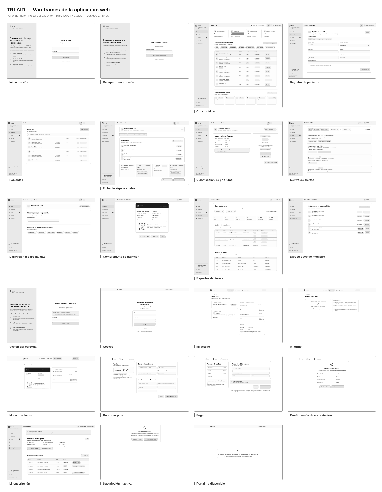

<i>Tablero de wireframes — Panel de triaje · Portal del paciente · Suscripción y pagos · Desktop 1440 px</i>

### 4.4.2. Web Applications Wireflow Diagrams

Los wireflows se organizan **por objetivo de usuario (user goal)**: cada diagrama conecta las pantallas de un objetivo mediante flechas de navegación etiquetadas con los disparadores de cada transición. Las flechas punteadas representan flujos alternativos (pago pendiente de actualización, suscripción vencida, cierre de sesión, atención de una alerta).

  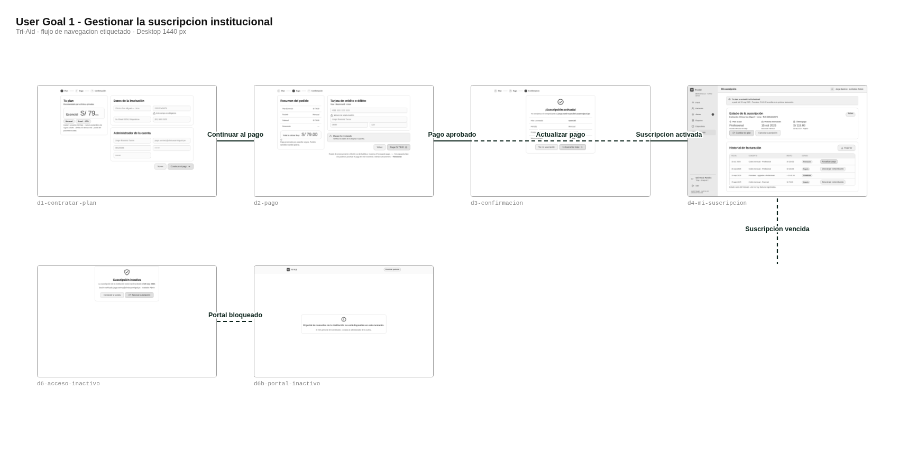

<i>Wireflow User Goal 1 — Gestionar la suscripción institucional</i>

  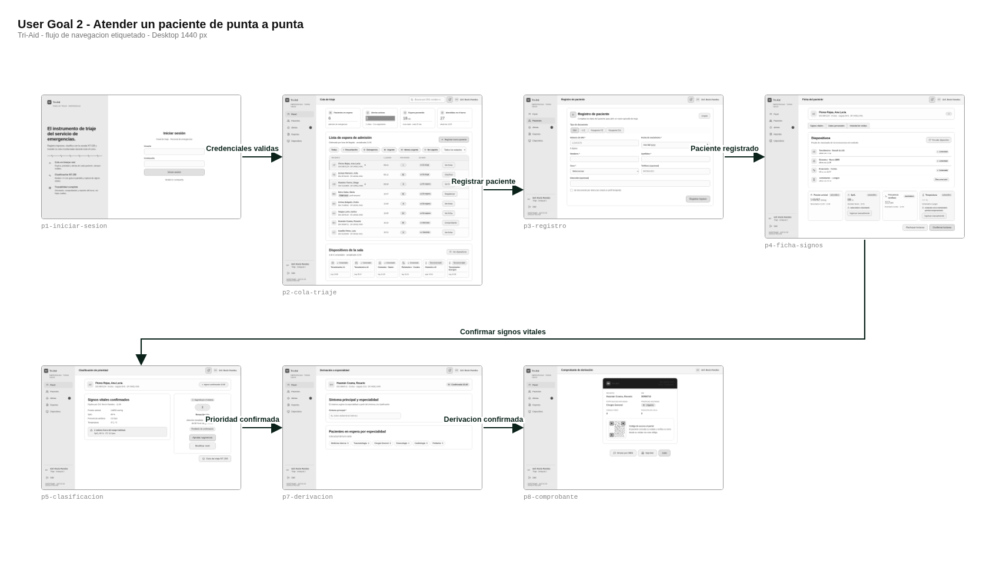

<i>Wireflow User Goal 2 — Atender un paciente de punta a punta</i>

  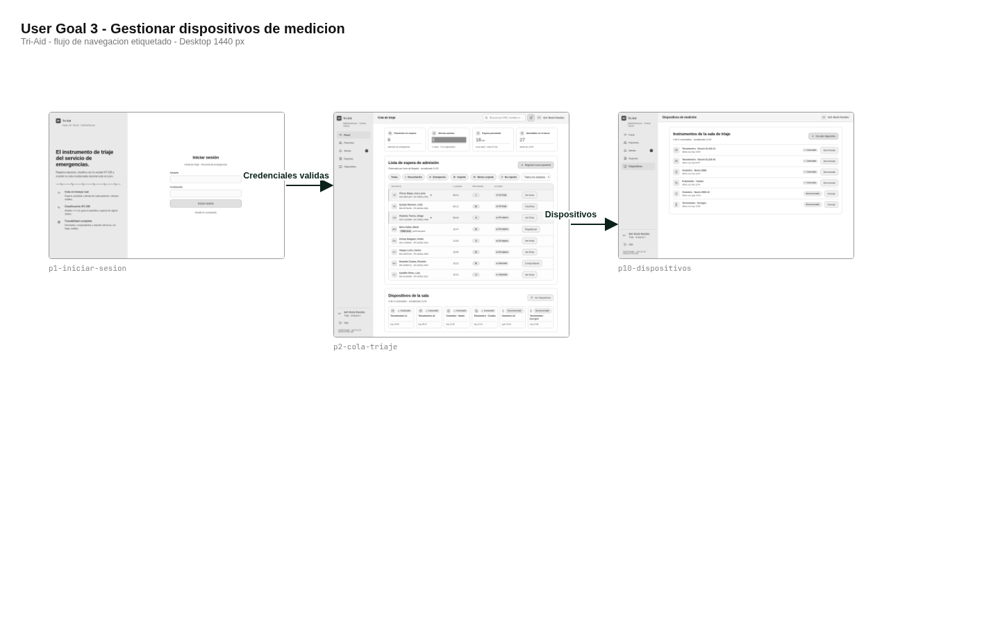

<i>Wireflow User Goal 3 — Gestionar dispositivos de medición</i>

  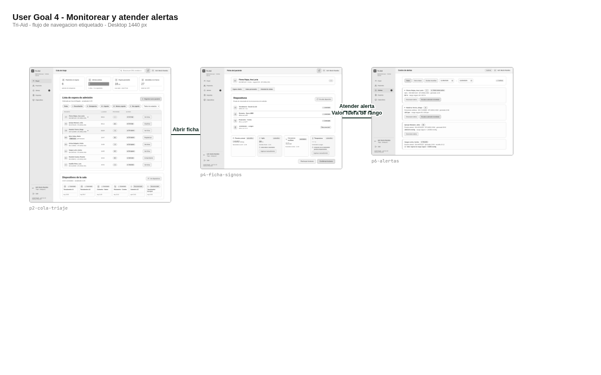

<i>Wireflow User Goal 4 — Monitorear y atender alertas</i>

  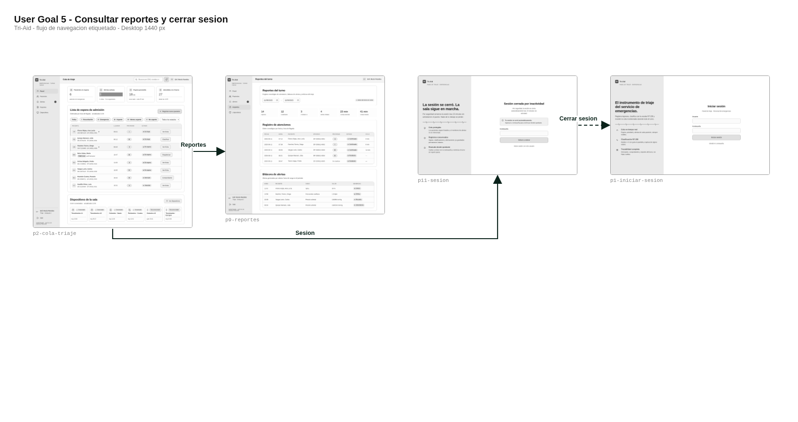

<i>Wireflow User Goal 5 — Consultar reportes y cerrar sesión</i>

  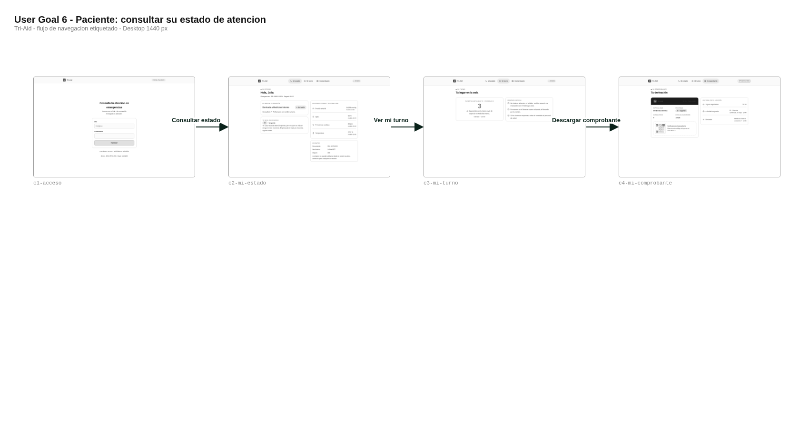

<i>Wireflow User Goal 6 — Paciente: consultar su estado de atención</i>

### 4.4.3. Web Applications Mock-ups

Los mock-ups aplican el sistema visual definitivo sobre la estructura validada en los wireframes: tipografía Space Grotesk + IBM Plex Mono, verde profundo institucional y acento ECG para los elementos vivos del monitor.

  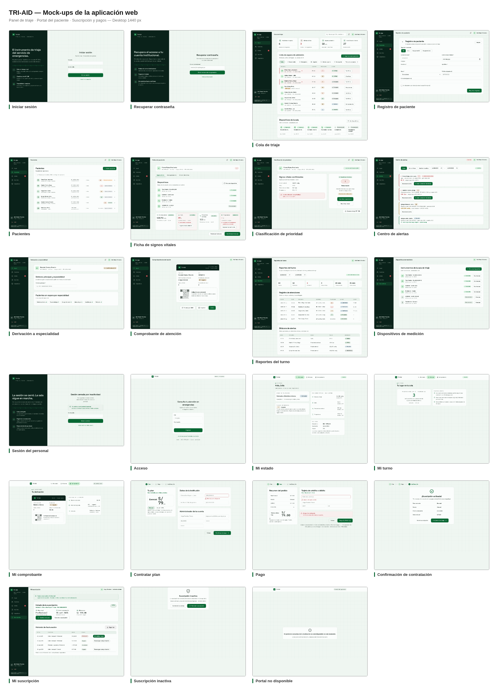

<i>Tablero de mock-ups — Panel de triaje · Portal del paciente · Suscripción y pagos · Desktop 1440 px</i>

### 4.4.4. Web Applications User Flow Diagrams

Cada objetivo de usuario se documenta con su **user flow en mock-ups de alta fidelidad**, incluyendo el happy path y los flujos alternativos (valores fuera de rango, pago pendiente, suscripción inactiva):

  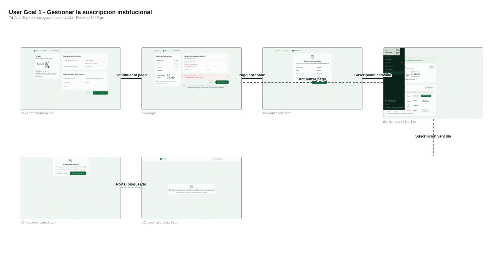

<i>User Flow User Goal 1 — Gestionar la suscripción institucional</i>

  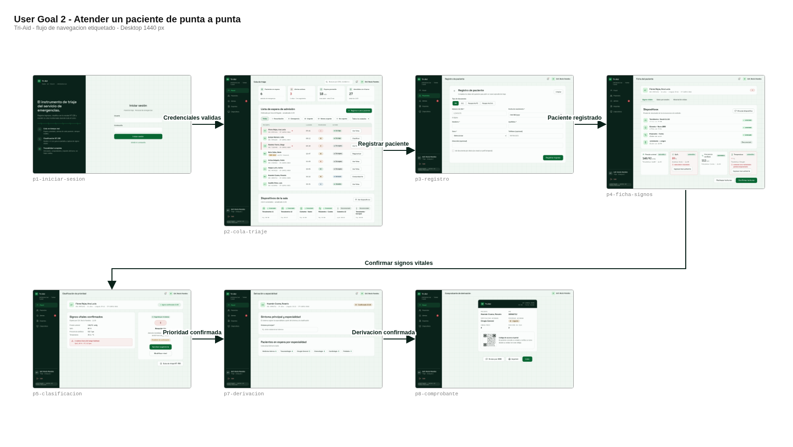

<i>User Flow User Goal 2 — Atender un paciente de punta a punta</i>

  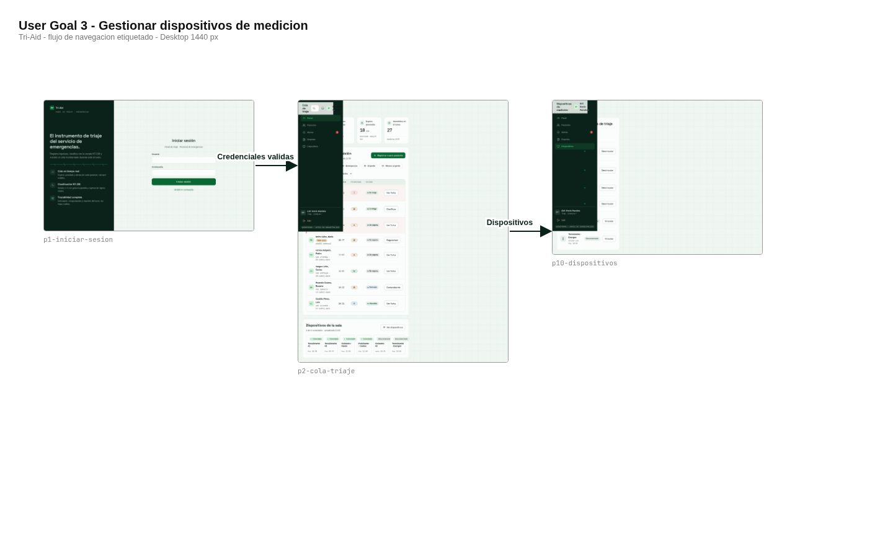

<i>User Flow User Goal 3 — Gestionar dispositivos de medición</i>

  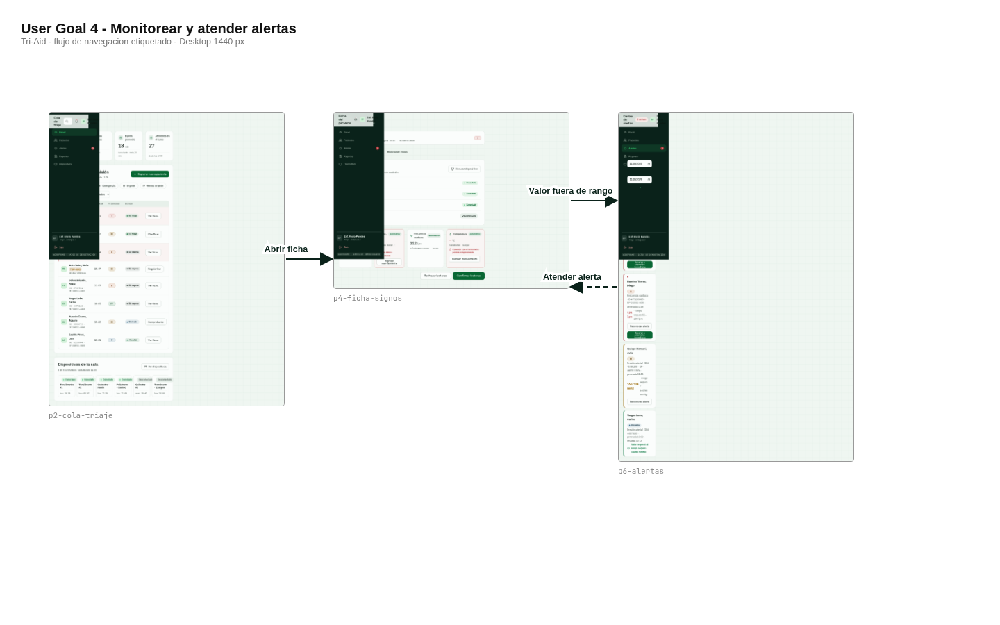

<i>User Flow User Goal 4 — Monitorear y atender alertas</i>

  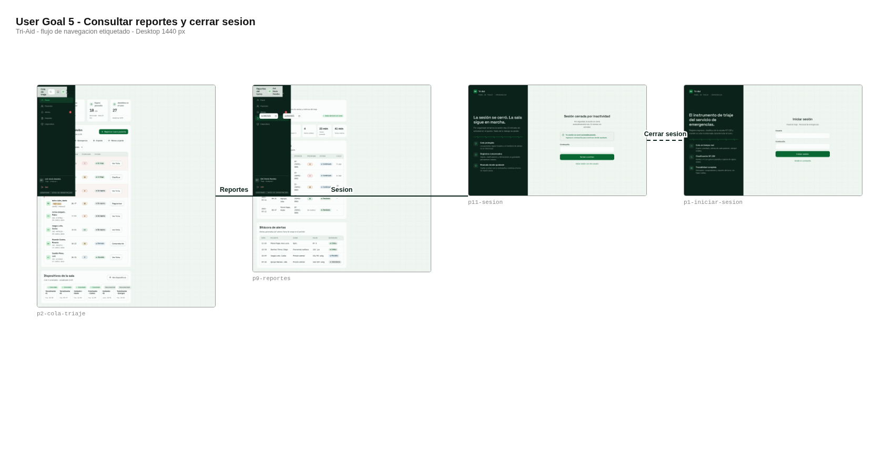

<i>User Flow User Goal 5 — Consultar reportes y cerrar sesión</i>

  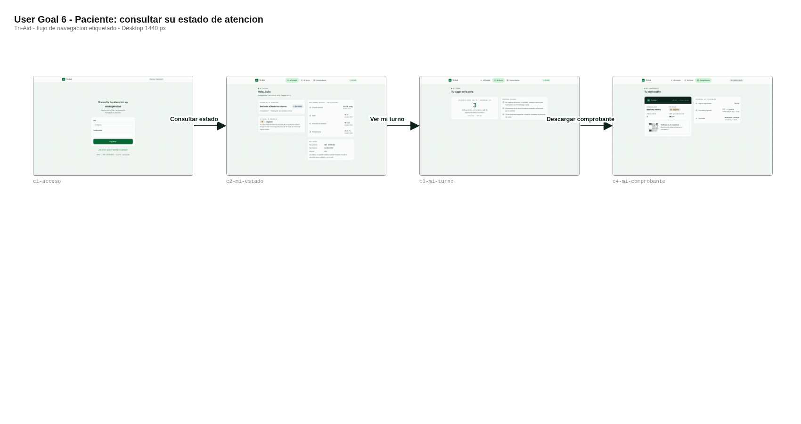

<i>User Flow User Goal 6 — Paciente: consultar su estado de atención</i>

**User Goals cubiertos:**

1. **Atender a un paciente desde su llegada** (Iniciar sesión → Cola de triaje → Registro → Ficha de signos vitales → Clasificación → Derivación → Comprobante). Flujos incluidos: registro de paciente nuevo o existente, valor fuera de rango → alerta (Centro de alertas) → atención, re-clasificación durante la espera.
2. **Gestionar la suscripción institucional** (Contratar plan → Pago → Confirmación de contratación → Mi suscripción). Flujos incluidos: contratación desde la landing, pago rechazado → actualizar método de pago, cambio de plan con prorrateo, cancelación con confirmación.
3. **Consultar el estado de la atención como paciente** (Acceso → Mi estado → Mi turno → Mi comprobante). Flujos incluidos: consulta por DNI, estado y turno, descarga del comprobante; institución con plan inactivo → mensaje institucional (Portal no disponible).
