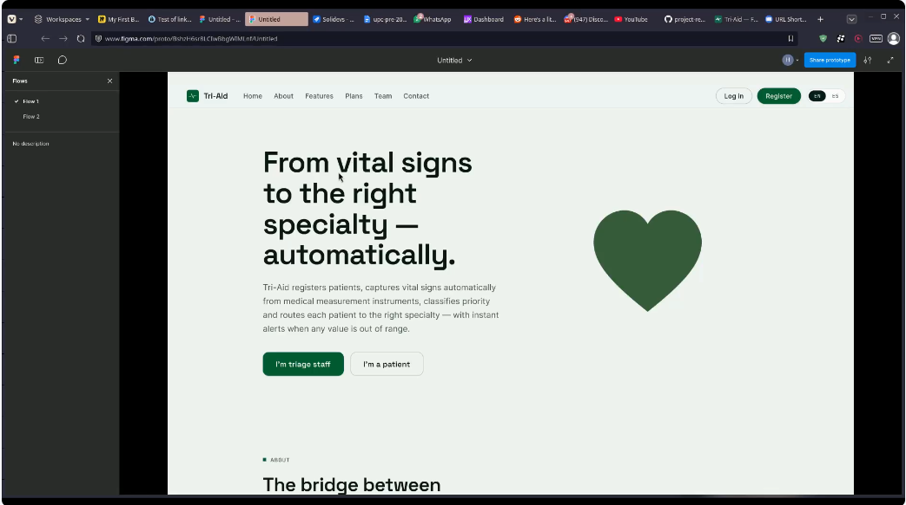

## 4.5. Web Applications Prototyping

Se desarrolló un prototipo interactivo en Figma que simula los flujos principales de la plataforma, permitiendo navegar por la Landing Page de Tri-Aid y validar la experiencia del usuario antes de la implementación. La siguiente figura muestra una vista previa del prototipo:

Enlace del video del prototipo:
[https://shorturl.at/6OcrV](https://shorturl.at/6OcrV)
