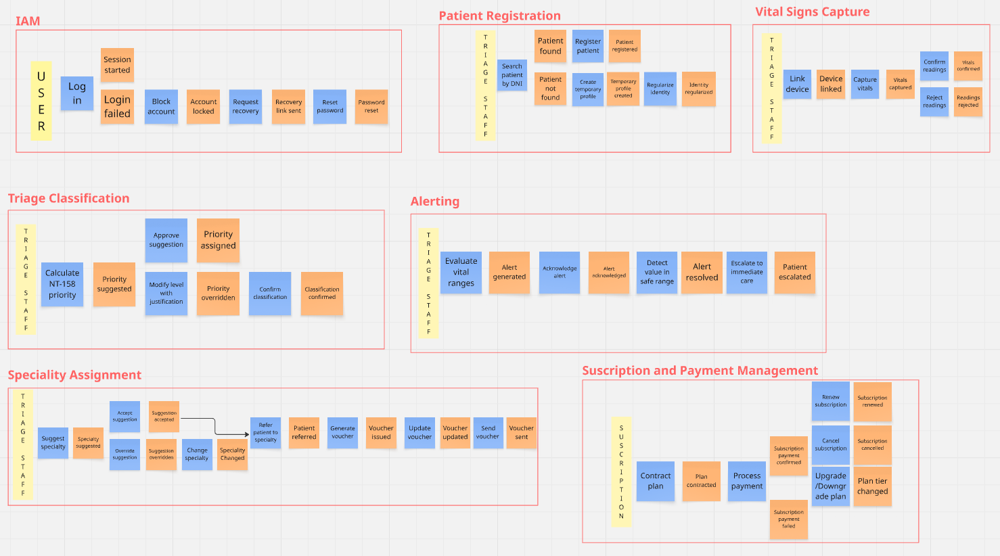
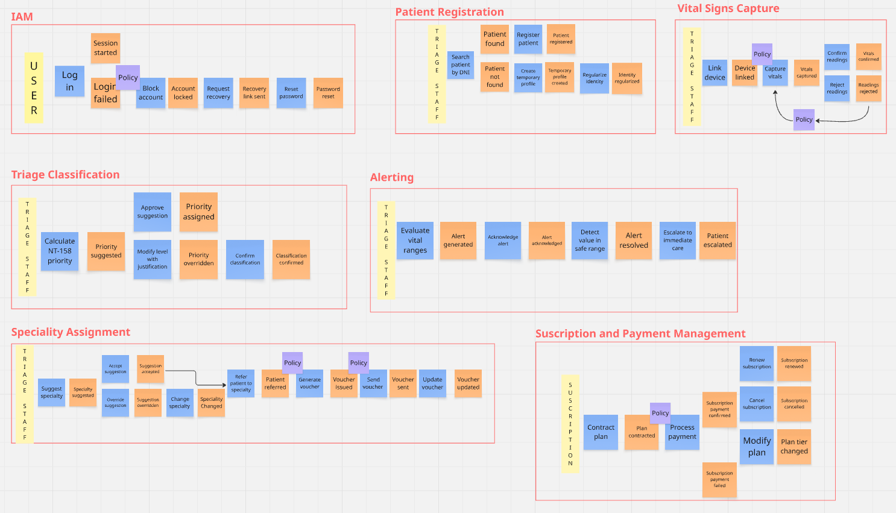
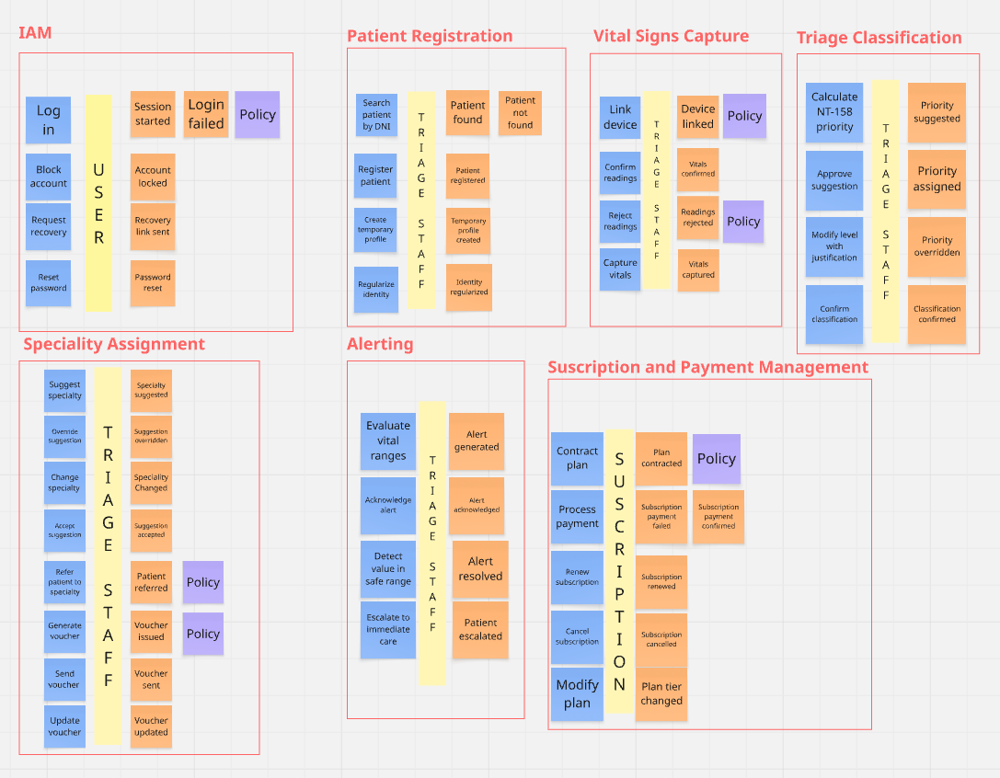
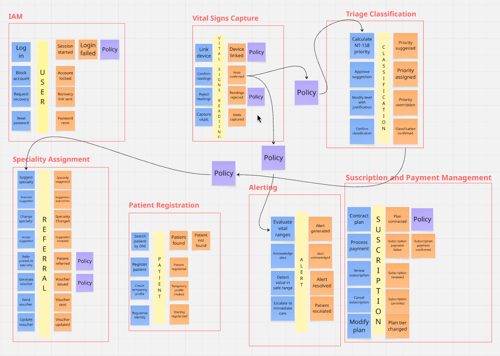
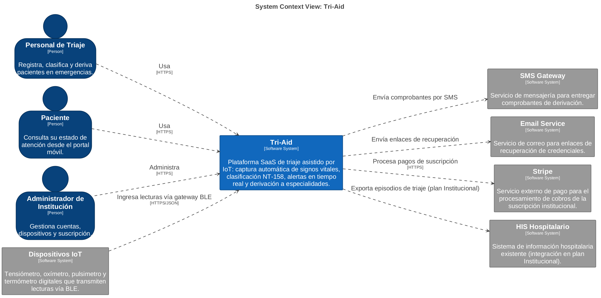
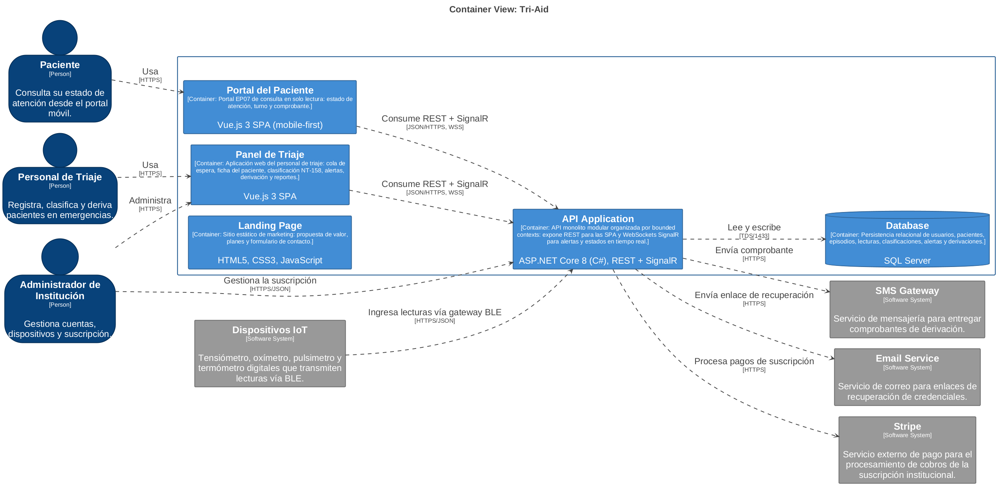
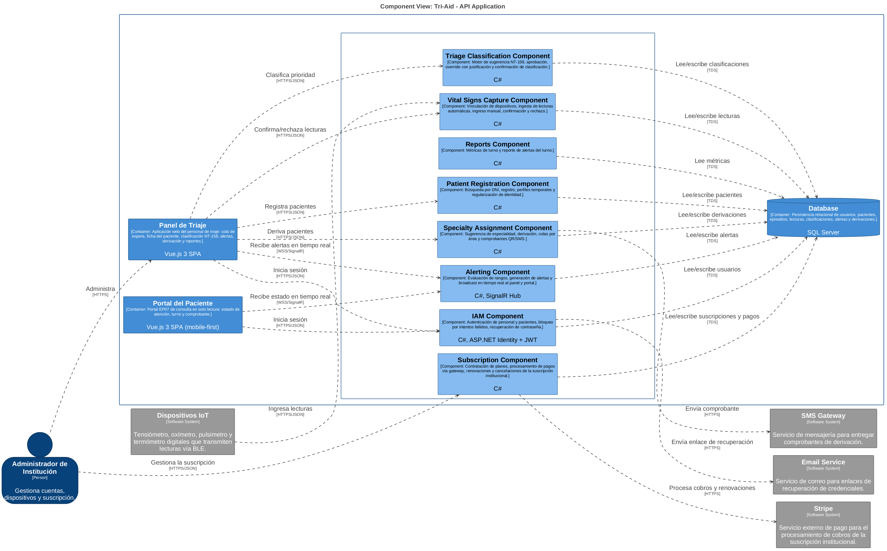

### 4.6. Domain-Driven Software Architecture

En esta sección se define la arquitectura de software orientada al dominio de Tri-Aid. A partir de los Bounded Contexts identificados en la sesión de Design-Level EventStorming, se delimitan los puntos de integración con servicios externos y la estructura interna de cada contexto, con el objetivo de construir una arquitectura SaaS escalable sobre un stack de Vue.js en el frontend y C# (.NET) en el backend.

### 4.6.1. Design-Level EventStorming

Como continuación del Big Picture EventStorming realizado en el Capítulo II, llevamos a cabo una sesión de Design-Level EventStorming con el fin de profundizar en el modelado del dominio del triaje, identificando con mayor detalle los Bounded Contexts, Commands, Events, Policies y Aggregates que estructuran nuestra solución. Se utilizó la herramienta Miro para su elaboración.

A partir de esta sesión identificamos los siguientes Bounded Contexts:

| Bounded Context | Descripción |
|---|---|
| Patient Registration | Gestiona el registro e identificación de los pacientes que ingresan al servicio de emergencia. |
| Vital Signs Capture | Gestiona la captura y almacenamiento de los signos vitales del paciente, de forma automática mediante dispositivos IoT o mediante ingreso manual de contingencia. |
| Triage Classification | Gestiona la clasificación asistida de la prioridad de atención del paciente en base a los signos vitales confirmados, sujeta a validación del personal de triaje. |
| Alerting | Gestiona la generación, reconocimiento y resolución de alertas inmediatas cuando los signos vitales de un paciente se encuentran fuera de rango. |
| Specialty Assignment | Gestiona la sugerencia y asignación del paciente a la especialidad médica correspondiente, las colas por área y la emisión de comprobantes. |
| Identity and Access Management | Gestiona la autenticación, el bloqueo por intentos fallidos y los permisos del personal de triaje y de los pacientes dentro de la plataforma. |
| Subscription and Payment Management | Gestiona la contratación de planes, el procesamiento de pagos mediante gateway, las renovaciones y cancelaciones de la suscripción institucional. |

**Paso 1: Definition of Commands and Actors**

Iniciamos el análisis identificando las acciones específicas (Comandos) que disparan los procesos en cada Bounded Context y a los actores responsables de ejecutarlos. Distinguimos las decisiones humanas (Personal de Triaje, Paciente) de las reacciones automáticas del sistema.

**Paso 2: Policy Design and Inter-Context Orchestration**

En este paso establecimos las Policies que gestionan el comportamiento reactivo y la comunicación entre los Bounded Contexts. Destacan tres orquestaciones entre contextos: la confirmación de signos vitales dispara el cálculo de prioridad (Vital Signs Capture → Triage Classification) y la vigilancia de rangos (Vital Signs Capture → Alerting); la confirmación de la clasificación dispara la sugerencia de especialidad (Triage Classification → Specialty Assignment).

**Paso 3: Aggregate Modeling and Business Logic Rules**

Con el flujo de comunicación definido, introdujimos los Aggregates para delimitar las fronteras de consistencia, agrupando comandos y eventos bajo entidades lógicas: User, Patient, VitalSignsReading, Classification, Alert y Referral.

**Paso 4: Identification of External Systems, Read Models and Attribute Refinement**

En la etapa final incorporamos los sistemas externos con los que el dominio se integra (dispositivos IoT, SMS Gateway y Email Service), los Read Models que el personal necesita visualizar antes de ejecutar un comando (cola de triaje, rangos NT-158, disponibilidad de especialidades, alertas activas, historial de visitas) y refinamos los atributos técnicos de cada aggregate para eliminar ambigüedades de cara a la implementación.

### 4.6.2. Software Architecture Context Diagram

Este diagrama representa el nivel más alto de abstracción, mostrando Tri-Aid como un solo elemento y detallando sus interacciones con el mundo exterior. Fue elaborado con Structurizr DSL.

> * Centro del Sistema: Tri-Aid posiciona la captura automática de signos vitales, la clasificación asistida NT-158 y la derivación informada como su núcleo de valor.
> * Usuarios (Actors): El Personal de Triaje opera el panel de triaje; el Paciente consulta su estado a través del portal EP07; el Administrador de Institución gestiona cuentas, dispositivos y la suscripción.
> * Sistemas Externos: Los Dispositivos IoT (tensiómetro, oxímetro, pulsimetro y termómetro BLE) ingresan las lecturas de signos vitales; el SMS Gateway entrega comprobantes de derivación; el Email Service envía enlaces de recuperación de credenciales; Stripe procesa los cobros de la suscripción institucional; y el HIS Hospitalario recibe episodios de triaje bajo el plan Institucional.

### 4.6.3. Software Architecture Container Diagrams

Este diagrama desglosa Tri-Aid en sus unidades de ejecución principales, especificando las decisiones tecnológicas adoptadas.

> * Landing Page: Sitio estático en HTML5, CSS3 y JavaScript destinado al marketing, la presentación de planes y la captación de clientes.
> * Panel de Triaje: Aplicación web en Vue.js 3 donde el personal de triaje gestiona la cola de espera, la ficha del paciente, la clasificación, las alertas, la derivación y los reportes del turno.
> * Portal del Paciente: SPA en Vue.js 3 (mobile-first) correspondiente al portal EP07, de consulta en solo lectura.
> * API Application: Contenedor central desarrollado en ASP.NET Core 8 con C#. Es un monolito modular organizado por bounded contexts que expone servicios REST para las SPA y WebSockets (SignalR) para alertas y actualizaciones de estado en tiempo real.
> * Database: Motor relacional SQL Server que persiste usuarios, pacientes, episodios, lecturas de signos vitales, clasificaciones, alertas, derivaciones y suscripciones.
> * Integraciones externas del API: SMS Gateway (comprobantes), Email Service (recuperación de credenciales) y Stripe (cobros de la suscripción institucional).

### 4.6.4. Software Architecture Components Diagrams

Este diagrama profundiza en el contenedor API Application, revelando cómo se organiza internamente la lógica de negocio en componentes alineados con los Bounded Contexts identificados en el proceso de diseño.

> * IAM Component: Autenticación de personal y pacientes con ASP.NET Identity y JWT, incluyendo el bloqueo temporal por intentos fallidos y la recuperación de contraseña.
> * Patient Registration Component: Búsqueda por DNI, registro de pacientes, creación de perfiles temporales de emergencia y regularización de identidad.
> * Vital Signs Capture Component: Vinculación de dispositivos, ingesta de lecturas automáticas provenientes del gateway BLE, ingreso manual de contingencia y confirmación o rechazo de lecturas.
> * Triage Classification Component: Motor de sugerencia de prioridad basado en rangos NT-158, aprobación, modificación con justificación obligatoria y confirmación de la clasificación.
> * Alerting Component: Evaluación de rangos vitales, generación de alertas y broadcast en tiempo real vía hub de SignalR hacia el panel y el portal.
> * Specialty Assignment Component: Sugerencia de especialidad, derivación con colas por área, reasignaciones y generación y envío de comprobantes QR/SMS.
> * Reports Component: Métricas del turno (tiempos de clasificación y espera, duración por paciente) y reporte de alertas del turno.
> * Subscription Component: Contratación de planes, procesamiento de pagos mediante Stripe, renovaciones, cancelaciones y cambios de tier de la suscripción institucional.

