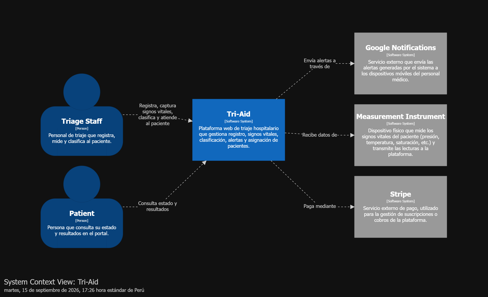
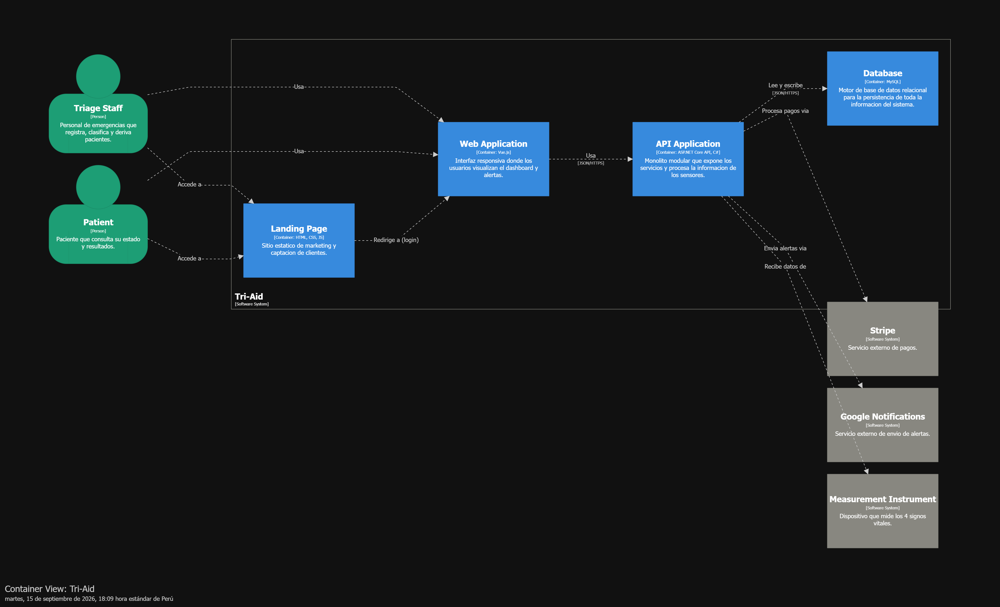

## 4.6. Domain-Driven Software Architecture

En esta sección, el equipo ha dedicado 3 horas para identificar los principales Bounded Contexts del dominio del triaje hospitalario, sus interacciones y la estructura necesaria para implementar una arquitectura escalable y mantenible, orientada al dominio, para la plataforma Tri-Aid.

### 4.6.1. Design Level-EventStorming

### 4.6.2. Software Architecture Context Diagram

Este diagrama representa el nivel más alto de abstracción, mostrando a Tri-Aid como un solo sistema y sus interacciones con los actores externos.

> - **Centro del Sistema**: Tri-Aid se posiciona como la plataforma que gestiona el registro, captura de signos vitales, clasificación, alertas y asignación de pacientes.
> - **Actores (Usuarios)**: Se identifican a Triage Staff y Patient, quienes interactúan con la plataforma para sus respectivas labores.
> - **Sistemas Externos**: El ecosistema se integra con Stripe para la gestión de pagos, Google Notifications para el envío de alertas móviles, y Measurement Instrument para la captura de signos vitales.

### 4.6.3. Software Architecture Container Diagram
Este diagrama desglosa el sistema Tri-Aid en sus unidades de ejecución principales.

> - **Interfaces de usuario**: Los actores Triage Staff y Patient acceden primero a la Landing Page (HTML, CSS, JS), que incluye un formulario de contacto y redirige al login de la Web Application (Vue.js), donde cada actor visualiza su dashboard según su rol.
> - **Núcleo del sistema**: La Web Application consume la API Application, un monolito modular en ASP.NET Core con C# que centraliza la lógica de negocio, gestiona la autenticación y expone los servicios vía JSON/HTTPS. La API persiste y consulta datos en una Database MySQL.
> - **Sistemas externos**: La API Application procesa pagos a través de Stripe y envía alertas mediante Google Notifications, ambos vía HTTPS/REST. El Measurement Instrument envía automáticamente los datos de los 4 signos vitales a la API mediante HTTPS/Webhook.

### 4.6.4. Software Architecture Component Diagram
