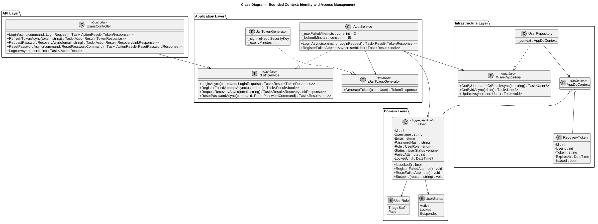
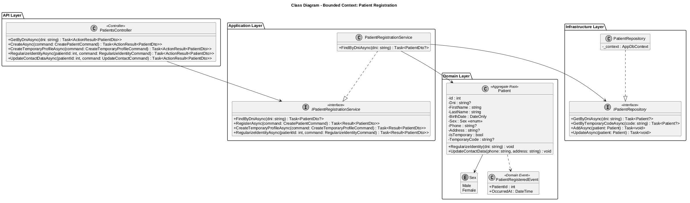
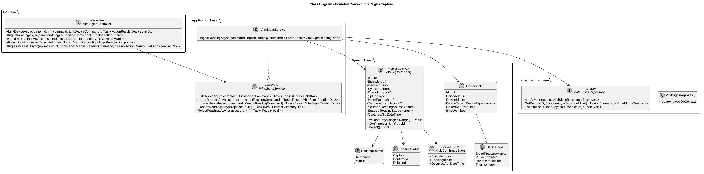
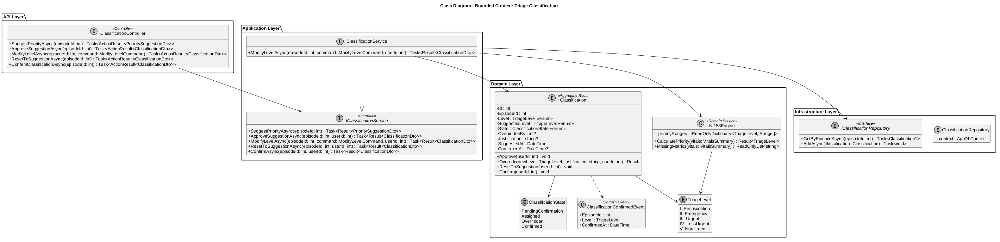
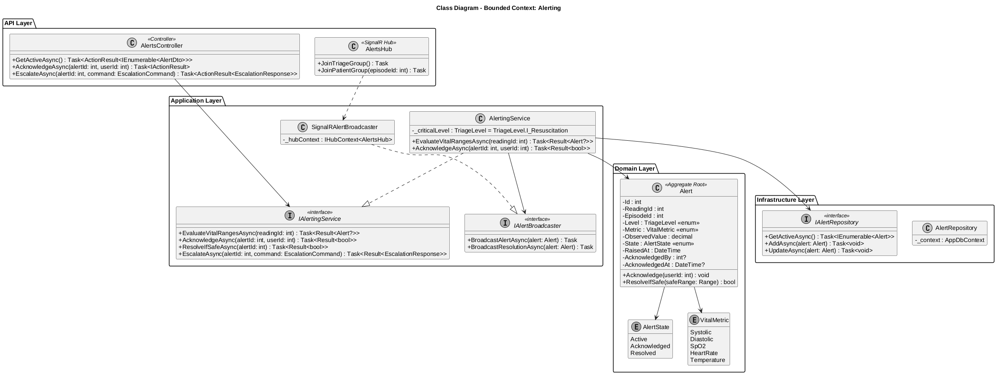
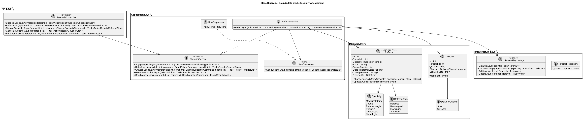
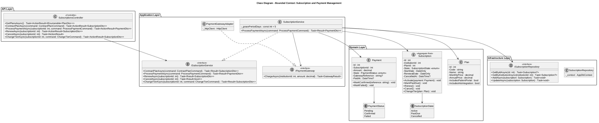

### 4.7. Software Object-Oriented Design

El desarrollo estructural de nuestra plataforma se fundamenta en el paradigma orientado a objetos, diseñado en C# sobre ASP.NET Core 8 siguiendo los principios de Domain-Driven Design (DDD). Esta decisión nos permite segmentar los procesos en *Bounded Contexts* independientes, garantizando alta cohesión y bajo acoplamiento. Cada contexto se implementa con una arquitectura en capas (API, Application, Domain e Infrastructure), donde las entidades de dominio protegen sus invariantes, los servicios de aplicación orquestan los casos de uso y los repositorios abstraen la persistencia en SQL Server. El frontend en Vue.js 3 consume estos casos de uso a través de la API REST.

A continuación, se presentan los diagramas de clases UML de los Bounded Contexts identificados, junto con el diccionario de clases de dominio centrales de cada uno.

### 4.7.1. Class Diagrams

#### 1. Bounded Context: Identity and Access Management
Este contexto gestiona la autenticación del personal y de los pacientes, el bloqueo temporal por intentos fallidos y la recuperación de contraseña.

  

**Diccionario de Clases de Dominio:**
* **Clase `User` (Aggregate Root):** Representa a cualquier usuario autenticable de la plataforma (personal de triaje o paciente).
    * *Atributos:* `- Id : int`, `- Username : string`, `- Email : string`, `- PasswordHash : string`, `- Role : UserRole`, `- Status : UserStatus`, `- FailedAttempts : int`, `- LockedUntil : DateTime?`
    * *Métodos:* `+ IsLocked() : bool`, `+ RegisterFailedAttempt() : void`, `+ ResetFailedAttempts() : void`, `+ Suspend(reason: string) : void`
* **Enum `UserRole`:** Rol del usuario (`TriageStaff`, `Patient`).
* **Enum `UserStatus`:** Estado de la cuenta (`Active`, `Locked`, `Suspended`).
* **Clase de soporte `RecoveryToken`:** Token temporal de recuperación de contraseña con caducidad.
    * *Atributos:* `- Id : int`, `- UserId : int`, `- Token : string`, `- ExpiresAt : DateTime`, `- IsUsed : bool`
* **Servicios:** `IAuthService` / `AuthService` (orquesta el login con bloqueo tras 3 intentos fallidos) e `IJwtTokenGenerator` / `JwtTokenGenerator` (emisión de tokens JWT).

#### 2. Bounded Context: Patient Registration
Este contexto gestiona la búsqueda por DNI, el registro de pacientes, los perfiles temporales de emergencia y la regularización de identidad.

  

**Diccionario de Clases de Dominio:**
* **Clase `Patient` (Aggregate Root):** Representa al paciente registrado en el sistema.
    * *Atributos:* `- Id : int`, `- Dni : string?`, `- FirstName : string`, `- LastName : string`, `- BirthDate : DateOnly`, `- Sex : Sex`, `- Phone : string?`, `- Address : string?`, `- IsTemporary : bool`, `- TemporaryCode : string?`
    * *Métodos:* `+ RegularizeIdentity(dni: string) : void`, `+ UpdateContactData(phone: string, address: string) : void`
* **Enum `Sex`:** Sexo del paciente (`Male`, `Female`).
* **Evento de dominio `PatientRegisteredEvent`:** Se emite al registrar un paciente nuevo (`PatientId`, `OccurredAt`).
* **Servicios:** `IPatientRegistrationService` / `PatientRegistrationService` (búsqueda, registro, perfil temporal y regularización) e `IPatientRepository` / `PatientRepository` para la persistencia.

#### 3. Bounded Context: Vital Signs Capture
Este contexto gestiona la vinculación de dispositivos, la ingesta de lecturas automáticas de los dispositivos IoT, el ingreso manual de contingencia y la confirmación o rechazo de lecturas.

  

**Diccionario de Clases de Dominio:**
* **Clase `VitalSignsReading` (Aggregate Root):** Representa una medición de signos vitales de un paciente.
    * *Atributos:* `- Id : int`, `- EpisodeId : int`, `- DeviceId : int?`, `- Systolic : short?`, `- Diastolic : short?`, `- SpO2 : byte?`, `- HeartRate : short?`, `- Temperature : decimal?`, `- Source : ReadingSource`, `- Status : ReadingStatus`, `- CapturedAt : DateTime`
    * *Métodos:* `+ ValidatePhysiologicalRange() : Result`, `+ Confirm(userId: int) : void`, `+ Reject() : void`
* **Enum `ReadingSource`:** Origen de la lectura (`Automatic`, `Manual`).
* **Enum `ReadingStatus`:** Estado de la lectura (`Captured`, `Confirmed`, `Rejected`).
* **Clase `DeviceLink`:** Vinculación de un dispositivo BLE a un episodio de triaje (`DeviceType`, `LinkedAt`, `IsActive`).
* **Evento de dominio `VitalsConfirmedEvent`:** Dispara la orquestación hacia Triage Classification y Alerting.
* **Servicios:** `IVitalSignsService` / `VitalSignsService` e `IVitalSignsRepository` / `VitalSignsRepository`.

#### 4. Bounded Context: Triage Classification
Este contexto gestiona la clasificación asistida de prioridad según la guía NT-158, con aprobación, override justificado y confirmación.

  

**Diccionario de Clases de Dominio:**
* **Clase `Classification` (Aggregate Root):** Representa la clasificación de prioridad de un episodio.
    * *Atributos:* `- Id : int`, `- EpisodeId : int`, `- Level : TriageLevel`, `- SuggestedLevel : TriageLevel`, `- State : ClassificationState`, `- OverriddenBy : int?`, `- Justification : string?`, `- SuggestedAt : DateTime`, `- ConfirmedAt : DateTime?`
    * *Métodos:* `+ Approve(userId: int) : void`, `+ Override(newLevel: TriageLevel, justification: string, userId: int) : Result`, `+ ResetToSuggestion(userId: int) : void`, `+ Confirm(userId: int) : void`
* **Enum `TriageLevel`:** Niveles NT-158 (`I_Resuscitation`, `II_Emergency`, `III_Urgent`, `IV_LessUrgent`, `V_NonUrgent`).
* **Enum `ClassificationState`:** Estado de la clasificación (`PendingConfirmation`, `Assigned`, `Overridden`, `Confirmed`).
* **Clase `Nt158Engine` (Domain Service):** Motor puro de cálculo que sugiere el nivel a partir del resumen de signos vitales confirmados y reporta las métricas faltantes (`+ CalculatePriority(vitals) : Result<TriageLevel>`, `+ MissingMetrics(vitals)`).
* **Evento de dominio `ClassificationConfirmedEvent`:** Dispara la orquestación hacia Specialty Assignment.

#### 5. Bounded Context: Alerting
Este contexto gestiona la evaluación de rangos vitales, la generación, el reconocimiento y la resolución de alertas, y su difusión en tiempo real.

  

**Diccionario de Clases de Dominio:**
* **Clase `Alert` (Aggregate Root):** Representa una alerta generada por un valor fuera de rango.
    * *Atributos:* `- Id : int`, `- ReadingId : int`, `- EpisodeId : int`, `- Level : TriageLevel`, `- Metric : VitalMetric`, `- ObservedValue : decimal`, `- State : AlertState`, `- RaisedAt : DateTime`, `- AcknowledgedBy : int?`, `- AcknowledgedAt : DateTime?`
    * *Métodos:* `+ Acknowledge(userId: int) : void`, `+ ResolveIfSafe(safeRange: Range) : bool`
* **Enum `AlertState`:** Ciclo de vida de la alerta (`Active`, `Acknowledged`, `Resolved`).
* **Enum `VitalMetric`:** Métrica monitoreada (`Systolic`, `Diastolic`, `SpO2`, `HeartRate`, `Temperature`).
* **Servicios:** `IAlertingService` / `AlertingService` (evaluación y gestión de alertas) e `IAlertBroadcaster` / `SignalRAlertBroadcaster`, que difunde alertas y resoluciones en tiempo real mediante el hub de SignalR `AlertsHub`.

#### 6. Bounded Context: Specialty Assignment
Este contexto gestiona la sugerencia de especialidad, la derivación con colas por área, las reasignaciones justificadas y la emisión de comprobantes.

  

**Diccionario de Clases de Dominio:**
* **Clase `Referral` (Aggregate Root):** Representa la derivación de un paciente clasificado a una especialidad.
    * *Atributos:* `- Id : int`, `- EpisodeId : int`, `- Specialty : Specialty`, `- Room : string`, `- QueuePosition : int`, `- State : ReferralState`, `- ChangeReason : string?`, `- ReferredAt : DateTime`
    * *Métodos:* `+ ChangeSpecialty(newSpecialty: Specialty, reason: string) : Result`, `+ UpdateQueuePosition(position: int) : void`
* **Clase `Voucher`:** Comprobante de derivación con código QR para el portal del paciente.
    * *Atributos:* `- Id : int`, `- ReferralId : int`, `- QrCode : string`, `- Channel : DeliveryChannel`, `- SentAt : DateTime?`
    * *Métodos:* `+ MarkSent() : void`
* **Enum `Specialty`:** Especialidades disponibles (`MedicinaInterna`, `Cirugia`, `Traumatologia`, `Pediatria`, `Ginecologia`, `Neurologia`).
* **Enum `ReferralState`:** Estado de la derivación (`Referred`, `Reassigned`, `InAttention`, `Attended`).
* **Servicios:** `IReferralService` / `ReferralService` (sugerencia, derivación, cambio, voucher) e `ISmsDispatcher` / `SmsDispatcher`, que entrega el comprobante vía SMS Gateway.

#### 7. Bounded Context: Subscription and Payment Management
Este contexto gestiona el ciclo de vida comercial de la plataforma: catálogo de planes, contratación, procesamiento de pagos mediante Stripe, renovaciones y cancelaciones de la suscripción institucional.

  

**Diccionario de Clases de Dominio:**
* **Clase `Subscription` (Aggregate Root):** Representa la suscripción activa de una institución.
    * *Atributos:* `- Id : int`, `- InstitutionId : int`, `- PlanId : int`, `- State : SubscriptionState`, `- StartDate : DateOnly`, `- RenewalDate : DateOnly`, `- CancelledAt : DateTime?`
    * *Métodos:* `+ Activate(payment: Payment) : void`, `+ MarkPastDue() : void`, `+ Renew() : void`, `+ Cancel() : void`, `+ ChangeTier(plan: Plan) : void`
* **Clase `Plan`:** Entidad que define las características y el precio de cada plan comercial.
    * *Atributos:* `- Id : int`, `- Code : string`, `- Name : string`, `- MonthlyPrice : decimal`, `- AnnualPrice : decimal`, `- IncludesPatientPortal : bool`, `- IncludesHisIntegration : bool`
* **Clase `Payment`:** Representa un cobro asociado a la suscripción.
    * *Atributos:* `- Id : int`, `- SubscriptionId : int`, `- Amount : decimal`, `- State : PaymentStatus`, `- GatewayReference : string?`, `- PaidAt : DateTime?`
    * *Métodos:* `+ MarkConfirmed(reference: string) : void`, `+ MarkFailed() : void`
* **Enum `SubscriptionState`:** Estado de la suscripción (`Active`, `PastDue`, `Cancelled`).
* **Enum `PaymentStatus`:** Estado del cobro (`Pending`, `Confirmed`, `Failed`).
* **Servicios:** `ISubscriptionService` / `SubscriptionService` (contratación, cobros, renovaciones) e `IPaymentGateway` / `PaymentGatewayAdapter`, que encapsula la comunicación con **Stripe** como gateway de pagos externo.
