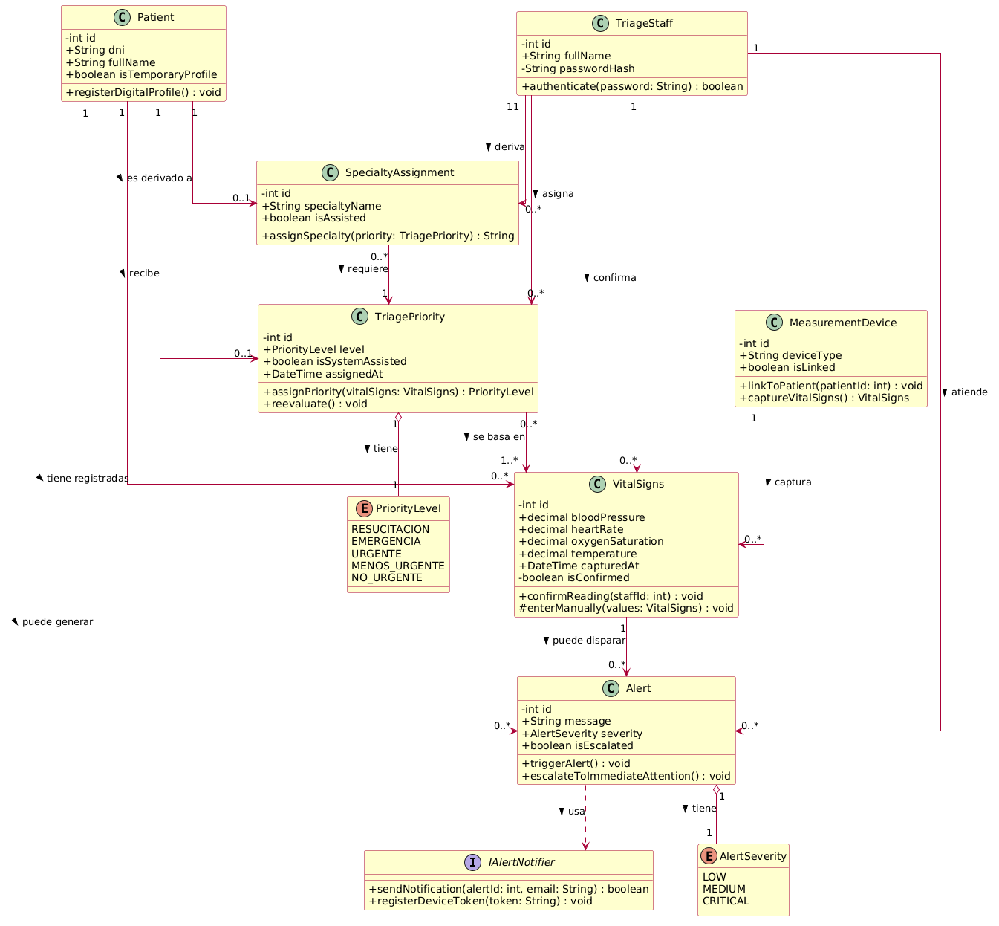

### 4.7. Software Object-Oriented Design

El desarrollo estructural de nuestra plataforma se fundamenta estrictamente en el paradigma orientado a objetos. Esta decisión metodológica nos brinda la capacidad de segmentar los distintos procesos del negocio de triaje hospitalario, garantizando una expansión futura sin fricciones. A través de la correcta aplicación del encapsulamiento para proteger la información sensible de pacientes y personal, sumado a la herencia y el uso de interfaces para jerarquizar nuestras entidades de monitoreo y notificación, diseñamos componentes de software robustos, facilitando enormemente las labores de actualización técnica.

### 4.7.1. Class Diagrams

### 4.7.2. Class Dictionary

> **Clase: Patient**
>
> Descripción: Representa al paciente que ingresa a emergencias, ya sea con identificación (DNI) o con un perfil temporal cuando no cuenta con documentos al momento del ingreso.
>
> Atributos:
> - Id : int - Identificador único del paciente.
> - Dni : String - Documento Nacional de Identidad del paciente.
> - FullName : String - Nombre completo del paciente.
> - IsTemporaryProfile : bool - Indica si el registro es temporal (paciente sin DNI al ingreso).
>
> Métodos:
> - RegisterDigitalProfile() : void - Genera el registro digital del paciente al momento del ingreso.

> **Clase: TriageStaff**
>
> Descripción: Representa al personal de emergencias encargado de registrar, clasificar y derivar a los pacientes durante el proceso de triaje.
>
> Atributos:
> - Id : int - Identificador único del personal.
> - FullName : String - Nombre completo del personal de triaje.
> - PasswordHash : String - Contraseña encriptada para el inicio de sesión (Privado por seguridad).
>
> Métodos:
> - Authenticate(password: String) : bool - Valida las credenciales de acceso del personal.

> **Clase: MeasurementDevice**
>
> Descripción: Representa el instrumento de medición vinculado al paciente, encargado de capturar los signos vitales de forma automática (IoT).
>
> Atributos:
> - Id : int - Identificador único del dispositivo.
> - DeviceType : String - Tipo de instrumento de medición.
> - IsLinked : bool - Indica si el dispositivo está vinculado a un paciente.
>
> Métodos:
> - LinkToPatient(patientId: int) : void - Vincula el dispositivo de medición al paciente correspondiente.
> - CaptureVitalSigns() : VitalSigns - Captura automáticamente los signos vitales del paciente.

> **Clase: VitalSigns**
>
> Descripción: Almacena las lecturas de los signos vitales del paciente, capturadas de forma automática (IoT) o manual como respaldo, y su confirmación por parte del personal de triaje.
>
> Atributos:
> - Id : int - Identificador único de la lectura.
> - BloodPressure : decimal - Presión arterial registrada.
> - HeartRate : decimal - Frecuencia cardíaca registrada.
> - OxygenSaturation : decimal - Saturación de oxígeno registrada.
> - Temperature : decimal - Temperatura corporal registrada.
> - CapturedAt : DateTime - Fecha y hora de la captura.
> - IsConfirmed : bool - Indica si la lectura fue confirmada por el personal (Privado).
>
> Métodos:
> - ConfirmReading(staffId: int) : void - Confirma la lectura capturada por parte del personal de triaje.
> - EnterManually(values: VitalSigns) : void - Registra manualmente los signos vitales como mecanismo de respaldo (Protegido).

> **Clase: TriagePriority**
>
> Descripción: Representa la prioridad de atención asignada al paciente según la escala NT-158, de forma asistida por el sistema, y su reevaluación mientras el paciente permanece en sala de espera.
>
> Atributos:
> - Id : int - Identificador único de la prioridad asignada.
> - Level : PriorityLevel - Nivel de prioridad asignado (enumeración).
> - IsSystemAssisted : bool - Indica si la asignación fue asistida por el sistema.
> - AssignedAt : DateTime - Fecha y hora de la asignación.
>
> Métodos:
> - AssignPriority(vitalSigns: VitalSigns) : PriorityLevel - Asigna la prioridad del paciente en base a los signos vitales confirmados.
> - Reevaluate() : void - Reevalúa la prioridad del paciente mientras espera atención.

> **Clase: Alert**
>
> Descripción: Almacena los eventos de deterioro crítico detectados en el paciente que requieren escalamiento a atención inmediata.
>
> Atributos:
> - Id : int - Identificador único de la alerta.
> - Message : String - Descripción del evento crítico detectado.
> - Severity : AlertSeverity - Nivel de gravedad de la alerta (enumeración).
> - IsEscalated : bool - Indica si la alerta fue escalada a atención inmediata.
>
> Métodos:
> - TriggerAlert() : void - Dispara la alerta en tiempo real ante un deterioro crítico.
> - EscalateToImmediateAttention() : void - Escala al paciente a atención inmediata.

> **Clase: SpecialtyAssignment**
>
> Descripción: Representa la asignación de la especialidad médica correspondiente al paciente, mediante ruteo asistido por el sistema, en base a la prioridad ya confirmada.
>
> Atributos:
> - Id : int - Identificador único de la asignación.
> - SpecialtyName : String - Nombre de la especialidad asignada.
> - IsAssisted : bool - Indica si la asignación fue asistida por el sistema.
>
> Métodos:
> - AssignSpecialty(priority: TriagePriority) : String - Asigna la especialidad correspondiente en base a la prioridad confirmada del paciente.

> **Interfaz: IAlertNotifier**
>
> Descripción: Contrato que define la estructura para servicios externos (como Google Notifications) encargados de enviar notificaciones ante alertas críticas.
>
> Métodos:
> - SendNotification(alertId: int, email: String) : bool - Ejecuta el envío de la alerta crítica al destinatario correspondiente.
> - RegisterDeviceToken(token: String) : void - Registra el token del dispositivo móvil para habilitar notificaciones push.

> **Enumeración: PriorityLevel**
>
> Descripción: Define los niveles de prioridad según la escala de triaje NT-158.
> Valores: Resucitación, Emergencia, Urgente, Menos urgente, No urgente.

> **Enumeración: AlertSeverity**
>
> Descripción: Categoriza el nivel de urgencia de las alertas generadas por deterioro del paciente.
> Valores: Low, Medium, Critical.
