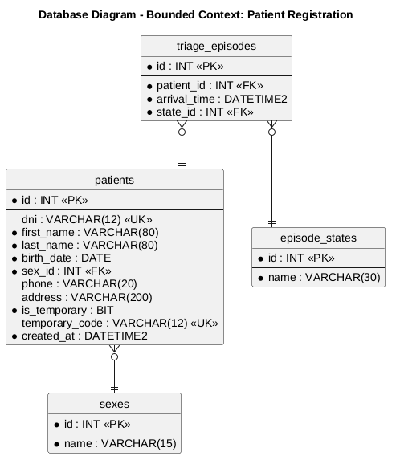
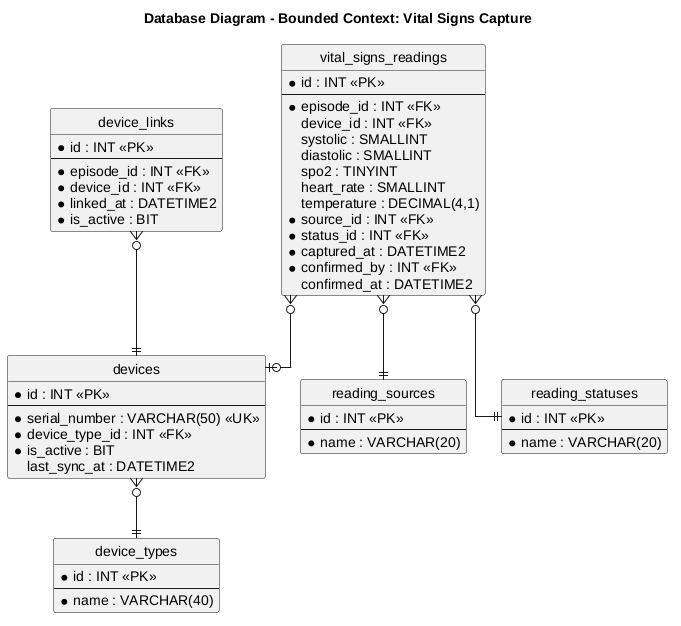
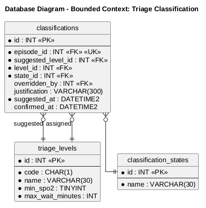
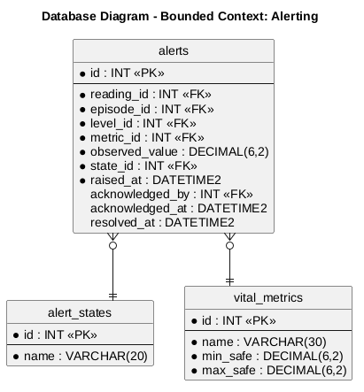

### 4.8. Database Design

El diseño de la base de datos es un pilar central en la construcción de Tri-Aid, debido a que la plataforma debe resguardar lecturas continuas de signos vitales, clasificaciones de triaje, alertas y derivaciones con integridad referencial y trazabilidad temporal. El modelo relacional se implementó en SQL Server y se derivó directamente de los aggregates identificados en el Design-Level EventStorming: cada aggregate root corresponde a una tabla principal, los catálogos aseguran la validez de los estados y niveles, y las llaves foráneas materializan la comunicación entre Bounded Contexts a través del identificador del episodio de triaje (episode_id), que actúa como hilo conductor de la atención.

### 4.8.1. Database Diagrams

A continuación, se detalla el esquema relacional para cada *Bounded Context*. Se especifican las tablas principales, sus columnas, las restricciones aplicadas (primary keys, foreign keys y unique keys) y las relaciones entre los objetos que permiten la correcta persistencia de la información.

#### 1. Bounded Context: Identity and Access Management
Este diagrama define la persistencia de las cuentas de usuario, sus roles, estados y los tokens de recuperación de contraseña.

**Explicación del esquema:**
* **Tablas:** `users`, `user_roles`, `user_statuses`, `recovery_tokens`.
* **Columnas principales:** `username` y `email` con restricción unique; `password_hash` para el almacenamiento seguro de credenciales; `failed_attempts` y `locked_until` para el bloqueo temporal por intentos fallidos.
* **Constraints o Relaciones:** La tabla `users` referencia a los catálogos `user_roles` y `user_statuses` mediante las llaves foráneas `role_id` y `status_id`. Cada token de recuperación pertenece a un único usuario a través de `user_id`, con expiración (`expires_at`) y marca de uso (`is_used`).

#### 2. Bounded Context: Patient Registration
Este diagrama estructura el registro de pacientes, incluidos los perfiles temporales de emergencia, y el episodio de triaje que inicia la atención.

**Explicación del esquema:**
* **Tablas:** `patients`, `sexes`, `triage_episodes`, `episode_states`.
* **Columnas principales:** `dni` (unique y nullable, para soportar perfiles temporales), `is_temporary` y `temporary_code` (unique) para los registros de emergencia; `arrival_time` en el episodio.
* **Constraints o Relaciones:** `patients.sex_id` referencia al catálogo `sexes`. La tabla `triage_episodes` vincula cada atención a un paciente mediante `patient_id` y a su estado actual mediante `state_id`. Este episodio es la llave foránea que los demás bounded contexts utilizan para mantener la trazabilidad de la atención.

#### 3. Bounded Context: Vital Signs Capture
Este diagrama define el almacenamiento de las lecturas de signos vitales, la vinculación de dispositivos y sus catálogos.

**Explicación del esquema:**
* **Tablas:** `vital_signs_readings`, `devices`, `device_types`, `device_links`, `reading_sources`, `reading_statuses`.
* **Columnas principales:** `systolic`, `diastolic`, `spo2`, `heart_rate` y `temperature` para los valores medidos; `captured_at` como estampa de tiempo de la medición; `confirmed_by` y `confirmed_at` para la validación del personal.
* **Constraints o Relaciones:** Cada lectura pertenece a un episodio (`episode_id`), registra su origen mediante `source_id` (automático o manual) y su estado mediante `status_id` (capturada, confirmada o rechazada). La tabla `device_links` materializa la vinculación de un dispositivo a un episodio, y `devices` referencia su tipo a través de `device_type_id`.

#### 4. Bounded Context: Triage Classification
Este diagrama persiste la clasificación de prioridad NT-158 de cada episodio, incluyendo la sugerencia del sistema y el override del personal.

**Explicación del esquema:**
* **Tablas:** `classifications`, `triage_levels`, `classification_states`.
* **Columnas principales:** `suggested_level_id` (nivel calculado por el sistema) y `level_id` (nivel final asignado) permiten distinguir la sugerencia original de la decisión del personal; `justification` es obligatoria cuando existe override; `suggested_at` y `confirmed_at` registran las estampas de tiempo.
* **Constraints o Relaciones:** `episode_id` es llave foránea y unique al mismo tiempo: cada episodio tiene exactamente una clasificación. Ambas referencias a niveles apuntan al catálogo `triage_levels`, que almacena los rangos de la guía NT-158.

#### 5. Bounded Context: Alerting
Este diagrama modela la persistencia de las alertas generadas por valores fuera de rango, su ciclo de vida y su auditoría.

**Explicación del esquema:**
* **Tablas:** `alerts`, `alert_states`, `vital_metrics`.
* **Columnas principales:** `observed_value` guarda el valor que disparó la alerta; `raised_at`, `acknowledged_at` y `resolved_at` documentan el ciclo de vida completo; `acknowledged_by` registra al usuario responsable de reconocer la alerta.
* **Constraints o Relaciones:** Cada alerta se origina en una lectura (`reading_id`) de un episodio (`episode_id`). El catálogo `vital_metrics` almacena además los rangos seguros (`min_safe`, `max_safe`) que utiliza el sistema para la resolución automática de alertas.

