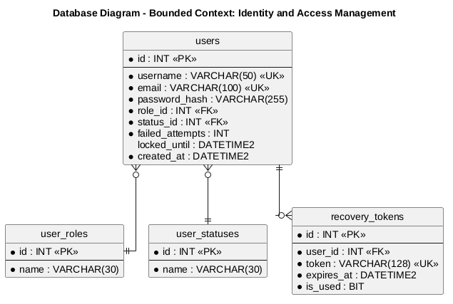

### 4.8. Database Design

El diseño de la base de datos es un pilar central en la construcción de Tri-Aid, debido a que la plataforma debe resguardar lecturas continuas de signos vitales, clasificaciones de triaje, alertas y derivaciones con integridad referencial y trazabilidad temporal. El modelo relacional se implementó en SQL Server y se derivó directamente de los aggregates identificados en el Design-Level EventStorming: cada aggregate root corresponde a una tabla principal, los catálogos aseguran la validez de los estados y niveles, y las llaves foráneas materializan la comunicación entre Bounded Contexts a través del identificador del episodio de triaje (episode_id), que actúa como hilo conductor de la atención.

### 4.8.1. Database Diagrams

A continuación, se detalla el esquema relacional para cada *Bounded Context*. Se especifican las tablas principales, sus columnas, las restricciones aplicadas (primary keys, foreign keys y unique keys) y las relaciones entre los objetos que permiten la correcta persistencia de la información.

#### 1. Bounded Context: Identity and Access Management
Este diagrama define la persistencia de las cuentas de usuario, sus roles, estados y los tokens de recuperación de contraseña.

**Explicación del esquema:**
* **Tablas:** `users`, `user_roles`, `user_statuses`, `recovery_tokens`.
* **Columnas principales:** `username` y `email` con restricción unique; `password_hash` para el almacenamiento seguro de credenciales; `failed_attempts` y `locked_until` para el bloqueo temporal por intentos fallidos.
* **Constraints o Relaciones:** La tabla `users` referencia a los catálogos `user_roles` y `user_statuses` mediante las llaves foráneas `role_id` y `status_id`. Cada token de recuperación pertenece a un único usuario a través de `user_id`, con expiración (`expires_at`) y marca de uso (`is_used`).

