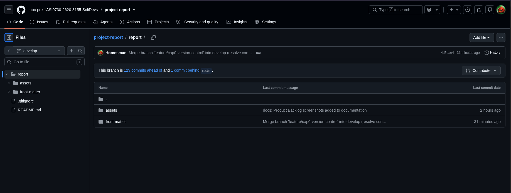
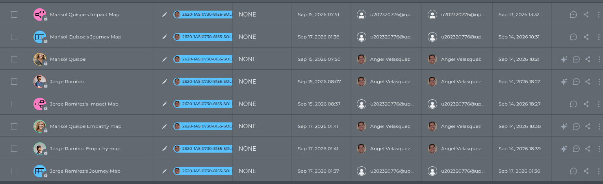
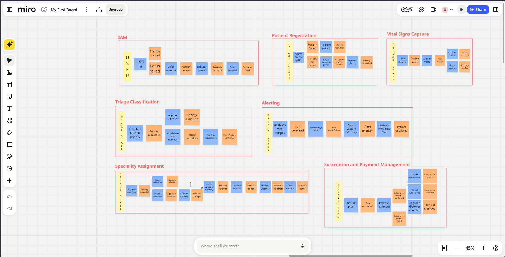
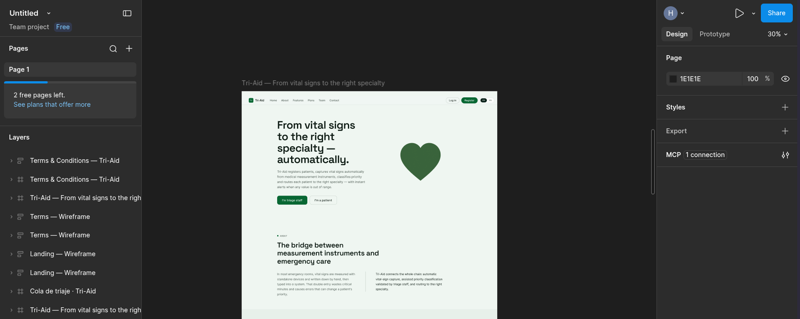
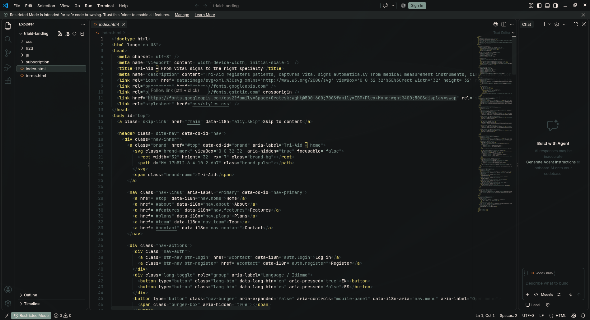
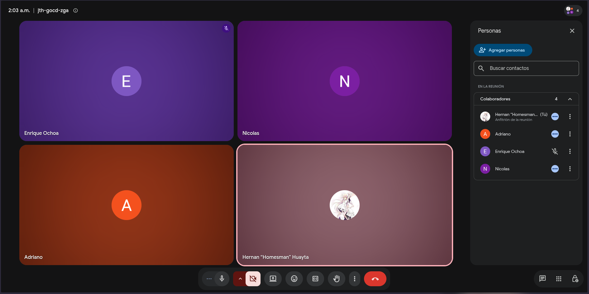
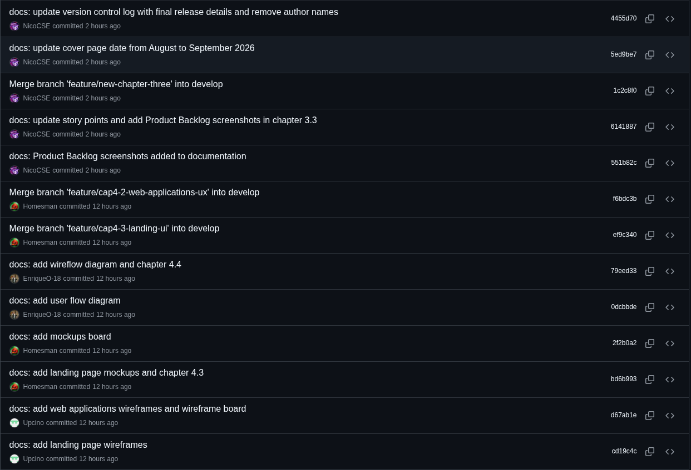
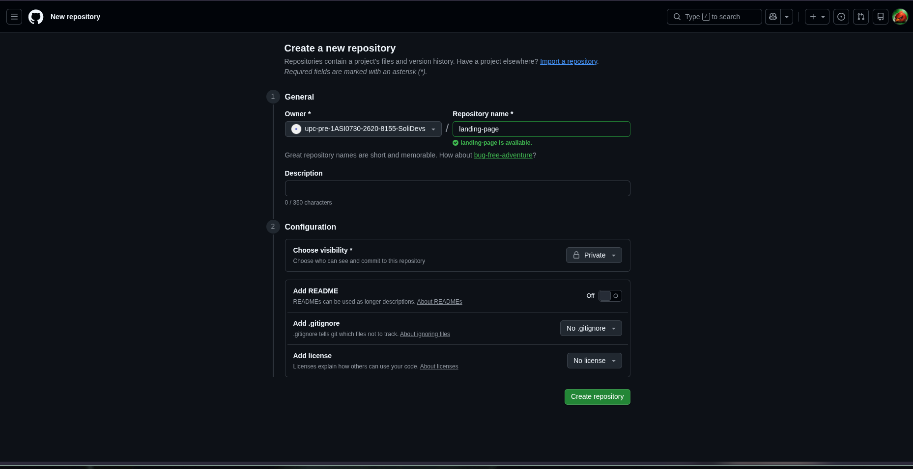
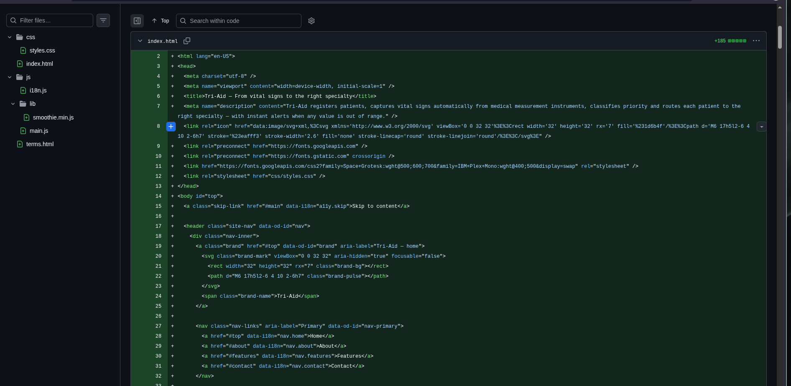
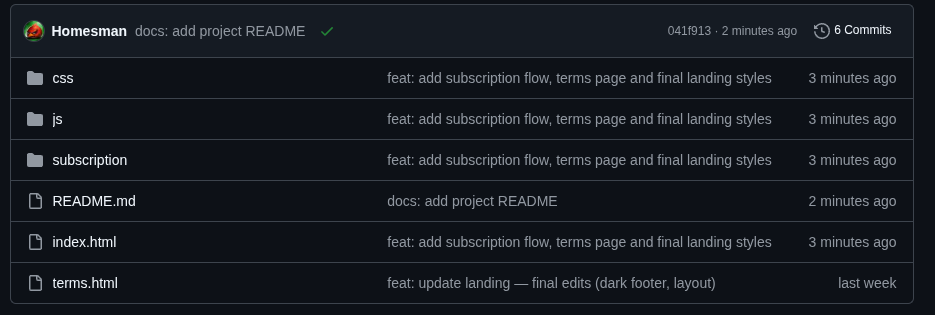

## 5.1. Software Configuration Management.

Durante el desarrollo de Tri-Aid se gestionaron múltiples elementos como prototipos, documentación UX, diagramas de arquitectura, código fuente y versiones del sistema. Para ello, se utilizaron herramientas colaborativas que facilitaron el trabajo en equipo y permitieron llevar un control adecuado de los cambios realizados en cada uno de los productos de la solución.

### 5.1.1. Software Development Environment Configuration.

El entorno de desarrollo del proyecto fue configurado utilizando herramientas digitales basadas en la nube y de escritorio, las cuales permitieron el trabajo colaborativo y la integración de las distintas fases del desarrollo de la plataforma.

### GitHub

Utilizado como repositorio principal para la gestión del código fuente, control de versiones y trabajo colaborativo entre los integrantes del equipo mediante GitFlow.

[GitHub](https://github.com/)

<p align="center">

</p>

### Uxpressia

Herramienta utilizada para la elaboración de entregables UX como user personas, user task matrix, journey maps, empathy maps e impact map.

[UXPressia](https://uxpressia.com/)

<p align="center">
  
</p>

### Miro

Plataforma empleada para la elaboración del Big Picture EventStorming y el Design-Level EventStorming, permitiendo la colaboración del equipo en el modelado del dominio.

[Miro](https://miro.com/)

<p align="center">
  
</p>

### Figma

Herramienta utilizada para la elaboración de wireframes, mockups y prototipos de la Landing Page y de las aplicaciones web (Panel de Triaje y Portal del Paciente).

[Figma](https://www.figma.com/)

<p align="center">
  
</p>

### VSCode

Editor de código principal del equipo. Permitió trabajar de manera eficiente con archivos HTML, CSS y JavaScript para la Landing Page, así como con la documentación del informe en Markdown, facilitando la organización del código y la integración con el repositorio del proyecto.

[VSCode](https://code.visualstudio.com/)

<p align="center">
  
</p>

### Meet

Herramienta de comunicación utilizada para la coordinación del equipo durante el desarrollo del proyecto. A través de reuniones virtuales se realizaron los Sprint Planning, los seguimientos de avances y la toma de decisiones.

[Meet](https://meet.google.com/)

<p align="center">
  
</p>

## 5.1.2 Source Code Management

La gestión del código fuente del proyecto se realizó mediante la plataforma GitHub, la cual fue utilizada como sistema de control de versiones para organizar y dar seguimiento a todos los cambios realizados durante el desarrollo.

El proyecto cuenta con dos repositorios principales:

- Repositorio del informe (documentación): https://github.com/upc-pre-1ASI0730-2620-8155-SoliDevs/project-report
- Repositorio de la Landing Page: https://github.com/upc-pre-1ASI0730-2620-8155-SoliDevs/landing-page

En el repositorio del informe se gestionaron todos los avances relacionados a la documentación del proyecto, mientras que en el repositorio de la Landing Page se desarrolló la parte visual y funcional del producto.

### GitFlow Workflow

Para la organización del desarrollo se implementó el modelo GitFlow como estrategia de control de versiones. Este modelo permitió estructurar el trabajo del equipo y mantener un flujo ordenado de integración.

Las ramas utilizadas en el proyecto fueron:

- **main**: contiene la versión estable del proyecto.
- **develop**: rama principal de trabajo donde se integran los avances del equipo.

La rama develop fue utilizada como base para el desarrollo continuo del proyecto, permitiendo consolidar los cambios antes de integrarlos a la versión final.

Adicionalmente, para el desarrollo de nuevas funcionalidades se utilizaron ramas tipo feature, siguiendo buenas prácticas de control de versiones. Cada funcionalidad o sección del informe se desarrolló en su propia rama y se integró mediante merge al finalizar.

### Convenciones de Ramas

Se estableció la siguiente convención para la creación de ramas:

- Feature branches:
  feature/nombre-funcionalidad

Ejemplos reales del proyecto:
feature/cap4-design-level-eventstorming  
feature/cap4-database-design  
feature/cap4-3-landing-ui  

Estas ramas permitieron desarrollar cada funcionalidad y sección de manera independiente sin afectar la estabilidad del proyecto.

### Semantic Versioning

Para el control de versiones del proyecto se adoptó el uso de Semantic Versioning (SemVer), siguiendo la estructura:

vMAJOR.MINOR.PATCH

Donde:
- MAJOR: cambios importantes o incompatibles  
- MINOR: nuevas funcionalidades  
- PATCH: corrección de errores  

Ejemplos reales del registro de versiones del informe:
v0.1.0 (creación del repositorio)  
v1.0.0 (Student Outcome)  
v2.0.0 (Information Architecture)  
v3.0.0 (sección 4.4 Web Applications UX/UI Design)  

Esto permite mantener un control claro sobre la evolución del proyecto.

### Conventional Commits

Para estandarizar los mensajes de commits, se aplicó la convención de Conventional Commits, lo que permitió mejorar la organización y trazabilidad del repositorio.

Los tipos de commits utilizados fueron:

- feat: nuevas funcionalidades  
- docs: cambios en documentación  
- fix: corrección de errores  
- chore: tareas menores o mantenimiento  

Ejemplos reales del proyecto:

docs: add design-level event storming captures  
docs: add chapter 4.7 object-oriented design  
docs: add subscription management user stories (EP09, US51-53)  
feat: add landing page deployment configuration  
chore: update repository structure  

<p align="center">
  
</p>

<p align="center">
Historial de commits del repositorio, evidenciando el uso de Conventional Commits y el trabajo colaborativo de los integrantes del equipo.
</p>

El uso de estas convenciones permitió identificar fácilmente el tipo de cambio realizado en cada commit y mejorar la colaboración entre los integrantes del equipo.

## 5.1.3 Source Code Style Guide & Conventions

Con el objetivo de garantizar la consistencia, legibilidad y mantenibilidad del proyecto, el equipo definió una guía de estilo basada en las tecnologías utilizadas en el desarrollo de la Landing Page y de la documentación del informe.

Esta guía establece estándares que permiten mantener un código limpio, organizado y comprensible para todos los integrantes del equipo.

### HTML

Para la estructura del documento HTML se establecieron las siguientes convenciones:

- Uso de etiquetas en minúsculas (lowercase)
- Correcto cierre de todos los elementos HTML
- Uso de etiquetas semánticas como `header`, `nav`, `main`, `section` y `footer`
- Inclusión de atributos `alt` en imágenes para mejorar la accesibilidad
- Estructuración jerárquica del contenido

Ejemplo:

```html
<section>
  <h1>Triaje más rápido. Detección temprana.</h1>
  <p>Plataforma de triaje asistido por IoT</p>
</section>
```

### CSS

Para los estilos del sistema se definieron las siguientes convenciones:

- Uso de kebab-case para nombres de clases
- Nombres descriptivos según la funcionalidad del elemento
- Reutilización de clases para evitar duplicidad
- Organización de estilos en archivos CSS independientes

Ejemplo:

```css
.hero-section {
  background-color: #1B4F8A;
  color: #ffffff;
}
```

### JavaScript

Para la lógica del cliente se definieron las siguientes convenciones:

- Uso de const y let en lugar de var
- Nombres de funciones y variables en camelCase
- Organización del código en módulos independientes
- Comentarios solo cuando la lógica lo requiera

### Markdown (documentación)

Para la documentación del informe se definieron las siguientes convenciones:

- Estructura de encabezados jerárquica según la numeración del statement
- Imágenes referenciadas desde la carpeta de assets del reporte
- Tablas en HTML para los artefactos que lo requieren (Product Backlog, User Task Matrix)
- Commits de documentación con el tipo docs según Conventional Commits

## 5.1.4. Software Deployment Configuration.

En esta sección se especifica la configuración y los pasos necesarios para el despliegue de los productos digitales de la solución Tri-Aid. El despliegue de la Landing Page se ha configurado para garantizar que los cambios realizados en el repositorio de código fuente se reflejen de manera automática en el entorno de producción.

## Despliegue de la Landing Page

1. Se creó el repositorio en GitHub dentro de la organización del equipo SoliDevs, configurado como repositorio público.

<p align="center">
  
</p>

2. El código fuente desarrollado en VS Code fue sincronizado con la rama main del repositorio mediante comandos de Git.

<p align="center">
  
</p>

3. Hosting: La visualización del producto se gestiona a través de la infraestructura de GitHub Pages, asegurando que el HTML, CSS y JavaScript de la Landing Page sean accesibles de forma pública una vez realizado el push de los archivos.

<p align="center">
  
</p>
