## 5.2. Landing Page, Services & Applications Implementation.

La implementación de la Landing Page, los servicios y las aplicaciones web constituye la fase en la que los conceptos definidos en los capítulos anteriores se transforman en un producto funcional. En esta etapa, el equipo traduce los requisitos y especificaciones obtenidos del Process Elicitation en código, cumpliendo las necesidades de los segmentos objetivo: el personal de triaje y los pacientes de emergencias.

### 5.2.1. Sprint 1

El primer sprint del proyecto posee gran importancia en el proceso de desarrollo ágil. A lo largo de este periodo, el equipo se enfocó con mayor énfasis en la implementación de las características fundamentales y de las funcionalidades de mayor prioridad de la planificación inicial, concentrando el esfuerzo en la Landing Page como carta de presentación del producto y en la documentación de arquitectura del Capítulo IV.

#### 5.2.1.1. Sprint Planning 1.

Para este sprint, la reunión de Sprint Planning permitió al equipo seleccionar las historias de usuario prioritarias del backlog, estimar el esfuerzo y asignar las tareas. El objetivo fue mantener la alineación del equipo y garantizar que la Landing Page comunique correctamente la propuesta de valor de Tri-Aid al personal de triaje y a los pacientes.

| Campo / Sección | Detalle |
| :--- | :--- |
| Sprint # | Sprint 1 |
| Date | 2026-09-12 |
| Time | 8:00 PM |
| Location | Google Meet |
| Prepared By | Alva Ayala, Mitchell Adriano |
| Attendees (to planning meeting) | Alva Ayala, Mitchell Adriano / Castro Solorza, Nicolás Eduardo / Huayta Fuentes, Hernan Gabriel / Ochoa Prado, Enrique Augusto |
| Sprint 1 Review Summary | Al ser el primer sprint del proyecto, no existe revisión de un sprint anterior. El equipo partió de la aprobación del Product Backlog inicial, enfocándose en las Historias de Usuario de la Landing Page: propuesta de valor, beneficios por segmento, planes de suscripción y formulario de contacto. |
| Sprint 1 Retrospective Summary | Al ser el inicio del proyecto, se establecieron las normas de trabajo del equipo: reuniones de seguimiento (Daily Stand-ups) por Google Meet, uso de GitFlow y Conventional Commits para el control de versiones, y comunicación constante para evitar bloqueos en el desarrollo. |
| Sprint 1 Goal | Nuestro enfoque se centra en comunicar la propuesta de valor de Tri-Aid a los visitantes de la Landing Page. Creemos que esto entregará una Landing Page clara y confiable, que genere interés en hospitales y en los pacientes. Esto será confirmado cuando los visitantes naveguen la propuesta de valor completa, comparen los planes de suscripción y envíen una solicitud a través del formulario de contacto. |
| Sprint 1 Velocity | El equipo ha establecido un Velocity de 11 Story Points, que representa la capacidad máxima de esfuerzo que los developers pueden aceptar de manera realista para este Sprint 1. |
| Sum of Story Points | 11 (US01: 2 · US02: 2 · US03: 2 · US04: 2 · US05: 3) |

#### 5.2.1.2. Aspect Leaders and Collaborators

En esta sección se presenta la matriz de liderazgo y colaboración (LACX), que define los roles de cada integrante del equipo en los distintos aspectos considerados dentro del Sprint.

Los aspectos seleccionados corresponden a las principales áreas del proyecto Tri-Aid, incluyendo el diseño UX/UI, el desarrollo de la Landing Page, la documentación del informe y el modelado del sistema.

| Team Member (Last Name, First Name) | GitHub Username | UX/UI Design | Landing Page | Documentation | Modeling |
|------------------------------------|----------------|-------------|-------------|--------------|----------|
| Alva Ayala, Mitchell Adriano | Upcino | C | L | C | C |
| Castro Solorza, Nicolás Eduardo | NicoCSE | L | C | C | C |
| Huayta Fuentes, Hernan Gabriel | Homesman | C | C | L | L |
| Ochoa Prado, Enrique Augusto | EnriqueO-18 | C | C | C | L |

#### 5.2.1.3. Sprint Backlog 1

El objetivo del presente Sprint fue el diseño y desarrollo de la Landing Page de Tri-Aid, enfocándose en comunicar la propuesta de valor, los beneficios por segmento, los planes de suscripción y el contacto con potenciales clientes institucionales.

Durante este Sprint, el equipo trabajó de manera colaborativa en la construcción de las diferentes secciones de la Landing Page, asegurando una experiencia de usuario clara, intuitiva y alineada con los objetivos del sistema.

  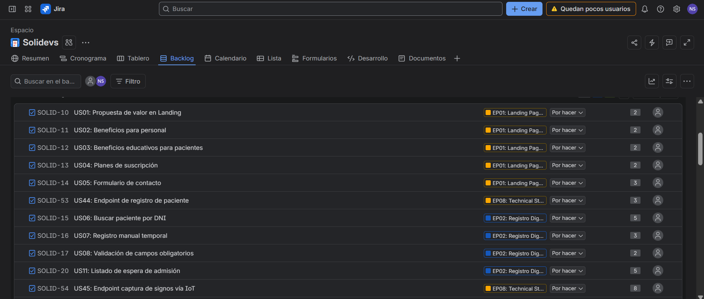
  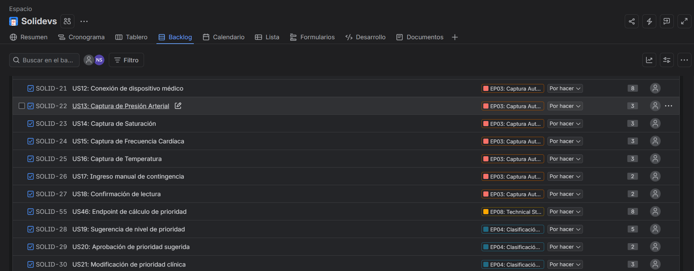
  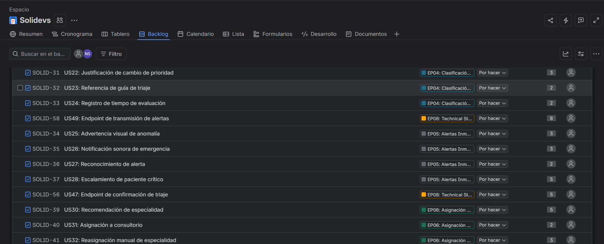
  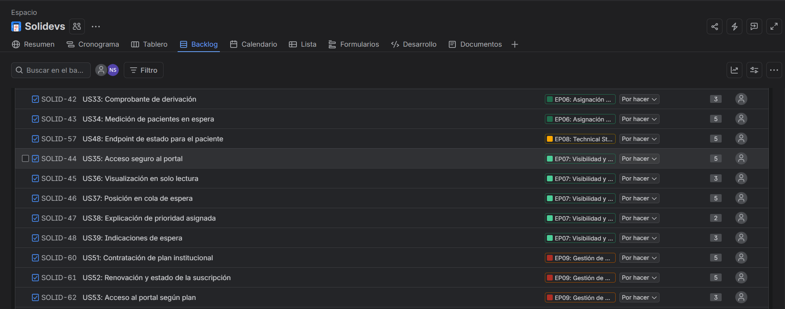
  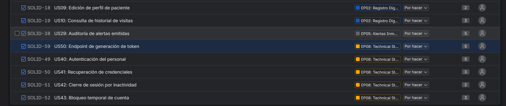

A continuación, se detallan las User Stories priorizadas y las tareas asociadas:

| US Id | Title | Task Id | Task Title | Description | Estimation (Hours) | Assigned To | Status |
|------|------|--------|------------|------------|-------------------|-------------|--------|
| US01 | Propuesta de valor en Landing | T01 | Hero y propuesta de valor | Diseño de la sección principal con titular, subtítulo y CTAs | 3 | Mitchell Alva | Done |
| US02 | Beneficios para personal | T02 | Beneficios del personal de triaje | Redacción y diseño de las tarjetas de beneficios para el personal de triaje | 2 | Nicolás Castro | Done |
| US03 | Beneficios educativos para pacientes | T03 | Beneficios para pacientes | Redacción y diseño de los beneficios orientados al paciente | 2 | Hernan Huayta | Done |
| US04 | Planes de suscripción | T04 | Sección de planes | Diseño de los 3 planes con toggle mensual/anual y precios | 2 | Enrique Ochoa | Done |
| US05 | Formulario de contacto | T05 | Formulario de contacto | Formulario con validación de campos obligatorios y mensaje de éxito | 2 | Mitchell Alva | Done |
| US51 | Contratación de plan institucional | T06 | Registro de suscripción | Definición del flujo de contratación de planes institucionales | 5 | Hernan Huayta | Done |
| US52 | Renovación y estado de la suscripción | T07 | Estados de suscripción | Definición de los estados de suscripción (activa, mora, cancelada) | 3 | Enrique Ochoa | Done |
| US53 | Acceso al portal según plan | T08 | Acceso condicionado al plan | Definición del acceso al portal según las características del plan | 3 | Hernan Huayta | Done |

#### 5.2.1.4. Development Evidence for Sprint Review

En esta sección se explican los avances en implementación con relación a los productos de la solución según el alcance del Sprint: Landing Page y documentación de arquitectura del informe. Se presenta la tabla de commits relacionados con la implementación.

| Repository | Branch | Commit Id | Commit Message | Committed on (Date) |
|------------|--------|-----------|----------------|---------------------|
| SoliDevs/project-report | feature/cap4-design-level-eventstorming | 86073d4 | docs: add C4 architecture diagrams with Structurizr DSL | 16/09/2026 |
| SoliDevs/project-report | feature/cap4-design-level-eventstorming | e501858 | docs: add design-level event storming captures | 16/09/2026 |
| SoliDevs/project-report | feature/cap4-design-level-eventstorming | 17be34a | docs: add chapter 4.6 domain-driven software architecture | 16/09/2026 |
| SoliDevs/project-report | feature/cap4-class-diagrams | a8589f2 | docs: add class diagrams sources and renders per bounded context | 16/09/2026 |
| SoliDevs/project-report | feature/cap4-class-diagrams | 5742bc4 | docs: add chapter 4.7 object-oriented design | 16/09/2026 |
| SoliDevs/project-report | feature/cap3-subscription-stories | 49d36ba | docs: add subscription management user stories (EP09, US51-53) | 16/09/2026 |
| SoliDevs/project-report | feature/cap3-product-backlog | 68d6523 | docs: fix epic placement and add subscription stories to product backlog | 16/09/2026 |
| SoliDevs/project-report | feature/cap4-ui-design | cd19c4c | docs: add landing page wireframes | 16/09/2026 |
| SoliDevs/project-report | feature/cap4-ui-design | bd6b993 | docs: add landing page mockups and chapter 4.3 | 16/09/2026 |
| SoliDevs/project-report | feature/cap4-ui-design | 2f2b0a2 | docs: add mockups board | 16/09/2026 |
| SoliDevs/project-report | feature/cap4-2-web-applications-ux | 0dcbbde | docs: add user flow diagram | 16/09/2026 |
| SoliDevs/project-report | feature/cap4-2-web-applications-ux | 79eed33 | docs: add wireflow diagram and chapter 4.4 | 16/09/2026 |
| SoliDevs/project-report | feature/cap5-scm | 4725457 | docs: add chapter 5.1 software configuration management | 16/09/2026 |

#### 5.2.1.5. Execution Evidence for Sprint Review

En esta sección se presentan las evidencias de la ejecución de la Landing Page desarrollada durante el Sprint. Las siguientes capturas muestran la interacción del usuario con las diferentes secciones de la página, permitiendo validar la estructura de información, la propuesta de valor y la navegación definida para Tri-Aid.

**Figura 1. Sección principal de la Landing Page**

  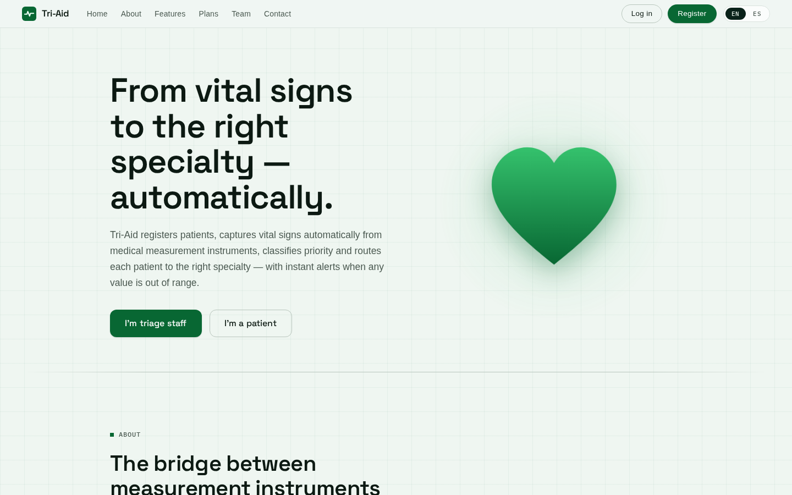

La figura muestra la sección principal de la Landing Page, donde se presenta la propuesta de valor de Tri-Aid junto con los llamados a la acción dirigidos al personal de triaje y a los pacientes.

**Figura 2. Sección About**

  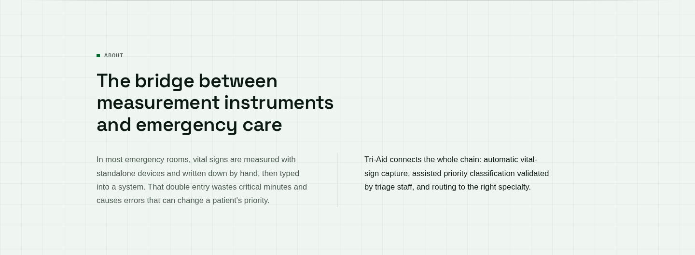

En esta sección se describe el problema que aborda Tri-Aid y la solución propuesta, permitiendo al visitante comprender el propósito y los beneficios del servicio.

**Figura 3. Sección Features**

  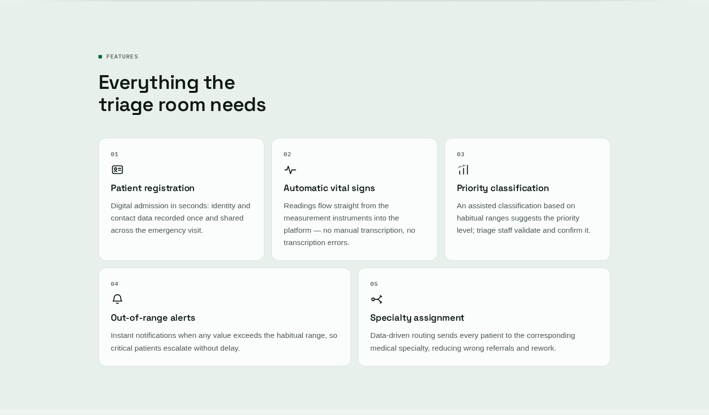

La figura muestra las principales características de la plataforma: captura automática de signos vitales, clasificación asistida NT-158 y seguimiento del paciente en tiempo real.

**Figura 4. Sección Plans**

  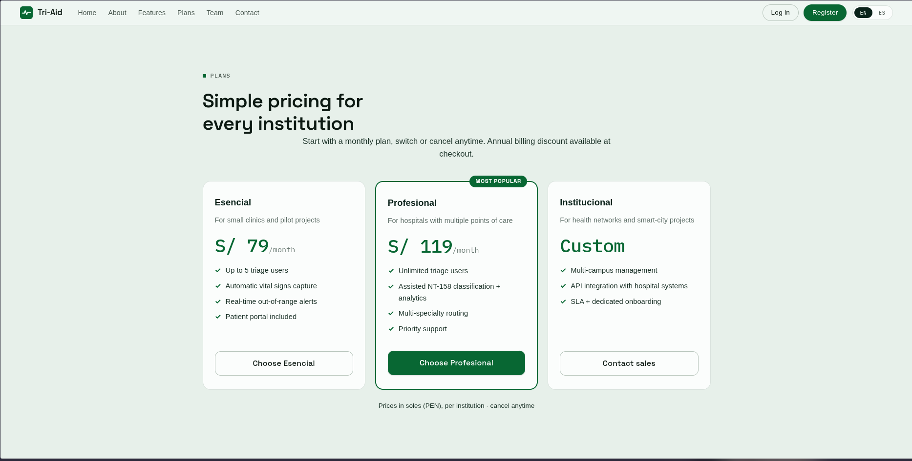

La figura muestra la sección de planes de suscripción con el toggle de facturación mensual/anual, dirigida a las instituciones de salud interesadas en la plataforma.

**Figura 5. Sección Team**

  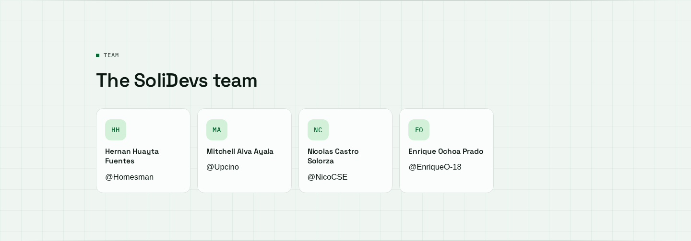

La figura presenta al equipo SoliDevs, responsables del desarrollo de la plataforma.

**Figura 6. Sección Contact**

  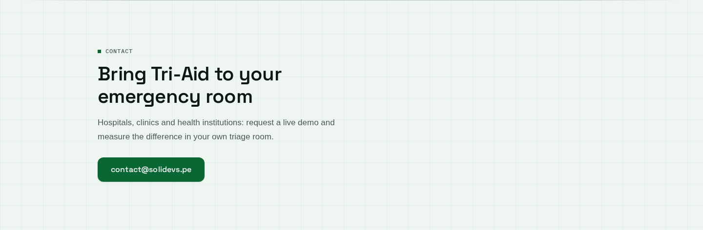

La figura muestra el formulario de contacto que permite a las instituciones solicitar una demostración del producto.

#### 5.2.1.6. Services Documentation Evidence for Sprint Review

Durante este Sprint el alcance se concentró en la Landing Page, por lo que la documentación de servicios del Web Service (RESTful API) se encuentra planificada para sprints posteriores junto con la implementación de los endpoints definidos en las User Stories US44 a US50. La especificación de dichos endpoints se encuentra definida en el Product Backlog del proyecto.

#### 5.2.1.7. Software Deployment Evidence for Sprint Review.

Esta sección se ha decidido omitir debido a que, para este avance, el equipo se ha enfocado solamente en el diseño y desarrollo de la Landing Page. En futuros entregables se procederá a brindar información más detallada del despliegue de las aplicaciones web y los servicios.

#### 5.2.1.8. Team Collaboration Insights during Sprint

Durante el Sprint 1, la colaboración del equipo se distribuyó entre los cuatro integrantes, cubriendo la implementación de la Landing Page, los wireframes y mockups del Panel de Triaje y del Portal del Paciente, la documentación de arquitectura (Design-Level EventStorming, C4, clases y base de datos) y la gestión del Product Backlog.

  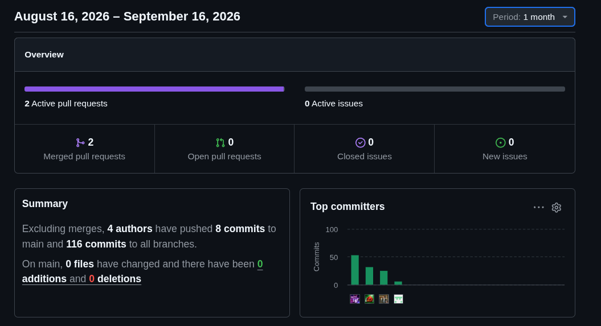

La evidencia muestra el resumen de contribuciones del repositorio durante el mes de trabajo: 4 autores con commits en el proyecto, evidenciando la participación activa de todos los integrantes del equipo en el desarrollo de los productos de la solución y de la documentación.
