## 5.2. Landing Page, Services & Applications Implementation.

La implementación de la Landing Page, los servicios y las aplicaciones web constituye la fase en la que los conceptos definidos en los capítulos anteriores se transforman en un producto funcional. En esta etapa, el equipo traduce los requisitos y especificaciones obtenidos del Process Elicitation en código, cumpliendo las necesidades de los segmentos objetivo: el personal de triaje y los pacientes de emergencias.

### 5.2.1. Sprint 1

El primer sprint del proyecto posee gran importancia en el proceso de desarrollo ágil. A lo largo de este periodo, el equipo se enfocó con mayor énfasis en la implementación de las características fundamentales y de las funcionalidades de mayor prioridad de la planificación inicial, concentrando el esfuerzo en la Landing Page como carta de presentación del producto y en la documentación de arquitectura del Capítulo IV.

#### 5.2.1.1. Sprint Planning 1.

Para este sprint, la reunión de Sprint Planning permitió al equipo seleccionar las historias de usuario prioritarias del backlog, estimar el esfuerzo y asignar las tareas. El objetivo fue mantener la alineación del equipo y garantizar que la Landing Page comunique correctamente la propuesta de valor de Tri-Aid al personal de triaje y a los pacientes.

| Campo / Sección | Detalle |
| :--- | :--- |
| Sprint # | Sprint 1 |
| Date | 2026-09-12 |
| Time | 8:00 PM |
| Location | Google Meet |
| Prepared By | Alva Ayala, Mitchell Adriano |
| Attendees (to planning meeting) | Alva Ayala, Mitchell Adriano / Castro Solorza, Nicolás Eduardo / Huayta Fuentes, Hernan Gabriel / Ochoa Prado, Enrique Augusto |
| Sprint 1 Review Summary | Al ser el primer sprint del proyecto, no existe revisión de un sprint anterior. El equipo partió de la aprobación del Product Backlog inicial, enfocándose en las Historias de Usuario de la Landing Page: propuesta de valor, beneficios por segmento, planes de suscripción y formulario de contacto. |
| Sprint 1 Retrospective Summary | Al ser el inicio del proyecto, se establecieron las normas de trabajo del equipo: reuniones de seguimiento (Daily Stand-ups) por Google Meet, uso de GitFlow y Conventional Commits para el control de versiones, y comunicación constante para evitar bloqueos en el desarrollo. |
| Sprint 1 Goal | Nuestro enfoque se centra en comunicar la propuesta de valor de Tri-Aid a los visitantes de la Landing Page. Creemos que esto entregará una Landing Page clara y confiable, que genere interés en hospitales y en los pacientes. Esto será confirmado cuando los visitantes naveguen la propuesta de valor completa, comparen los planes de suscripción y envíen una solicitud a través del formulario de contacto. |
| Sprint 1 Velocity | El equipo ha establecido un Velocity de 11 Story Points, que representa la capacidad máxima de esfuerzo que los developers pueden aceptar de manera realista para este Sprint 1. |
| Sum of Story Points | 11 (US01: 2 · US02: 2 · US03: 2 · US04: 2 · US05: 3) |

#### 5.2.1.2. Aspect Leaders and Collaborators

En esta sección se presenta la matriz de liderazgo y colaboración (LACX), que define los roles de cada integrante del equipo en los distintos aspectos considerados dentro del Sprint.

Los aspectos seleccionados corresponden a las principales áreas del proyecto Tri-Aid, incluyendo el diseño UX/UI, el desarrollo de la Landing Page, la documentación del informe y el modelado del sistema.

| Team Member (Last Name, First Name) | GitHub Username | UX/UI Design | Landing Page | Documentation | Modeling |
|------------------------------------|----------------|-------------|-------------|--------------|----------|
| Alva Ayala, Mitchell Adriano | Upcino | C | L | C | C |
| Castro Solorza, Nicolás Eduardo | NicoCSE | L | C | C | C |
| Huayta Fuentes, Hernan Gabriel | Homesman | C | C | L | L |
| Ochoa Prado, Enrique Augusto | EnriqueO-18 | C | C | C | L |

#### 5.2.1.3. Sprint Backlog 1

El objetivo del presente Sprint fue el diseño y desarrollo de la Landing Page de Tri-Aid, enfocándose en comunicar la propuesta de valor, los beneficios por segmento, los planes de suscripción y el contacto con potenciales clientes institucionales.

Durante este Sprint, el equipo trabajó de manera colaborativa en la construcción de las diferentes secciones de la Landing Page, asegurando una experiencia de usuario clara, intuitiva y alineada con los objetivos del sistema.

<div align="center">
  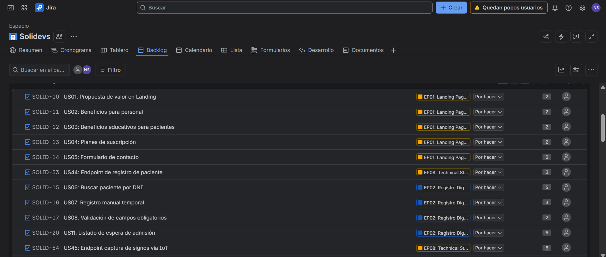
  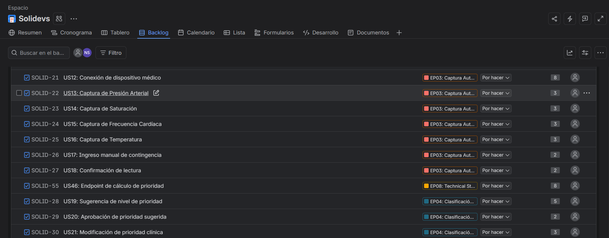
  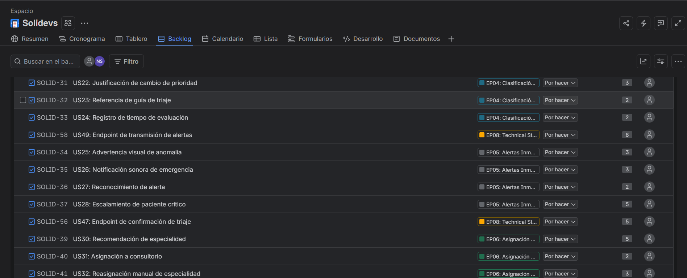
  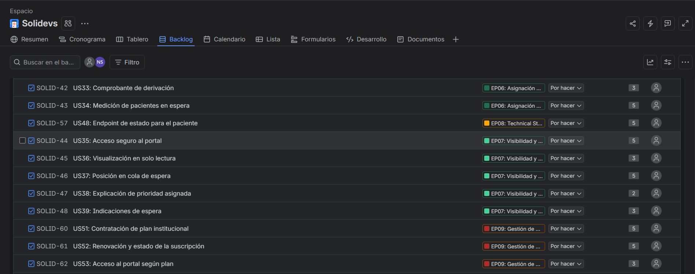
  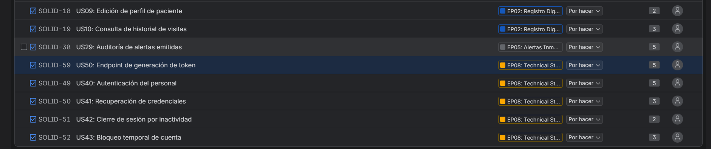
</div>

A continuación, se detallan las User Stories priorizadas y las tareas asociadas:

| US Id | Title | Task Id | Task Title | Description | Estimation (Hours) | Assigned To | Status |
|------|------|--------|------------|------------|-------------------|-------------|--------|
| US01 | Propuesta de valor en Landing | T-01 | Diseñar wireframe de la sección hero | Diseñar la sección principal con titular, subtítulo y llamadas a la acción | 1 | Mitchell Alva | Done |
| US01 | Propuesta de valor en Landing | T-02 | Implementar sección hero | Maquetar en HTML/CSS el hero con la propuesta de valor de Tri-Aid | 1 | Mitchell Alva | Done |
| US02 | Beneficios para personal | T-03 | Redactar beneficios del personal de triaje | Definir los mensajes de automatización y reducción de errores para el segmento salud | 1 | Nicolás Castro | Done |
| US02 | Beneficios para personal | T-04 | Diseñar tarjetas de beneficios | Diseñar las tarjetas de beneficios con iconografía para el personal de triaje | 1 | Nicolás Castro | Done |
| US02 | Beneficios para personal | T-05 | Integrar sección en la landing | Integrar la sección de beneficios al layout responsive de la landing | 1 | Nicolás Castro | Done |
| US03 | Beneficios educativos para pacientes | T-06 | Redactar beneficios para pacientes | Definir los mensajes de visibilidad del estado y acompañamiento para el segmento paciente | 1 | Hernan Huayta | Done |
| US03 | Beneficios educativos para pacientes | T-07 | Diseñar sección de beneficios | Diseñar la presentación de beneficios orientados al paciente y su familia | 1 | Hernan Huayta | Done |
| US03 | Beneficios educativos para pacientes | T-08 | Integrar sección responsive | Adaptar la sección de beneficios a móviles y tablets | 1 | Hernan Huayta | Done |
| US04 | Planes de suscripción | T-09 | Diseñar los planes de suscripción | Diseñar los 3 planes (Básico, Institucional, Enterprise) con precios y características | 1 | Enrique Ochoa | Done |
| US04 | Planes de suscripción | T-10 | Implementar toggle mensual/anual | Implementar el conmutador de facturación mensual y anual con descuento | 1 | Enrique Ochoa | Done |
| US05 | Formulario de contacto | T-11 | Diseñar formulario de contacto | Diseñar el formulario con campos de institución, cargo y mensaje | 1 | Mitchell Alva | Done |
| US05 | Formulario de contacto | T-12 | Implementar validación de campos | Validar los campos obligatorios y el formato de correo en el cliente | 1 | Mitchell Alva | Done |
| US05 | Formulario de contacto | T-13 | Implementar mensaje de éxito | Mostrar la confirmación de envío y el canal de respuesta al visitante | 1 | Mitchell Alva | Done |
| US51 | Contratación de plan institucional | T-14 | Definir flujo de contratación | Definir el flujo de contratación de planes institucionales desde el registro hasta la activación | 2 | Hernan Huayta | Done |
| US51 | Contratación de plan institucional | T-15 | Modelar registro de suscripción | Modelar el registro de la suscripción con institución, plan y fecha de renovación | 2 | Hernan Huayta | Done |
| US51 | Contratación de plan institucional | T-16 | Documentar integración con gateway de pagos | Documentar la confirmación del pago mediante el gateway para activar la suscripción | 1 | Enrique Ochoa | Done |
| US52 | Renovación y estado de la suscripción | T-17 | Definir estados de la suscripción | Definir los estados activa, pendiente, en mora y cancelada con sus transiciones | 1 | Enrique Ochoa | Done |
| US52 | Renovación y estado de la suscripción | T-18 | Modelar ciclo de renovación | Modelar la renovación automática anual y las notificaciones previas al vencimiento | 1 | Enrique Ochoa | Done |
| US52 | Renovación y estado de la suscripción | T-19 | Documentar reglas de mora y cancelación | Documentar el tratamiento de pagos rechazados, mora y cancelación del plan | 1 | Enrique Ochoa | Done |
| US53 | Acceso al portal según plan | T-20 | Definir características por plan | Definir las características del portal habilitadas según el plan contratado | 1 | Hernan Huayta | Done |
| US53 | Acceso al portal según plan | T-21 | Modelar acceso condicionado | Modelar el acceso condicionado del personal y pacientes según el plan de la institución | 1 | Hernan Huayta | Done |
| US53 | Acceso al portal según plan | T-22 | Documentar restricciones por plan | Documentar las restricciones y degradación del servicio al vencer el plan | 1 | Enrique Ochoa | Done |

#### 5.2.1.4. Development Evidence for Sprint Review

En esta sección se explican los avances en implementación con relación a los productos de la solución según el alcance del Sprint: Landing Page y documentación de arquitectura del informe. Se presenta la tabla de commits relacionados con la implementación.

| Repository | Branch | Commit Id | Commit Message | Committed on (Date) |
|------------|--------|-----------|----------------|---------------------|
| SoliDevs/project-report | feature/cap4-design-level-eventstorming | 86073d4 | docs: add C4 architecture diagrams with Structurizr DSL | 16/09/2026 |
| SoliDevs/project-report | feature/cap4-design-level-eventstorming | e501858 | docs: add design-level event storming captures | 16/09/2026 |
| SoliDevs/project-report | feature/cap4-design-level-eventstorming | 17be34a | docs: add chapter 4.6 domain-driven software architecture | 16/09/2026 |
| SoliDevs/project-report | feature/cap4-class-diagrams | a8589f2 | docs: add class diagrams sources and renders per bounded context | 16/09/2026 |
| SoliDevs/project-report | feature/cap4-class-diagrams | 5742bc4 | docs: add chapter 4.7 object-oriented design | 16/09/2026 |
| SoliDevs/project-report | feature/cap3-subscription-stories | 49d36ba | docs: add subscription management user stories (EP09, US51-53) | 16/09/2026 |
| SoliDevs/project-report | feature/cap3-product-backlog | 68d6523 | docs: fix epic placement and add subscription stories to product backlog | 16/09/2026 |
| SoliDevs/project-report | feature/cap4-ui-design | cd19c4c | docs: add landing page wireframes | 16/09/2026 |
| SoliDevs/project-report | feature/cap4-ui-design | bd6b993 | docs: add landing page mockups and chapter 4.3 | 16/09/2026 |
| SoliDevs/project-report | feature/cap4-ui-design | 2f2b0a2 | docs: add mockups board | 16/09/2026 |
| SoliDevs/project-report | feature/cap4-2-web-applications-ux | 0dcbbde | docs: add user flow diagram | 16/09/2026 |
| SoliDevs/project-report | feature/cap4-2-web-applications-ux | 79eed33 | docs: add wireflow diagram and chapter 4.4 | 16/09/2026 |
| SoliDevs/project-report | feature/cap5-scm | 4725457 | docs: add chapter 5.1 software configuration management | 16/09/2026 |

#### 5.2.1.5. Execution Evidence for Sprint Review

En esta sección se presentan las evidencias de la ejecución de la Landing Page desarrollada durante el Sprint. Las siguientes capturas muestran la interacción del usuario con las diferentes secciones de la página, permitiendo validar la estructura de información, la propuesta de valor y la navegación definida para Tri-Aid.

**Figura 1. Sección principal de la Landing Page**

<div align="center">
  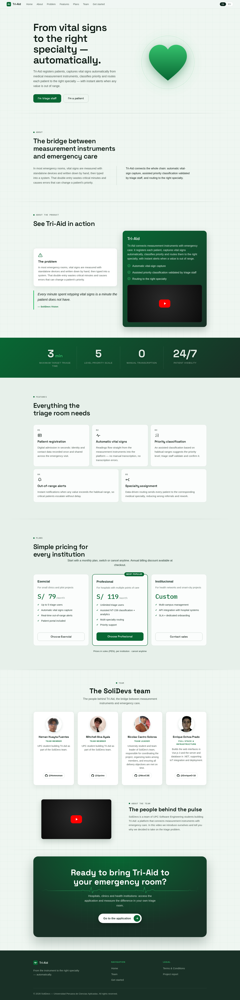
</div>

La figura muestra la sección principal de la Landing Page, donde se presenta la propuesta de valor de Tri-Aid junto con los llamados a la acción dirigidos al personal de triaje y a los pacientes.

**Figura 2. Sección About**

<div align="center">
  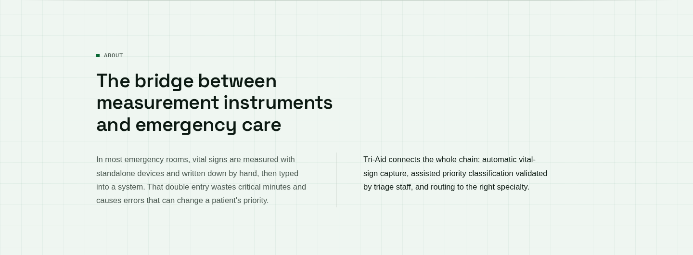
</div>

En esta sección se describe el problema que aborda Tri-Aid y la solución propuesta, permitiendo al visitante comprender el propósito y los beneficios del servicio.

**Figura 3. Sección Features**

<div align="center">
  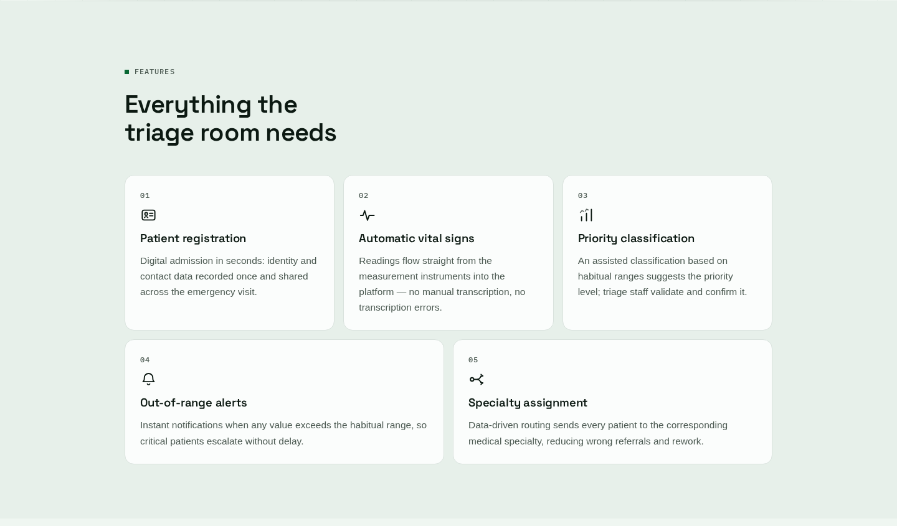
</div>

La figura muestra las principales características de la plataforma: captura automática de signos vitales, clasificación asistida NT-158 y seguimiento del paciente en tiempo real.

**Figura 4. Sección Plans**

<div align="center">
  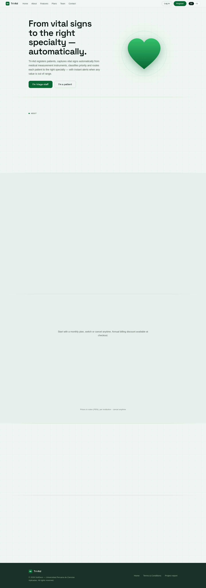
</div>

La figura muestra la sección de planes de suscripción con el toggle de facturación mensual/anual, dirigida a las instituciones de salud interesadas en la plataforma.

**Figura 5. Sección Team**

<div align="center">
  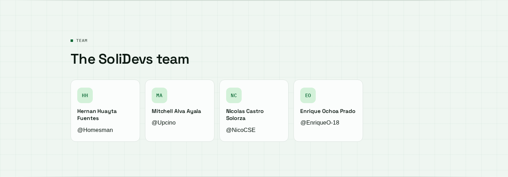
</div>

La figura presenta al equipo SoliDevs, responsables del desarrollo de la plataforma.

**Figura 6. Sección Contact**

<div align="center">
  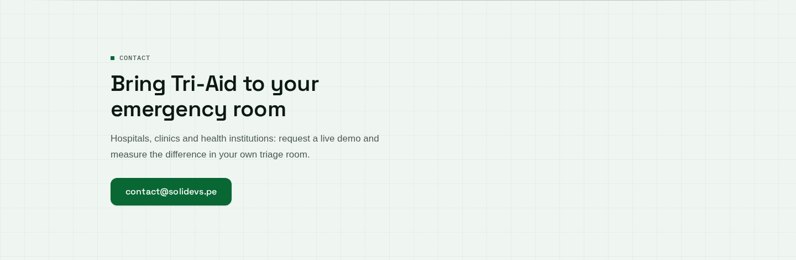
</div>

La figura muestra el formulario de contacto que permite a las instituciones solicitar una demostración del producto.

#### 5.2.1.6. Services Documentation Evidence for Sprint Review

Durante este Sprint el alcance se concentró en la Landing Page, por lo que la documentación de servicios del Web Service (RESTful API) se encuentra planificada para sprints posteriores junto con la implementación de los endpoints definidos en las User Stories US44 a US50. La especificación de dichos endpoints se encuentra definida en el Product Backlog del proyecto.

#### 5.2.1.7. Software Deployment Evidence for Sprint Review.

Esta sección se ha decidido omitir debido a que, para este avance, el equipo se ha enfocado solamente en el diseño y desarrollo de la Landing Page. En futuros entregables se procederá a brindar información más detallada del despliegue de las aplicaciones web y los servicios.

#### 5.2.1.8. Team Collaboration Insights during Sprint

Durante el Sprint 1, la colaboración del equipo se distribuyó entre los cuatro integrantes, cubriendo la implementación de la Landing Page, los wireframes y mockups del Panel de Triaje y del Portal del Paciente, la documentación de arquitectura (Design-Level EventStorming, C4, clases y base de datos) y la gestión del Product Backlog.

<div align="center">
  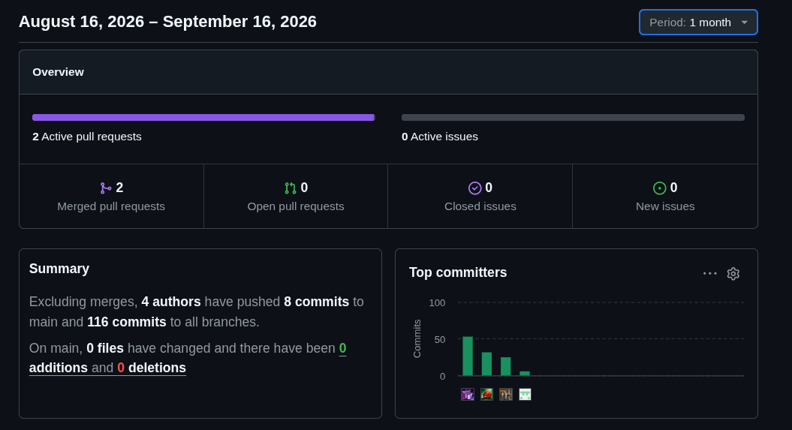
</div>

La evidencia muestra el resumen de contribuciones del repositorio durante el mes de trabajo: 4 autores con commits en el proyecto, evidenciando la participación activa de todos los integrantes del equipo en el desarrollo de los productos de la solución y de la documentación.

### 5.2.2. Sprint 2
El segundo sprint de nuestro proyecto estuvo enfocado en la construcción de la aplicación web de Tri-Aid mediante una arquitectura por Bounded Contexts (Domain-Driven Design): Patient Registration, Vital Signs Capture, Triage Classification, Specialty Assignment y Alerting. Durante este periodo, el equipo implementó el flujo completo de atención de extremo a extremo —registro del paciente, captura y confirmación de signos vitales, clasificación de prioridad según la escala NT-158, derivación a especialidades con comprobante, y generación y atención de alertas— integrando cada contexto mediante un bus de eventos y una infraestructura de persistencia compartida sobre una API REST simulada.

#### 5.2.2.1. Sprint Planning 2.

En esta sección se especifican los aspectos principales del Sprint Planning Meeting. El segundo sprint posee gran importancia pues marca el paso del diseño a la implementación: cada integrante asumió el liderazgo de un bounded context, con la meta de que el flujo de atención completo estuviera funcionando sobre el backend simulado al cierre del sprint.

| Campo / Sección | Detalle |
| :--- | :--- |
| Sprint # | Sprint 2 |
| Date | 2026-10-05 |
| Time | 9:00 PM |
| Location | Google Meet |
| Prepared By | Castro Solorza, Nicolás Eduardo |
| Attendees (to planning meeting) | Alva Ayala, Mitchell Adriano / Castro Solorza, Nicolás Eduardo / Huayta Fuentes, Hernan Gabriel / Ochoa Prado, Enrique Augusto |
| Sprint 2 Review Summary | Durante el Sprint 2 se lograron implementar los cinco bounded contexts del producto de punta a punta: registro de pacientes con identidad temporal y regularización, captura y confirmación de signos vitales con dispositivos vinculados, clasificación NT-158 con sugerencia automática del motor de reglas, derivación a especialidades con cola y comprobante, y alertas generadas por valores fuera de rango con reconocimiento y escalamiento. El Product Owner validó el flujo completo funcionando sobre el backend simulado y resaltó como siguiente prioridad el despliegue productivo (Firebase Hosting + API en Render) y la persistencia de la sesión del personal. |
| Sprint 2 Retrospective Summary | El equipo identificó como acierto la decisión de definir la infraestructura compartida (BaseApi/BaseEndpoint y bus de eventos) al inicio del sprint, lo que permitió que los cinco contextos se desarrollaran en paralelo sin bloqueos. Como oportunidad de mejora, se estableció que los contratos de los endpoints (recursos y assemblers) deben acordarse antes de comenzar el desarrollo de cada contexto, para evitar retrabajos de integración; asimismo, se acordó documentar cada contexto con su diagrama de clases y ERD en el mismo sprint en que se implementa. |
| Sprint 2 Goal | Nuestro enfoque está en que el personal de salud de los hospitales y clínicas afiliadas pueda atender a un paciente de punta a punta con Tri-Aid: registrarlo, capturar y confirmar sus signos vitales desde dispositivos vinculados, clasificar su prioridad con la escala NT-158, derivarlo a la especialidad correcta con comprobante y recibir alertas ante valores críticos.<br>Creemos que esto proporcionará al personal una aplicación web consistente que reduce el tiempo de triaje y los errores de transcripción, y al paciente trazabilidad sobre su atención.<br>Esto se confirmará cuando el flujo completo registro → signos vitales → clasificación → derivación → alertas funcione de extremo a extremo en la aplicación web conectada a la API simulada (json-server en desarrollo y Firebase RTDB en despliegue). |
| Sprint 2 Velocity | Para este Sprint 2, evaluando el desempeño previo y la capacidad actual del equipo, se ha establecido un Velocity de 54 Story Points. |
| Sum of Story Points | 54 |

#### 5.2.2.2 Aspect Leaders and Collaborators

En esta sección se presenta la matriz de liderazgo y colaboración (LACX), donde se definen los roles de cada integrante del equipo en los distintos aspectos considerados dentro del Sprint.

Los aspectos seleccionados corresponden a las principales áreas del proyecto Tri-Aid, incluyendo diseño UX/UI, desarrollo de la web application, documentación y modelado del sistema.

| Team Member (Last Name, First Name) | GitHub Username | UX/UI Design | Web Application | Documentation | Modeling |
|------------------------------------|----------------|-------------|-----------------|---------------|----------|
| Alva Ayala, Mitchell Adriano | Upcino | C | C | C | L |
| Castro Solorza, Nicolás Eduardo | NicoCSE | C | C | L | C |
| Huayta Fuentes, Hernan Gabriel | Homesman | C | L | C | C |
| Ochoa Prado, Enrique Augusto | EnriqueO-18 | L | C | C | C |

#### 5.2.2.3. Sprint Backlog 2

El objetivo de este sprint backlog 2 fue designar las tareas de implementación de los bounded contexts de la aplicación web: dominio (entidades, value objects y eventos), capa de aplicación (stores y servicios), infraestructura (recursos, assemblers y API) y presentación (vistas y componentes), además de sus diagramas de clases y de base de datos para el informe.

Durante este Sprint, el equipo trabajó de manera colaborativa y en paralelo —un responsable líder por contexto—, garantizando que el flujo completo de atención quedara operativo e integrado a través del bus de eventos.

A continuación, se detallan las User Stories priorizadas y las tareas asociadas:

| US Id | Title | Task Id | Task Title | Description | Estimation (Hours) | Assigned To | Status |
|------|------|--------|------------|------------|-------------------|-------------|--------|
| US-09 | Registrar paciente y generar episodio | T-01 | Modelar entidades Patient y Episode | Dominio con identidad temporal, regularización e identificador de episodio diario | 4 | Enrique Ochoa | Done |
| US-09 | Registrar paciente y generar episodio | T-02 | Implementar persistencia de registro | Recursos, assembler y API de patient-registration sobre BaseEndpoint | 4 | Enrique Ochoa | Done |
| US-09 | Registrar paciente y generar episodio | T-03 | Desarrollar vista de registro y ficha por pestañas | Registro con validación, ficha del paciente con signos, datos e historial | 6 | Enrique Ochoa | Done |
| US-12 | Vincular dispositivos al episodio | T-04 | Modelar DeviceLink, DeviceType y VitalsConfirmedEvent | Dominio del contexto vital-signs-capture | 3 | Mitchell Adriano | Done |
| US-12 | Vincular dispositivos al episodio | T-05 | Implementar device-store con inventario persistido | Alta, baja y estado online de dispositivos; picklist solo con dispositivos libres | 4 | Mitchell Adriano | Done |
| US-12 | Vincular dispositivos al episodio | T-06 | Desarrollar vista de dispositivos y panel de vínculo | Inventario, vínculo por episodio y liberación automática al completar derivación | 4 | Mitchell Adriano | Done |
| US-19 | Sugerir prioridad con la escala NT-158 | T-07 | Implementar motor de reglas NT-158 | Clasificación por rangos, valores faltantes y fuera de rango | 5 | Hernan Huayta | Done |
| US-19 | Sugerir prioridad con la escala NT-158 | T-08 | Modelar agregado Classification con estados | PendingConfirmation, Assigned, Overridden, Confirmed | 3 | Hernan Huayta | Done |
| US-21 | Aprobar o modificar la prioridad sugerida | T-09 | Desarrollar vista de clasificación con guía NT-158 | Sugerencia, modificación con justificación y confirmación con tiempo de ciclo | 5 | Hernan Huayta | Done |
| US-30 | Sugerir especialidad según síntomas | T-10 | Implementar catálogo codificado de síntomas | Catálogo ES/EN con restricciones demográficas por especialidad | 4 | Hernan Huayta | Done |
| US-31 | Derivar al paciente a una especialidad | T-11 | Modelar agregado Referral con cambio justificado | Cola por especialidad, estados Referred/InAttention/Attended | 4 | Hernan Huayta | Done |
| US-33 | Emitir comprobante de derivación | T-12 | Implementar voucher con QR y envío por SMS | Voucher dialog con código QR y confirmación de envío | 3 | Hernan Huayta | Done |
| US-38 | Generar alertas por valores fuera de rango | T-13 | Implementar reglas de rangos vitales y generación de alertas | Alertas desde lecturas fuera de rango y clasificaciones I/II | 5 | Nicolás Castro | Done |
| US-38 | Generar alertas por valores fuera de rango | T-14 | Desarrollar centro de alertas con auditoría | Vista cronológica con filtro de rango de fechas y sonido de notificación | 5 | Nicolás Castro | Done |
| US-39 | Reconocer y escalar alertas críticas | T-15 | Implementar reconocimiento y escalamiento a Trauma Shock | Estado persistido de alertas reconocidas y escaladas | 4 | Nicolás Castro | Done |
| US-41 | Ver indicadores del turno en el panel | T-16 | Desarrollar panel con métricas y cola en vivo | Espera promedio, alertas activas, atendidos y dispositivos de la sala | 4 | Mitchell Adriano | Done |
| US-42 | Consultar reportes del turno | T-17 | Desarrollar vista de reportes con registros de atención | Atenciones, alertas y métricas del turno consolidadas | 3 | Enrique Ochoa | Done |
| US-44 | Soportar internacionalización ES/EN | T-18 | Integrar i18n en todas las vistas del panel | Diccionarios ES/EN y selector de idioma persistente | 3 | Enrique Ochoa | Done |
| US-45 | Desplegar la aplicación | T-19 | Configurar Firebase Hosting y API en Render | Hosting SPA, reglas de base de datos, API json-server persistente y variables de entorno | 4 | Hernan Huayta | Done |
| US-45 | Desplegar la aplicación | T-20 | Documentar endpoints y diagramas por contexto | Secciones 4.7, 4.8 y documentación de servicios del sprint | 3 | Nicolás Castro | Done |

#### 5.2.2.4. Development Evidence for Sprint Review

| Repository | Branch | Commit Ids | Commit Message | Commit Message Body | Committed on (Date) |
|------------|--------|-----------|----------------|---------------------|---------------------|
| SoliDevs-WebApplication_Tri-aid | feature/patient-registration | 0fd229e | fix(patient-file): declare missing linkErr ref (link selector fully functional) |  | 05/10/2026 |
| SoliDevs-WebApplication_Tri-aid | feature/triage-alerts-ux | f8fa668 | feat(vital-signs): device link/unlink fixes and auto release on referral completion |  | 05/10/2026 |
| SoliDevs-WebApplication_Tri-aid | feature/triage-alerts-ux | dc03643 | feat(specialty-assignment): suggest validation fix and referral completion closure |  | 05/10/2026 |
| SoliDevs-WebApplication_Tri-aid | feature/triage-alerts-ux | 97bfd4c | feat(triage): out-of-range vital alert generation on classification confirm |  | 05/10/2026 |
| SoliDevs-WebApplication_Tri-aid | feature/triage-alerts-ux | 9296a91 | feat(alerting): GSAP animations, escalation to Trauma Shock and clinical alert rules |  | 05/10/2026 |
| SoliDevs-WebApplication_Tri-aid | feature/triage-alerts-ux | 7981299 | style(layout): responsive shell and hamburger drawer |  | 05/10/2026 |
| SoliDevs-WebApplication_Tri-aid | feature/triage-alerts-ux | b5db530 | Merge pull request #3 from feature/triage-alerts-ux |  | 05/10/2026 |
| SoliDevs-WebApplication_Tri-aid | feature/triage-alerts-ux | 88627ee | chore: firebase hosting config and RTDB production env |  | 05/10/2026 |
| SoliDevs-WebApplication_Tri-aid | feature/alerts-ux-polish | 99967f8 | feat(alerting): bell loads persisted alerts and maps them with pushAlerts |  | 06/10/2026 |
| SoliDevs-WebApplication_Tri-aid | feature/alerts-ux-polish | d01850b | feat(triage): priority pill uses classification level color |  | 06/10/2026 |
| SoliDevs-WebApplication_Tri-aid | feat/patient-domain | 42b8735 | refactor(shared): move triage-level to shared kernel, breaks domain-to-domain coupling |  | 06/10/2026 |
| SoliDevs-WebApplication_Tri-aid | feat/patient-domain | 661ff6a | feat(patient-registration): add domain layer with Patient and Episode aggregates |  | 06/10/2026 |
| SoliDevs-WebApplication_Tri-aid | develop | 31b20da | Merge branch 'feat/patient-domain' into develop |  | 06/10/2026 |

#### 5.2.2.5. Execution Evidence for Sprint Review

En esta sección se presentan evidencias de la ejecución de la web application desarrollada durante el Sprint. Las siguientes capturas corresponden a la aplicación desplegada en https://triaid-solidevs.web.app, conectada a la API REST desplegada en https://triaid-api.onrender.com.

**Figura 1. Panel de triaje (Cola de triaje)**

<div align="center">
  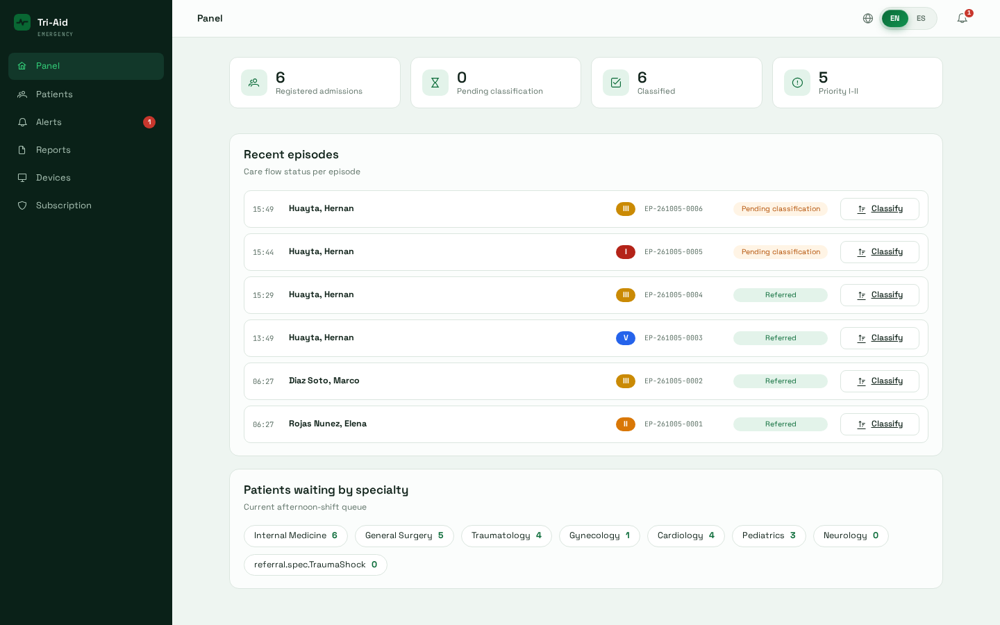
</div>

La figura muestra el panel principal del personal de salud: pacientes en espera, alertas activas del turno, espera promedio y atendidos, junto a la lista de espera de admisión ordenada por prioridad (escala NT-158) con acciones directas por paciente (ver ficha, clasificar, regularizar, comprobante) y el estado de los dispositivos de medición de la sala.

**Figura 2. Registro de paciente**

<div align="center">
  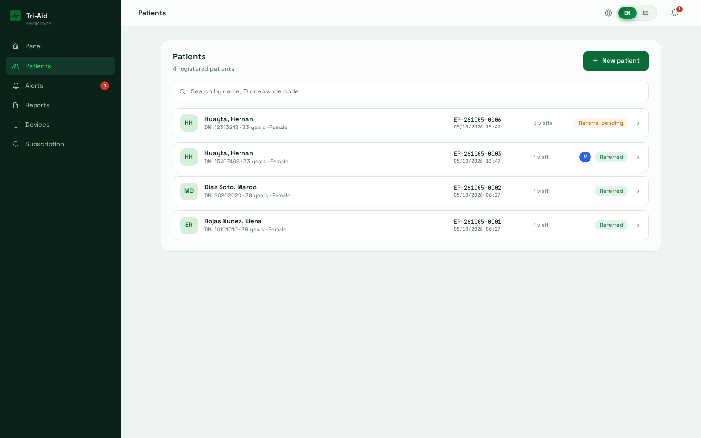
</div>

La figura representa el formulario de registro de pacientes: datos de identidad (DNI, CE, PAS o identidad temporal), datos de llegada y generación automática del episodio de atención con identificador diario, que habilita el flujo de triaje.

**Figura 3. Ficha del paciente y captura de signos vitales**

<div align="center">
  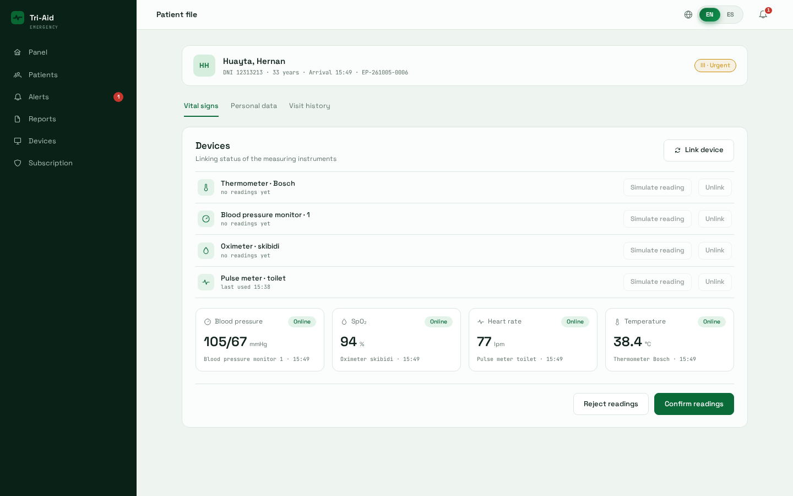
</div>

La figura muestra la ficha del paciente con el panel de captura de signos vitales: los dispositivos vinculados al episodio permiten la lectura automática (o el ingreso manual ante dispositivos desconectados), con confirmación de las lecturas que dispara el evento VitalsConfirmedEvent hacia los contextos de triaje y alertas.

**Figura 4. Clasificación de prioridad (NT-158)**

<div align="center">
  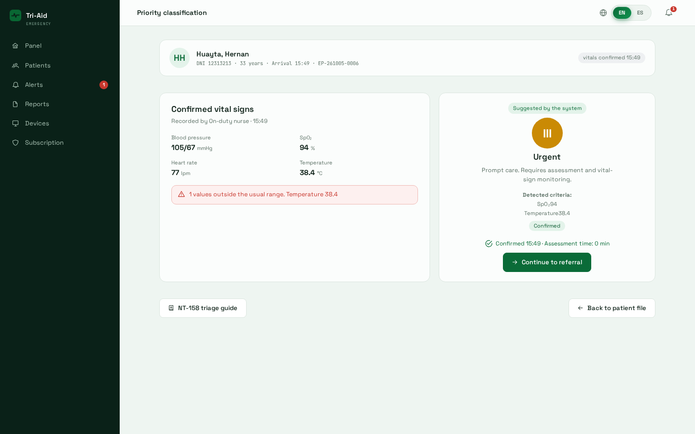
</div>

La figura presenta la clasificación de prioridad: el motor de reglas NT-158 sugiere el nivel a partir de los signos vitales confirmados, el personal puede aprobar la sugerencia o modificarla con justificación, y el tiempo de ciclo del triaje se registra al confirmar.

**Figura 5. Derivación a especialidad y comprobante**

<div align="center">
  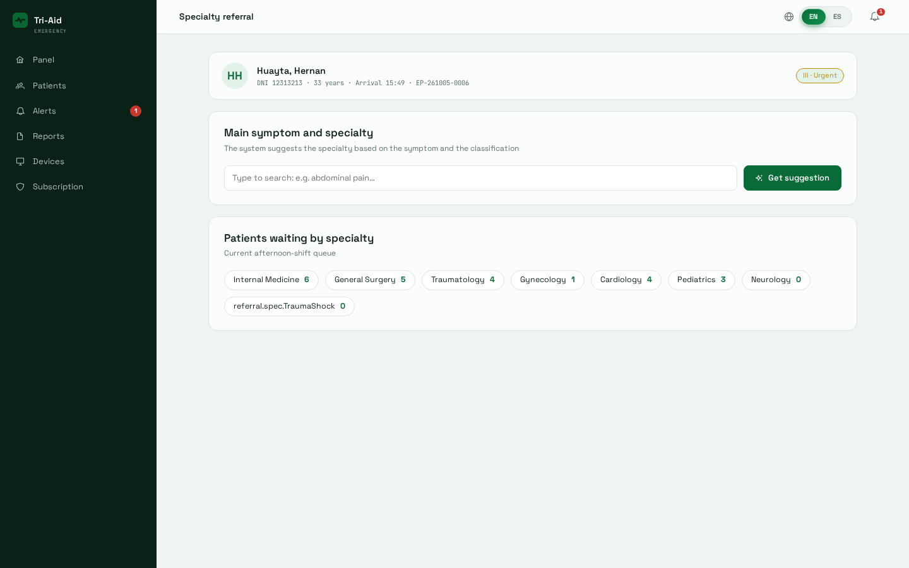
</div>

La figura muestra la derivación: sugerencia de especialidad a partir de los síntomas codificados, cambio de especialidad con justificación, cola por especialidad en vivo y comprobante de derivación con código QR y envío por SMS.

**Figura 6. Centro de alertas**

<div align="center">
  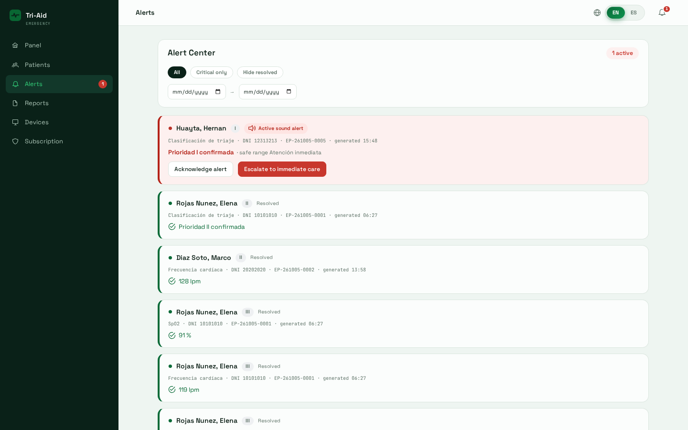
</div>

La figura presenta el centro de alertas: alertas generadas automáticamente por valores fuera de rango y clasificaciones de alta prioridad, con reconocimiento, escalamiento (Trauma Shock), auditoría cronológica del turno y filtro por rango de fechas.

**Figura 7. Dispositivos de medición**

<div align="center">
  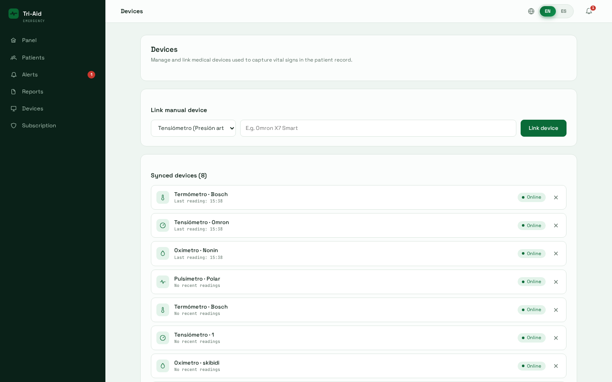
</div>

La figura muestra el inventario de dispositivos de medición: alta y baja de instrumentos, estado online/offline persistente y última hora de uso; los dispositivos libres pueden vincularse al episodio del paciente desde la ficha.

A continuación, se elaboró una explicación de forma audiovisual que detalla cada funcionalidad descrita en este segundo sprint: (enlace pendiente de publicación)

#### 5.2.2.6. Services Documentation Evidence for Sprint Review

En el alcance del presente Sprint 2, el equipo no ha implementado un Web Service propio con documentación OpenAPI/Swagger, dado que el backend formal en ASP.NET Core corresponde a un entregable posterior. Sin embargo, la Frontend Web Application consume una API REST simulada (json-server en desarrollo y Firebase Realtime Database en despliegue) que expone los recursos de cada bounded context bajo el mismo contrato REST, accedida a través de las clases BaseApi, BaseEndpoint y las APIs de cada contexto, con las rutas configuradas en las variables de entorno (.env.development / .env.production):

**API simulada — recursos por bounded context**

URL base (desarrollo): `http://localhost:3900/api/v1` · URL base (producción): `https://triaid-api.onrender.com/api/v1`

| Endpoint | Verbo HTTP | Bounded Context | Descripción | Parámetros | Response ejemplo |
|----------|-----------|-----------------|-------------|------------|------------------|
| `/patients` | GET | Patient Registration | Lista de pacientes registrados | — | Array de Patient (id, docType, dni, names, surnames, birth, sex, phone, address) |
| `/patients` | POST | Patient Registration | Registra un paciente nuevo | Body: objeto Patient sin id | Patient creado con id asignado |
| `/patients/{id}` | PUT | Patient Registration | Actualiza datos de contacto del paciente | `id`: int · Body: objeto Patient | Patient actualizado |
| `/episodes` | GET | Patient Registration | Lista de episodios de atención | — | Array de Episode (id, key, arrival, vitals, confirmed, vitalsConfirmedAt, referred) |
| `/episodes/{id}` | PUT | Patient Registration / Vital Signs Capture | Actualiza el episodio (signos vitales y confirmación) | `id`: string · Body: objeto Episode | Episode actualizado |
| `/devices` | GET | Vital Signs Capture | Inventario de dispositivos de medición | — | Array de Device (id, type, model, online, lastUse, linkedEpisode) |
| `/devices` | POST | Vital Signs Capture | Registra un dispositivo nuevo | Body: objeto Device sin id | Device creado |
| `/devices/{id}` | PUT | Vital Signs Capture | Actualiza estado y vínculo del dispositivo | `id`: int · Body: objeto Device | Device actualizado |
| `/devices/{id}` | DELETE | Vital Signs Capture | Retira un dispositivo del inventario | `id`: int | Objeto eliminado |
| `/triage-classifications` | GET | Triage Classification | Clasificaciones de triaje registradas | `?episodeId=` opcional | Array de Classification (id, episodeId, level, suggestedLevel, state, justification, suggestedAt, confirmedAt) |
| `/triage-classifications` | POST | Triage Classification | Registra la clasificación del episodio | Body: objeto Classification sin id | Classification creada |
| `/triage-classifications/{id}` | PUT | Triage Classification | Actualiza estado de la clasificación (aprobada, modificada, confirmada) | `id`: string · Body: objeto Classification | Classification actualizada |
| `/specialties` | GET | Specialty Assignment | Catálogo de especialidades disponibles | — | Array de Specialty (id, key, name, room, active) |
| `/referrals` | GET | Specialty Assignment | Derivaciones registradas | `?episodeId=` opcional | Array de Referral (id, episodeId, specialty, room, queuePosition, state, changeReason, referredAt) |
| `/referrals` | POST | Specialty Assignment | Registra la derivación del paciente | Body: objeto Referral sin id | Referral creada |
| `/referrals/{id}` | PUT | Specialty Assignment | Actualiza la derivación (cambio de especialidad, atención) | `id`: int · Body: objeto Referral | Referral actualizada |
| `/vouchers` | GET | Specialty Assignment | Comprobantes de derivación emitidos | — | Array de Voucher (id, referralId, qrCode, channel, sentAt) |
| `/vouchers` | POST | Specialty Assignment | Emite el comprobante de la derivación | Body: objeto Voucher sin id | Voucher creado |
| `/alerts` | GET | Alerting | Alertas del turno | — | Array de Alert (id, patientName, priority, vitalSign, value, safeRange, severity, time, acknowledgedAt, escalatedAt, escalatedTo) |
| `/alerts` | POST | Alerting | Registra una alerta generada | Body: objeto Alert sin id | Alert creada |
| `/alerts/{id}` | PUT | Alerting | Actualiza el estado de la alerta (reconocida, escalada) | `id`: int · Body: objeto Alert | Alert actualizada |
| `/symptoms` | GET | Specialty Assignment | Catálogo codificado de síntomas (ES/EN) | — | Array de síntomas con especialidad sugerida |

#### 5.2.2.7. Software Deployment Evidence for Sprint Review

Durante el Sprint 2, el equipo realizó el despliegue de la **Frontend Web Application** en Firebase Hosting y de la **API REST simulada (json-server)** en Render, dejando el flujo completo disponible en línea.

**1. Despliegue del frontend en Firebase Hosting**

Se utilizó el proyecto `triaid-solidevs` de Firebase, con el archivo `firebase.json` configurado para servir el build de producción de Vite (`dist/`) en modo Single Page Application:

```json
{
  "hosting": {
    "public": "dist",
    "rewrites": [{ "source": "**", "destination": "/index.html" }]
  },
  "database": {
    "rules": "database.rules.json"
  }
}
```

El build y despliegue se ejecutaron con:

```bash
npm run build
firebase deploy --only hosting,database
```

URL de la aplicación: 🔗 **[https://triaid-solidevs.web.app](https://triaid-solidevs.web.app)**

**2. Despliegue de la API simulada en Render**

Se creó el repositorio `triaid-api` con un servidor json-server 0.17.4 (puerto dinámico `process.env.PORT`) y se conectó a Render como Web Service (plan free, runtime Node):

```bash
git push origin main   # auto-deploy en Render
```

URL de la API: 🔗 **[https://triaid-api.onrender.com/api/v1](https://triaid-api.onrender.com/api/v1)**

La persistencia es en disco (lowdb escribe `db.json` en cada mutación) y, adicionalmente, cada escritura dispara un respaldo automático del estado al repositorio, de modo que los datos sobreviven a reinicios y re-despliegues.

**3. Conexión frontend ↔ API**

El frontend resuelve la URL del backend mediante variables de entorno, sin cambios en el código entre entornos:

```
# .env.production
VITE_TRIAGE_PLATFORM_API_URL=https://triaid-api.onrender.com/api/v1
VITE_CLASSIFICATIONS_ENDPOINT_PATH=/triage-classifications
VITE_REFERRALS_ENDPOINT_PATH=/referrals
VITE_SPECIALTIES_ENDPOINT_PATH=/specialties
VITE_PATIENTS_ENDPOINT_PATH=/patients
VITE_EPISODES_ENDPOINT_PATH=/episodes
VITE_DEVICES_ENDPOINT_PATH=/devices
VITE_SYMPTOMS_ENDPOINT_PATH=/symptoms
VITE_ALERTS_ENDPOINT_PATH=/alerts
```

#### 5.2.2.8. Team Collaboration Insights during Sprint

Para el desarrollo de este segundo sprint, todos los miembros del equipo desarrollaron y colaboraron de manera activa y continua. De tal modo, se muestra como evidencia los insights de cada miembro del equipo.

<p align="left">
  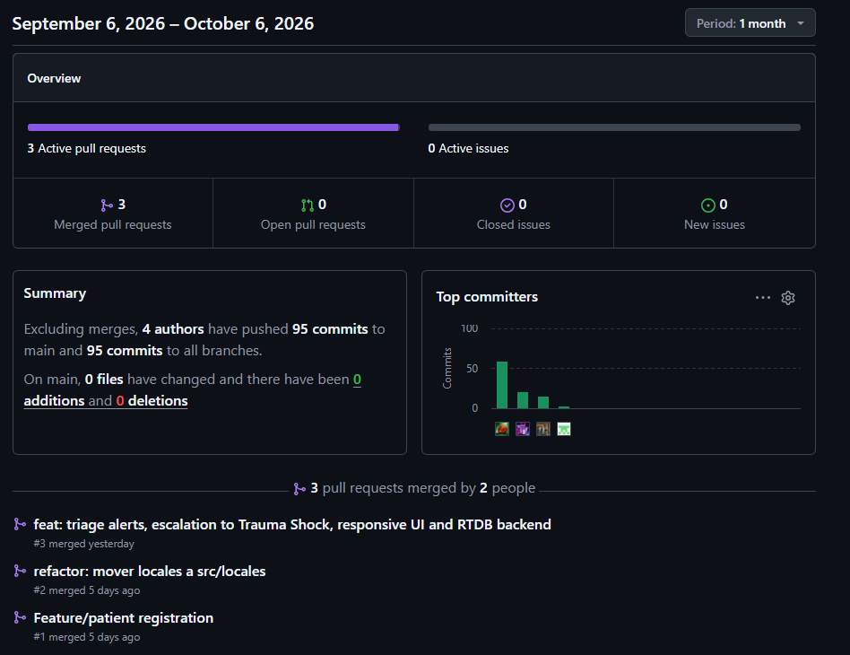
</p>
